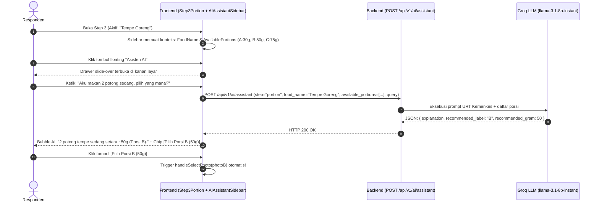

# 17. PRD & Spesifikasi Teknis: Asisten AI Recall (Atlas AI Sidebar)

> **Status:** Proposed / Ready for Implementation  
> **Target Release:** v1.2-recall-ai  
> **Modul Terkait:** Recall 24 Jam (Langkah 3 Estimasi Porsi & Pengembangan Step Selanjutnya)  
> **Stack:** Go 1.23 (Gin, Groq SDK/HTTP) & Next.js 16 (React 19, TypeScript, Tailwind CSS, TanStack React Query)

---

## 1. Latar Belakang & Problem Statement

Dalam metode survei konsumsi pangan **Food Recall 24 Jam**, salah satu titik friksi (*drop-off / cognitive load*) tertinggi bagi responden awam adalah **Langkah 3: Estimasi Ukuran Porsi (Portion Size Estimation)**.

### Permasalahan Utama:
1. **Kebingungan Ukuran Rumah Tangga (URT) vs Gramatur:** Responden mengingat makanan dalam bentuk URT (misalnya *"2 potong tempe ukuran sedang"*, *"1 centong cekung nasi"*, *"sebutir telur rebus"*), bukan dalam angka gramatur pasti.
2. **Keterbatasan Visual Foto Porsi:** Ketika disajikan pilihan foto porsi berkode (Porsi A, B, C, D) dengan label gramatur tertentu (misal 30g, 50g, 75g), responden sering ragu apakah "sedang" versi mereka sama dengan porsi B atau C.
3. **Penyimpangan Data Recall:** Jika responden salah mengestimasi porsi terlalu jauh, total energi dan zat gizi makro (TKPI) menjadi bias secara signifikan.

---

## 2. Visi & Filosofi Desain Fitur

Fitur ini dinamakan **"Asisten AI"** (atau **"Atlas AI"**) yang hadir sebagai **Slide-Over Sidebar Companion**:
- **Bukan Sekadar "Asisten Porsi":** Penamaan dan arsitektur dibuat generik (`Asisten AI`) dengan parameter kontekstual `step: "portion" | ...`. Hal ini disiapkan agar nantinya dapat diisi kapabilitas lain (seperti deteksi makanan terlewat di Step 5, rekomendasi bahan pelengkap di Step 4, dsb).
- **Pendamping Tanpa Menghalangi Layar:** Berbentuk sidebar drawer di desktop (slide dari kanan, lebar ~380px) dan sheet di mobile, sehingga responden dapat **tetap melihat foto porsi di sebelah kiri sembari berinteraksi dengan AI di sebelah kanan**.
- **AI Bertindak sebagai Konsultan Estimasi, Bukan Kalkulator Gizi:** AI **dilarang keras menghitung kalori/makronutrien sendiri** untuk menghindari risiko halusinasi. Perhitungan gizi tetap sepenuhnya deterministik dari tabel komposisi pangan (TKPI). AI hanya bertugas menjembatani bahasa natural URT ke **rekomendasi foto porsi atau gramatur terdekat**.
- **Zero Friction (1-Click Action):** Respon AI menyertakan chip tombol interaktif (misal: `[✓ Pilih Porsi B (50g)]`). Mengklik tombol ini langsung mengisi state form porsi di aplikasi tanpa user harus mengetik manual.

---

## 3. User Story & Flow Interaksi

### 3.1 User Story
> *"Sebagai responden yang sedang mengisi estimasi porsi tempe goreng, saya ingin bisa bertanya dalam bahasa sehari-hari ('saya makan 2 tempe goreng sedang berapa ya?') agar Asisten AI dapat menyarankan foto porsi terdekat dan saya bisa langsung memilihnya hanya dengan 1 klik."*

### 3.2 Diagram Alur (Sequence Flow)



---

## 4. Arsitektur Teknis & Spesifikasi API

### 4.1 Backend Architecture (Clean & Stateless)

Endpoint dibuat **stateless** (tidak memerlukan tabel database baru / migrasi baru). Riwayat percakapan dikelola sepenuhnya di sisi frontend (React state), dan di-reset otomatis ketika user berganti makanan.

#### Endpoint Specification:
- **URL:** `POST /api/v1/ai/assistant`
- **Auth:** `Bearer Token` (Middleware `authMiddleware`, `RespondentOnly()`)
- **Headers:** `Content-Type: application/json`

#### Request Payload (`AssistantRequest`):
```json
{
  "step": "portion",
  "food_name": "Tempe Goreng Tepung",
  "user_query": "Aku tadi makan 2 biji ukuran sedang, itu berapa gram ya?",
  "available_portions": [
    {
      "label": "A",
      "weight_gram": 25,
      "description": "1 potong kecil"
    },
    {
      "label": "B",
      "weight_gram": 50,
      "description": "2 potong sedang"
    },
    {
      "label": "C",
      "weight_gram": 100,
      "description": "Porsi besar / 4 potong"
    }
  ]
}
```

#### Response Payload (`AssistantResponse`):
```json
{
  "status": "success",
  "data": {
    "explanation": "2 potong tempe goreng ukuran sedang umumnya memiliki berat sekitar 50 gram, yang paling mendekati Porsi B.",
    "recommended_label": "B",
    "recommended_gram": 50
  }
}
```

---

## 5. Rincian Implementasi Kode

### 5.1 Backend (`atlas_food_backend`)

#### A. DTO (`internal/domain/ai/dto.go`)
```go
type AssistantStep string

const (
    AssistantStepPortion AssistantStep = "portion"
    // AssistantStepFood       AssistantStep = "food"       // Ekstensi masa depan
    // AssistantStepAdditional AssistantStep = "additional" // Ekstensi masa depan
)

type AvailablePortion struct {
    Label       string `json:"label"`
    WeightGram  int    `json:"weight_gram"`
    Description string `json:"description,omitempty"`
}

type AssistantRequest struct {
    Step              AssistantStep      `json:"step" binding:"required"`
    FoodName          string             `json:"food_name" binding:"required"`
    UserQuery         string             `json:"user_query" binding:"required"`
    AvailablePortions []AvailablePortion `json:"available_portions"`
}

type AssistantResponse struct {
    Explanation      string  `json:"explanation"`
    RecommendedLabel string  `json:"recommended_label,omitempty"`
    RecommendedGram  float64 `json:"recommended_gram,omitempty"`
}
```

#### B. Service Logic (`internal/domain/ai/service.go`)
- Menambahkan kontrak `AskAssistant(req AssistantRequest) (*AssistantResponse, error)` pada `Service` interface.
- Implementasi `portionHelper(req AssistantRequest)` dengan System Prompt berbasis standar URT Kemenkes RI:
  - 1 Centong Nasi ≈ 100g
  - 1 Potong Tempe Sedang ≈ 25–30g (2 potong ≈ 50–60g)
  - 1 Butir Telur Ayam ≈ 50–55g
  - 1 Potong Ayam Sedang ≈ 40–50g
  - 1 Sendok Makan Minyak/Gula ≈ 10g
- Mengharuskan output LLM berupa Strict JSON agar mudah diparsing tanpa parsing markdown liar.

#### C. Handler & Routing (`internal/domain/ai/handler.go`)
- Method `AskAssistant(c *gin.Context)`
- Registrasi route: `ai.POST("/assistant", h.AskAssistant)`

---

### 5.2 Frontend (`atlas_food_frontend`)

#### A. Domain Architecture
```
internal/domain/ai/
├── components/
│   ├── AIAssistantSidebar.tsx    # Slide-over sidebar UI & chat bubble
│   └── AiRecommendationPanel.tsx # Panel rekomendasi profil (tetap ada)
├── hooks/
│   ├── useAssistant.ts           # State chat session & mutasi tanya AI
│   └── useNutritionAnalysis.ts   # Analisis pasca submit (tetap ada)
├── services/
│   └── aiService.ts              # Fungsi API askAssistant()
├── types/
│   └── ai.ts                     # Tipe TypeScript DTO & ChatMessage
└── index.ts                      # Barrel export
```

#### B. Komponen Utama: `AIAssistantSidebar.tsx`
- **Floating Button Trigger:** Ikon Bot di kanan bawah layar (`bottom-6 right-6`), mudah dijangkau jempol pengguna mobile.
- **Drawer Slide-Over:** Menggunakan transisi CSS halus `translate-x-0` vs `translate-x-full` dengan overlay backdrop.
- **Quick Prompts:** Tombol saran cepat ("1 centong nasi berapa gram?", "2 potong tempe sedang?", dll).
- **Smart Action Chip:**
  ```tsx
  {message.response?.recommended_label && (
    <button
      onClick={() => onSelectPortion?.(message.response.recommended_label, message.response.recommended_gram)}
      className="mt-2 flex items-center gap-1 rounded-xl bg-primary/10 border border-primary text-primary px-3 py-1.5 text-xs font-semibold hover:bg-primary hover:text-white"
    >
      <Sparkles className="w-3 h-3" />
      Pilih Porsi {message.response.recommended_label} ({message.response.recommended_gram}g)
    </button>
  )}
  ```

#### C. Integrasi ke `Step3Portion.tsx`
Di dalam [Step3Portion.tsx](file:///Users/macbookair/Developer/BRIN/atlas_food_frontend/internal/domain/recall/components/Step3Portion.tsx):
```tsx
<AIAssistantSidebar
  foodName={currentFood.food.name}
  availablePortions={photos.map((p) => ({
    label: p.label,
    weight_gram: p.weight_gram,
    description: p.description,
  }))}
  onSelectPortion={(label, gram) => {
    if (label) {
      const match = photos.find((p) => p.label === label);
      if (match) {
        handleSelectPhoto(match);
        return;
      }
    }
    handleCustomGramChange(String(gram));
  }}
/>
```

---

## 6. Rencana Ekstensi Masa Depan (Future Variables)

Arsitektur parameter `step` memungkinkan modul asisten ini diperluas ke tahapan recall lainnya tanpa merombak arsitektur dasar:

| Step | Rencana Variabel / Fungsi AI | Contoh Kasus Penggunaan |
|---|---|---|
| **Step 1 (Meal Time)** | Contextual Meal Recommender | Menyarankan makanan khas sarapan/makan siang di daerah responden jika bingung. |
| **Step 2 (Food Search)** | Multi-Ingredient Breakdown | Responden mengetik "Soto Ayam Komplit" $\rightarrow$ AI memecah menjadi komponen: Soto Ayam, Nasi Putih, Telur Rebus, Kerupuk. |
| **Step 3 (Portion)** | **Portion Size Helper (Fokus Saat Ini)** | Konversi URT $\rightarrow$ Label Foto Porsi / Gramatur manual. |
| **Step 4 (Additional)** | Condiment / Cooking Oil Detector | Mengingatkan bumbu/minyak: *"Apakah tempe goreng ini digoreng dengan minyak? Mau dimasukkan minyak gorengnya?"* |
| **Step 5 (Review)** | Forgotten Food Detective | *"Kamu belum mencatat air minum atau camilan sore nih, apakah ada yang terlewat?"* |

---

## 7. Quality Assurance & Verifikasi

1. **Uji Fungsional:**
   - Membuka drawer saat makanan A dipilih, kirim pertanyaan URT $\rightarrow$ Rekomendasi label foto muncul.
   - Klik action chip $\rightarrow$ Radio tile foto porsi di layar utama terpilih, indikator total gram terupdate seketika.
   - Berpindah makanan (misal dari Tempe ke Nasi) $\rightarrow$ Chat history ter-reset bersih, siap untuk konteks makanan baru.
2. **Uji Error Handling:**
   - Pertanyaan di luar konteks makanan $\rightarrow$ AI dengan santun mengarahkan kembali ke estimasi porsi makanan tersebut.
   - Network timeout / Groq offline $\rightarrow$ Menampilkan banner pesan error ramah tanpa merusak form porsi manual.
3. **Uji Validasi Kode:**
   - Backend: `go test ./internal/domain/ai/...` lolos 100%.
   - Frontend: `npx tsc --noEmit` lolos (0 error) dan `npm run build` sukses.
