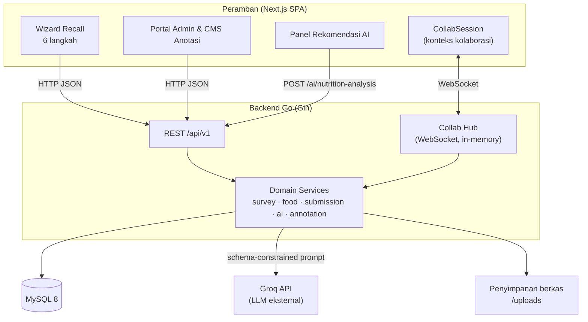
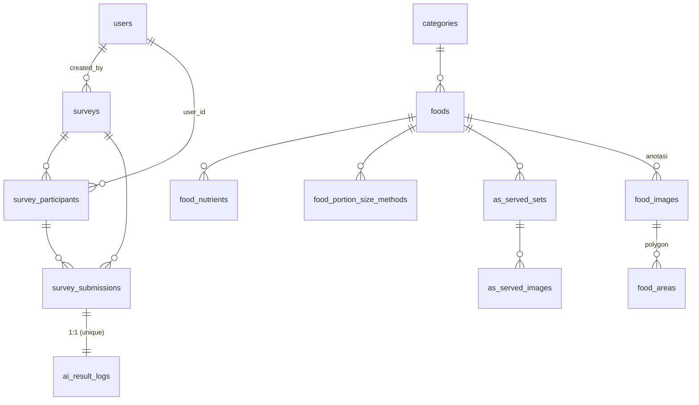
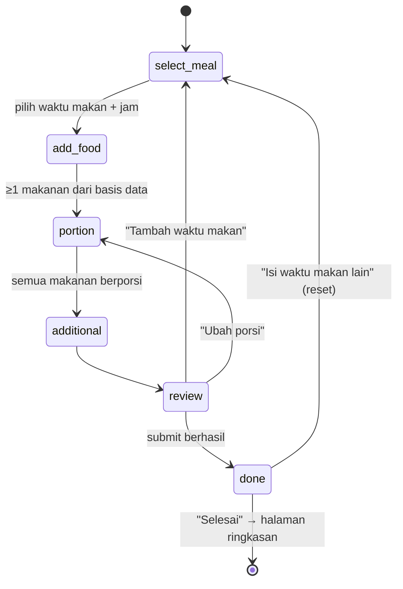
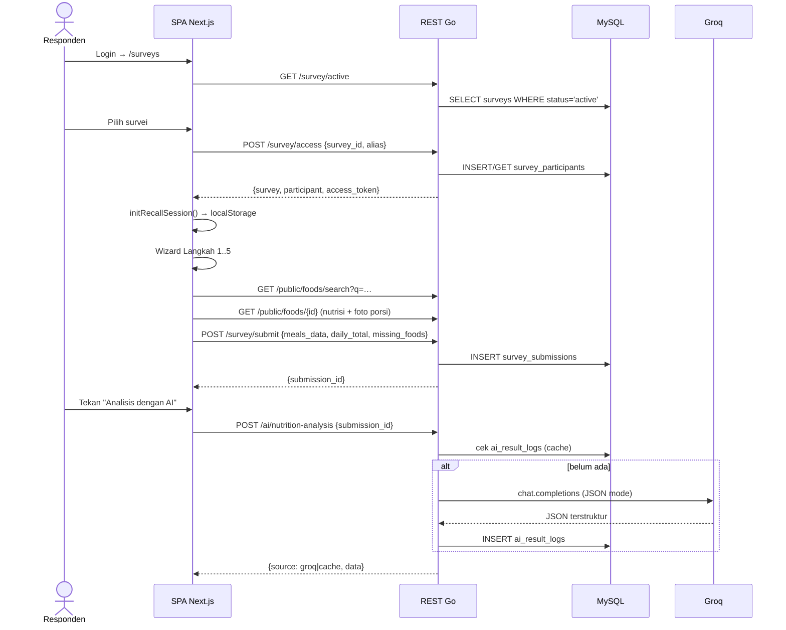
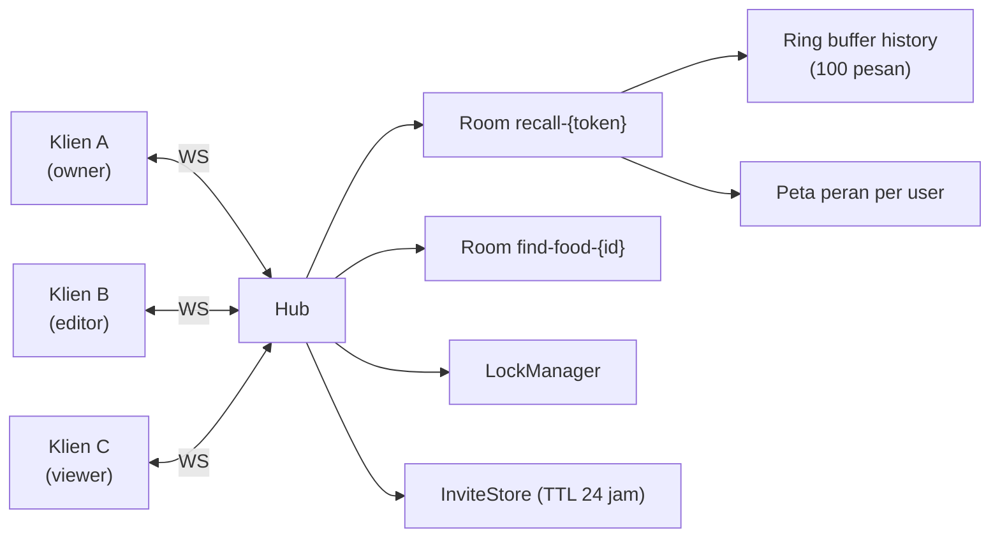
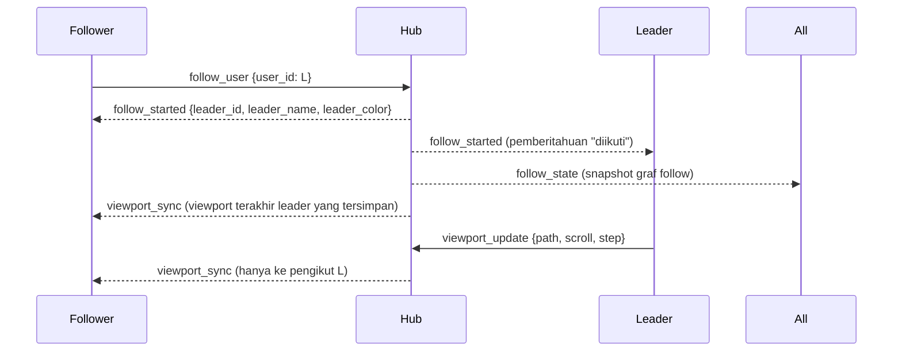
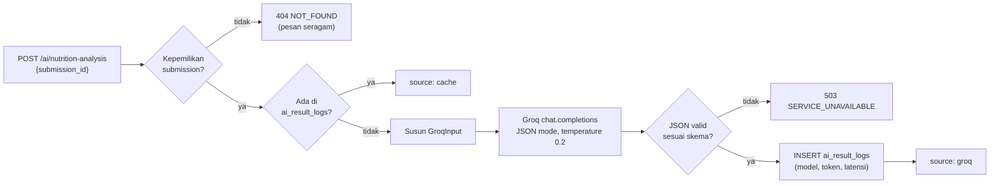
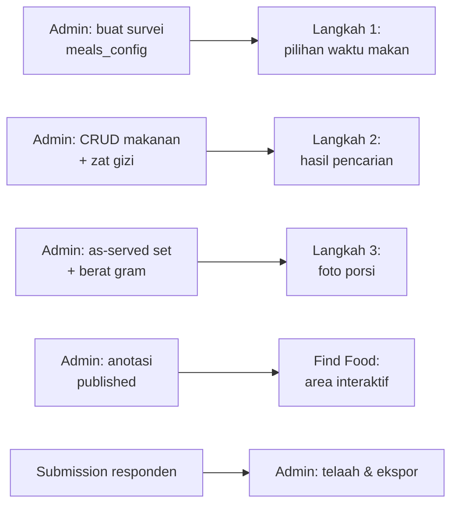

# Atlas Food — Spesifikasi Sistem, Arsitektur, dan Alur Kerja

**Dokumen rujukan tunggal untuk penulisan artikel ilmiah (target: jurnal terakreditasi SINTA 2)**

| Atribut | Keterangan |
|---|---|
| Nama sistem | Atlas Food (Atlas Makananku) |
| Domain masalah | *24-hour dietary recall* terkomputerisasi dengan pendampingan enumerator jarak jauh |
| Kontribusi utama | (1) Kolaborasi real-time bergaya Figma pada instrumen survei gizi; (2) Rekomendasi gizi berbasis LLM dengan keluaran terstruktur; (3) CMS anotasi foto makanan untuk estimasi porsi |
| Arsitektur | Client–server terpisah; SPA Next.js ↔ REST + WebSocket Go |
| Basis data | MySQL 8 (InnoDB, utf8mb4) |
| Status | Prototipe fungsional; sudah *build-clean* dan *type-safe*, **belum** melalui pengukuran kinerja & uji pengguna formal |

> **Catatan integritas data.** Dokumen ini hanya memuat fakta yang terverifikasi dari kode sumber (backend Go dan frontend Next.js) pada saat penulisan. Setiap angka kinerja, hasil uji pengguna, atau klaim akurasi AI **belum diukur** dan ditandai eksplisit sebagai *belum tersedia*. Bagian §12 menyediakan rancangan evaluasi untuk memperoleh angka-angka tersebut. Jangan mengutip nilai apa pun yang tidak ada di sini.

---

## Daftar Isi

1. [Latar Belakang & Posisi Riset](#1-latar-belakang--posisi-riset)
2. [Tujuan, Ruang Lingkup, dan Kontribusi](#2-tujuan-ruang-lingkup-dan-kontribusi)
3. [Arsitektur Sistem](#3-arsitektur-sistem)
4. [Model Data & Skema Basis Data](#4-model-data--skema-basis-data)
5. [Autentikasi, Otorisasi, dan Peran](#5-autentikasi-otorisasi-dan-peran)
6. [Modul A — Alur *Dietary Recall* Responden](#6-modul-a--alur-dietary-recall-responden)
7. [Modul B — Kolaborasi Real-Time](#7-modul-b--kolaborasi-real-time)
8. [Modul C — Rekomendasi Gizi Berbasis LLM](#8-modul-c--rekomendasi-gizi-berbasis-llm)
9. [Modul D — Portal Admin & CMS Anotasi Makanan](#9-modul-d--portal-admin--cms-anotasi-makanan)
10. [Kontrak API Ringkas](#10-kontrak-api-ringkas)
11. [Rekayasa Kualitas: Temuan Cacat & Perbaikan](#11-rekayasa-kualitas-temuan-cacat--perbaikan)
12. [Rancangan Evaluasi untuk Artikel Ilmiah](#12-rancangan-evaluasi-untuk-artikel-ilmiah)
13. [Kerangka Penulisan Artikel SINTA 2](#13-kerangka-penulisan-artikel-sinta-2)
14. [Keterbatasan & Pengembangan Lanjut](#14-keterbatasan--pengembangan-lanjut)
15. [Glosarium & Kata Kunci](#15-glosarium--kata-kunci)

---

## 1. Latar Belakang & Posisi Riset

### 1.1 Masalah domain

*24-hour dietary recall* (R24J) adalah metode baku penilaian asupan gizi individu: responden mengingat kembali seluruh makanan dan minuman yang dikonsumsi dalam 24 jam terakhir, beserta perkiraan porsinya. Metode ini menghadapi tiga hambatan klasik yang bersifat teknis maupun kognitif:

1. **Bias estimasi porsi.** Responden awam sulit menerjemahkan "satu piring nasi" menjadi satuan gram. Instrumen berbasis kertas mengandalkan buku foto porsi yang statis dan sulit didistribusikan.
2. **Ketergantungan pada pendampingan enumerator.** Kualitas data R24J sangat bergantung pada *probing* enumerator terlatih. Wawancara tatap muka mahal dan terbatas secara geografis; sementara instrumen mandiri (*self-administered*) menghilangkan pendampingan sama sekali.
3. **Jeda umpan balik.** Responden menyerahkan data tanpa memperoleh manfaat langsung, sehingga motivasi partisipasi rendah dan risiko *underreporting* meningkat.

### 1.2 Celah yang diisi sistem ini

Perangkat lunak R24J terkomputerisasi yang telah mapan (misalnya kelas sistem *Intake24*/ASA24) umumnya bersifat **mandiri penuh**: satu responden, satu sesi, tanpa kehadiran pihak lain di layar yang sama. Di sisi lain, teknologi kolaborasi multi-pengguna real-time (*multiplayer*) sudah menjadi hal biasa di perkakas desain dan dokumen (kursor langsung, *presence*, *follow mode*), tetapi belum lazim diterapkan pada **instrumen pengumpulan data gizi**.

Atlas Food memposisikan diri pada irisan tersebut: **instrumen R24J yang tetap dapat diisi mandiri, namun dapat "dimasuki" enumerator/ahli gizi secara jarak jauh dalam sesi yang sama**, lengkap dengan kontrol peran (dapat mengubah / hanya melihat), tanpa berbagi kredensial dan tanpa perangkat lunak *remote desktop*.

### 1.3 Klaim kebaruan (*novelty*) yang dapat dipertahankan

Rumusan berikut aman secara metodologis karena bertumpu pada rancangan sistem, bukan pada klaim superioritas empiris yang belum diukur:

- **N1 — Sinkronisasi tingkat-langkah pada wizard SPA.** Pada aplikasi satu halaman, seluruh langkah wizard berbagi satu URL, sehingga mekanisme *follow* konvensional yang memantulkan *path* saja tidak mampu menyamakan langkah antar peserta. Sistem ini memperluas pesan `viewport_update` dengan atribut `step` yang dipertahankan sebagai bagian dari *viewport state* di sisi server, sehingga peserta yang bergabung belakangan tetap mendarat di langkah yang benar.
- **N2 — Otorisasi berlapis tiga untuk peran per-ruang.** Peran (*owner/editor/viewer*) ditegakkan pada tiga lapis independen: kunci UI (atribut `inert`), gerbang pengiriman pesan di klien, dan penolakan di *hub* server; ditambah pengingatan peran per-pengguna di sisi ruang agar peran tidak dapat dinaikkan dengan cara menavigasi ulang tanpa parameter undangan.
- **N3 — Rekomendasi LLM berkendala skema dengan *caching* per-*submission*.** Keluaran model dibatasi ke skema JSON tetap dan dinormalisasi dua kali (server dan klien), lalu disimpan sebagai *audit log* (model, token, latensi) yang sekaligus berfungsi sebagai *cache* — menjadikan hasil dapat direproduksi dan dapat diaudit, bukan sekadar teks bebas.

---

## 2. Tujuan, Ruang Lingkup, dan Kontribusi

### 2.1 Tujuan sistem

| Kode | Tujuan |
|---|---|
| T1 | Menyediakan instrumen R24J berbasis web yang memandu responden melalui langkah terstruktur hingga menghasilkan estimasi asupan gizi harian |
| T2 | Memungkinkan pendampingan jarak jauh secara real-time dengan kontrol peran yang tegas |
| T3 | Memberi umpan balik gizi personal segera setelah pengiriman laporan, memakai model bahasa besar |
| T4 | Menyediakan portal admin untuk mengelola survei, basis data makanan, dan aset foto porsi teranotasi |

### 2.2 Ruang lingkup

**Termasuk:** autentikasi & peran; manajemen survei; katalog makanan & zat gizi; metode estimasi porsi berbasis foto; alur pengisian recall enam langkah; kolaborasi real-time; analisis gizi LLM; portal admin; CMS anotasi.

**Tidak termasuk (v1):** persistensi kolaborasi lintas-restart server (*hub* bersifat *in-memory*); replikasi isian recall antar peserta (kolaborasi bersifat *presence & awareness*, bukan *co-editing* dokumen); aplikasi seluler *native*; pengukuran antropometri; integrasi dengan rekam medis.

### 2.3 Kontribusi yang dilaporkan

1. Rancangan dan implementasi arsitektur R24J kolaboratif (Go + WebSocket ↔ Next.js) beserta protokol pesannya.
2. Mekanisme sinkronisasi langkah wizard lintas-peserta pada SPA (N1).
3. Model otorisasi peran per-ruang berlapis tiga (N2).
4. Pipeline rekomendasi gizi LLM berkendala skema, ber-*cache*, dan dapat diaudit (N3).
5. Katalog cacat perangkat lunak yang ditemukan lewat penelusuran alur end-to-end beserta perbaikannya (§11) — berguna sebagai bagian *hasil pengujian* artikel.

---

## 3. Arsitektur Sistem

### 3.1 Tumpukan teknologi

| Lapis | Teknologi | Versi/Catatan |
|---|---|---|
| Frontend | Next.js (App Router), React, TypeScript | *Client components*, rendering dinamis per rute |
| State klien | Zustand (state kolaborasi), TanStack Query (state server) | Zustand untuk *presence*/kursor/peran; Query untuk *fetch*/mutasi |
| Styling | Tailwind CSS v4 + *design token* di `styles/globals.css` | Utility dipetakan ke variabel CSS (`bg-surface` → `var(--color-surface)`) |
| Validasi | Zod + React Hook Form | Skema form admin |
| Backend | Go 1.21, Gin | REST + WebSocket dalam satu proses |
| Real-time | `gorilla/websocket` | *Hub* in-memory, tanpa Redis pada v1 |
| ORM | GORM + driver MySQL | |
| Basis data | MySQL 8, InnoDB, utf8mb4 | Migrasi SQL bernomor di `migrations/` |
| Autentikasi | JWT (`golang-jwt/jwt/v5`) | *Access token* di *cookie*; juga dikirim via *query* saat *handshake* WS |
| LLM | Groq Chat Completions API (kompatibel OpenAI) | Model *default* `llama3-8b-8192`, dapat dikonfigurasi |

### 3.2 Diagram arsitektur



### 3.3 Pola struktur kode: *domain-driven modular*

Kedua sisi memakai pemisahan per **domain bisnis**, bukan per jenis berkas. Ini membuat setiap fitur dapat ditelusuri sebagai satu unit.

**Backend** — `internal/domain/<nama>/` berisi `model.go` (entitas GORM), `dto.go` (kontrak HTTP), `repository.go` (akses data), `service.go` (aturan bisnis), `handler.go` (HTTP/WS). Domain yang ada: `auth`, `survey`, `food`, `submission`, `ai`, `annotation`, `collab`, `upload`.

**Frontend** — `internal/domain/<nama>/` berisi `components/`, `hooks/`, `services/`, `store/`, `types/`, `schemas/`, `constants/`, `utils/`. Domain yang ada: `auth`, `survey`, `recall`, `food`, `portion`, `submission`, `collab`, `ai`, `annotation`, `category`. Rute Next.js di `app/` sengaja dibuat tipis: perannya hanya menjadi *gerbang* (pemeriksaan sesi) dan merakit komponen domain.

Aturan dependensi: `app/` → `internal/domain/*` → `internal/lib|pkg`. Antar-domain hanya boleh bergantung searah (`recall` → `food`/`portion`/`collab`), tidak melingkar.

---

## 4. Model Data & Skema Basis Data

### 4.1 Entitas inti



### 4.2 Tabel kunci dan perannya

| Tabel | Kolom penting | Peran dalam alur |
|---|---|---|
| `users` | `role` (admin/respondent) | Identitas & RBAC |
| `surveys` | `slug`, `meals_config` (JSON), `prompts` (JSON), `status` (draft/active/closed), `access_token` | Konfigurasi instrumen; `meals_config` menentukan daftar waktu makan & jam bawaan yang muncul di Langkah 1 |
| `survey_participants` | `survey_id`, `user_id`, `alias` | Menautkan pengguna ke survei; dibuat saat responden mengakses survei aktif |
| `survey_submissions` | `meals_data` (JSON), `missing_foods` (JSON), `total_energy/protein/carbs/fat` | Laporan recall final; JSON menyimpan struktur bersarang waktu-makan → makanan → porsi → bahan tambahan |
| `ai_result_logs` | `submission_id` (**unique**), `input_payload`, `raw_response`, `overall_status`, `model_used`, `token_used`, `latency_ms` | *Cache* + jejak audit analisis LLM |
| `foods`, `categories`, `nutrient_types`, `food_nutrients` | `FULLTEXT (name, local_name)` | Katalog makanan & kandungan gizi per 100 g |
| `food_portion_size_methods`, `as_served_sets`, `as_served_images` | `method_type` (as_served/guide_image/weight), `weight_gram` | Aset estimasi porsi berbasis foto |
| `food_images`, `food_areas` | polygon, status draft/published | CMS anotasi (§9) |

### 4.3 Keputusan desain data yang perlu dijelaskan di artikel

- **JSON semi-terstruktur untuk `meals_data`.** Struktur satu laporan recall bersifat bersarang dan variatif (jumlah waktu makan, jumlah makanan, jumlah bahan tambahan berbeda tiap responden). Normalisasi penuh akan menghasilkan banyak tabel dengan *join* dalam untuk satu kali baca. Kolom JSON dipilih karena laporan **selalu dibaca sebagai satu kesatuan** dan tidak pernah di-*query* per-baris makanan. Total gizi tetap didenormalisasi ke kolom numerik (`total_energy` dkk.) agar agregasi lintas responden tetap murah.
- **Perhitungan gizi di sisi klien.** Nilai gizi dihitung dengan `(nilai_per_100g / 100) × berat_porsi_gram`, dibulatkan satu desimal, lalu dikirim bersama laporan. Konsekuensi metodologis: sumber kebenaran gizi tetap tabel `food_nutrients`; nilai terkirim adalah *snapshot* pada saat pengisian, sehingga perubahan basis data makanan di kemudian hari tidak mengubah laporan historis — sifat yang justru diinginkan untuk data penelitian.
- **`ai_result_logs.submission_id` unik.** Menjamin satu laporan memiliki tepat satu hasil analisis tersimpan, sekaligus menjadikan tabel ini *cache* alami.

---

## 5. Autentikasi, Otorisasi, dan Peran

### 5.1 Dua sumbu peran

Sistem membedakan dua sumbu peran yang **tidak boleh dicampur** — pembedaan ini penting dan layak ditulis eksplisit di artikel:

| Sumbu | Nilai | Sumber | Cakupan |
|---|---|---|---|
| Peran aplikasi | `admin`, `respondent` | Klaim JWT | Seluruh aplikasi; menentukan akses endpoint |
| Peran ruang (*room role*) | `owner`, `editor`, `viewer` | Ditetapkan *hub* saat bergabung ruang | Hanya di dalam satu sesi kolaborasi |

Seorang `respondent` dapat menjadi `owner` di ruangnya sendiri dan `viewer` di ruang rekan. Peran ruang tidak pernah menaikkan hak akses endpoint REST.

### 5.2 Alur autentikasi

1. `POST /auth/login` → JWT disimpan sebagai *cookie*.
2. Middleware `JWTAuth()` memvalidasi token dan menaruh `userID`, `username`, `role` ke konteks Gin.
3. `AdminOnly()` / `RespondentOnly()` menyaring per-grup rute.
4. *Handshake* WebSocket tidak dapat memakai *header* `Authorization` di peramban, sehingga token dikirim sebagai parameter *query* pada URL `wss://…/collab/rooms/{room_id}/ws?token=…&invite=…`. **Implikasi keamanan** (lihat §14): token berpotensi tercatat di log proksi.

### 5.3 Penetapan peran ruang (`ResolveRoomRole`)

Aturan yang diterapkan `hub.registerClient`:

1. Jika pengguna sudah pernah tercatat di ruang tersebut, **peran yang diingat menang** — mencegah kenaikan hak akses hanya dengan bernavigasi tanpa parameter `?invite=`.
2. Jika pengguna adalah klien pertama di ruang dan tidak masuk melalui undangan `viewer`, ia menjadi `owner`.
3. Tab kedua milik pengguna yang sama **mewarisi** peran tab pertama (bukan turun ke `editor`).
4. Nilai bawaan bila tidak ada informasi lain: `editor`.

Satu pengguna boleh memiliki banyak *socket* sekaligus (multi-tab/multi-perangkat). *Socket* lama sengaja **tidak** ditendang: penendangan memicu siklus rekoneksi saling-tendang tanpa henti. Duplikasi ditangani di tempat yang benar — daftar *presence* melakukan dedup berdasarkan `user_id`, dan notifikasi "bergabung" hanya disiarkan untuk *socket* pertama.

---

## 6. Modul A — Alur *Dietary Recall* Responden

### 6.1 Mesin keadaan enam langkah



| # | Langkah | Kunci masukan | Prasyarat lanjut |
|---|---|---|---|
| 1 | `select_meal` | Jenis waktu makan (dari `meals_config`), jam 24-jam | Jenis waktu makan terisi |
| 2 | `add_food` | Pencarian makanan & minuman (min. 3 karakter, *debounce* 300 ms), pencatatan manual bila tak ditemukan | ≥1 makanan dari basis data |
| 3 | `portion` | Pilih foto porsi (*as served*) **atau** isi berat manual (maks. 5000 g) | Seluruh makanan memiliki porsi > 0 |
| 4 | `additional` | Bahan tambahan/bumbu (12 pilihan cepat + takaran) | Opsional |
| 5 | `review` | Ringkasan item, item manual, total gizi harian | Validasi lolos |
| 6 | `done` | Konfirmasi + panel rekomendasi AI | — |

### 6.2 Persistensi sesi di sisi klien

Sesi recall disimpan di `localStorage` dengan kunci `atlas-food-recall-session` dalam *envelope* `{ savedAt, session }` ber-TTL **24 jam**. Pilihan `localStorage` (bukan `sessionStorage`) disengaja: R24J dapat diisi bertahap sepanjang hari dan berpindah aplikasi di ponsel; TTL menjaga agar sesi basi tidak dianggap valid. Setiap mutasi state menulis ulang *envelope*, sehingga *refresh* halaman tidak kehilangan progres.

Gerbang halaman `/surveys/[accessToken]/recall` memverifikasi tiga hal sebelum merender wizard: (a) ada token akses aplikasi, (b) ada sesi recall tersimpan, (c) `session.access_token` cocok dengan token di URL. Pengecualian tamu dijelaskan di §7.6.

### 6.3 Struktur data laporan yang dikirim

```jsonc
{
  "survey_id": "uuid",
  "participant_id": "uuid",
  "respondent_name": "string",
  "meals_data": [
    {
      "name": "Sarapan",
      "time": "07:00",
      "foods": [
        {
          "food_id": "uuid",
          "food_name": "Nasi Putih",
          "portion_gram": 150,
          "portion": {
            "method": "simple_grid | input",
            "image_id": "uuid?",
            "image_label": "string?",
            "base_weight": 100,
            "quantity": 1, "fraction": 0, "total_quantity": 1,
            "portion_gram": 150
          },
          "nutrients": { "energy": 195, "protein": 3.6, "carbs": 42.9, "fat": 0.3 },
          "additionals": [
            { "name": "Minyak", "amount": "5ml", "amount_value": 5, "unit": "ml" }
          ]
        }
      ],
      "meal_total": { "energy": 195, "protein": 3.6, "carbs": 42.9, "fat": 0.3 }
    }
  ],
  "daily_total": { "energy": 0, "protein": 0, "carbs": 0, "fat": 0 },
  "missing_foods": [ { "name": "Sambal buatan ibu" } ]
}
```

### 6.4 Validasi sebelum pengiriman

Tiga aturan ditegakkan di Langkah 5 sebelum tombol kirim aktif:

1. `survey_id` harus ada — bila kosong berarti sesi tidak terinisialisasi sah.
2. Minimal satu waktu makan berisi makanan.
3. Seluruh makanan pada waktu makan terisi wajib memiliki `portion_gram > 0`.

Item `missing_foods` (makanan yang tidak ada di basis data) **tidak** memenuhi syarat (1)–(3) karena tidak memiliki nilai gizi; item tersebut tetap dikirim sebagai masukan untuk pengelola basis data dan ditampilkan terpisah di Langkah 2 dan Langkah 5 dengan penanda "tanpa nilai gizi".

### 6.5 Alur end-to-end (sekuens)



---

## 7. Modul B — Kolaborasi Real-Time

Bagian ini adalah inti kebaruan teknis sistem dan sebaiknya menjadi porsi terbesar artikel.

### 7.1 Model konseptual

Kolaborasi dirancang mengikuti model **kesadaran bersama (*awareness*)** ala perkakas desain kolaboratif, bukan model **penyuntingan bersama dokumen** (*co-editing*) ala CRDT/OT. Yang direplikasi antar peserta adalah: kehadiran, kursor, *viewport*, langkah aktif, aktivitas, dan kunci entitas. Isian recall **tidak** direplikasi — setiap peserta memiliki salinan lokalnya sendiri.

Pilihan ini disengaja dan perlu dinyatakan tegas di artikel beserta alasannya: R24J adalah instrumen dengan **satu responden sebagai sumber kebenaran**. Membiarkan pihak lain menulis langsung ke laporan responden akan mencemari validitas data. Yang dibutuhkan pendamping adalah kemampuan **melihat, mengarahkan, dan memverifikasi** — persis yang disediakan model *awareness*.

### 7.2 Topologi dan siklus hidup



- **Hub** memelihara peta `roomID → Room`, kanal `register`/`unregister`/`broadcast`, `LockManager`, dan `InviteStore`. Seluruh keadaan bersifat *in-memory*.
- **Room** memiliki *ring buffer* riwayat 100 pesan, peta peran per-pengguna, dan *ticker* batching 50 ms.
- **Pembersihan**: *ticker* 30 detik menghapus ruang yang sudah kosong agar memori tidak bocor.

### 7.3 Protokol pesan

Format amplop seragam:

```jsonc
{ "type": "…", "room_id": "…", "user_id": "…", "username": "…", "payload": { }, "timestamp": "RFC3339" }
```

**Klien → Server**

| Tipe | Payload utama | Mutasi data? |
|---|---|---|
| `presence_join` | `user_id`, `display_name`, `role` | tidak |
| `cursor_move` | `x`, `y`, `scroll_x`, `scroll_y`, `page` | tidak |
| `viewport_update` | `page`, `path`, `scroll_x`, `scroll_y`, **`step`**, `zoom` | tidak |
| `follow_user` / `unfollow_user` | `user_id` | tidak |
| `food_search` | `query`, `filters` | **ya** |
| `food_select` | `food_id`, `food_name` | **ya** |
| `meal_add` | `meal_type`, `food_id`, `food_name` | **ya** |
| `portion_set` / `portion_select` | `food_id`, `portion_gram`, `image_label` | **ya** |
| `review_submit` | `survey_id` | **ya** |
| `db_edit_start/field/save/cancel` | `entity_type`, `entity_id`, `version` | **ya** |
| `get_history`, `ping` | — | tidak |

**Server → Klien**

`presence_list`, `presence_joined`/`user_joined`, `presence_left`/`user_left`, `cursor_update`, `viewport_sync`, `follow_started`, `follow_stopped`, `follow_state`, `user_searching`/`food_search_shared`, `food_selected`, `meal_updated`, `portion_updated`/`portion_selected`, `review_submitted`, `db_locked`, `db_field_updated`, `db_edit_saved`, `db_unlocked`, `activity_log`, `state_sync`, `history`, `error`, `pong`.

### 7.4 Kendali kualitas transport

| Mekanisme | Nilai | Alasan |
|---|---|---|
| Batas ukuran pesan | 64 KB | Menolak muatan abnormal |
| *Rate limit* | 50 pesan/detik/klien | Melindungi *hub* dari banjir pesan |
| Batching | *Ticker* 50 ms, *flush* paksa pada 50 pesan antre | Meredam frekuensi tinggi kursor/viewport |
| *Coalescing* kursor | Hanya posisi terakhir per pengguna yang dikirim | Praktik baku real-time: buang *frame* antara |
| Riwayat | *Ring buffer* 100 pesan; kursor & `viewport_sync` **tidak** dicatat | Mencegah riwayat dibanjiri pesan frekuensi tinggi |
| *Heartbeat* | Klien kirim `ping` tiap 25 s; server `pongWait` 60 s, `pingPeriod` 54 s | Deteksi koneksi mati |
| Rekoneksi | *Exponential backoff* `2^n` detik, batas 30 s | Menghindari badai rekoneksi |
| Buffer kirim | 256 pesan/klien; melebihi itu pesan di-*drop* + dicatat | Klien lambat tidak boleh memblokir *hub* |

### 7.5 *Follow mode* dan sinkronisasi langkah (kontribusi N1)

Alur *follow*:



Tiga persoalan teknis yang diselesaikan dan layak diuraikan di artikel:

1. **Path leader tidak boleh menimpa konteks sesi follower.** Saat memantulkan navigasi, `mergeLeaderPathForFollower` menyalin `pathname` dan parameter yang relevan (`q`) dari leader, tetapi **mempertahankan `room` dan `invite` milik follower**. Navigasi memakai `router.replace` agar riwayat peramban follower tidak menumpuk.
2. **Wizard SPA tidak memiliki URL per langkah.** Seluruh langkah berbagi satu *path*, sehingga pemantulan berbasis *path* saja membuat follower berada di halaman yang sama namun langkah yang berbeda. Solusinya: langkah aktif disiarkan sebagai atribut `step` pada `viewport_update`, disimpan server sebagai bagian *viewport* terakhir leader, dan diterapkan follower melalui `goToStep` setelah divalidasi terhadap daftar langkah yang sah (`step` dari jaringan tidak pernah dipercaya mentah).
3. **Setiap `viewport_update` wajib membawa `step`.** Server menyimpan *viewport* terakhir secara *replace*, bukan *merge*. Satu pesan yang dipicu *scroll* tanpa `step` akan menghapus jejak langkah leader, sehingga pengikut yang bergabung setelahnya mendarat di langkah yang salah. Karena itu langkah aktif disimpan pada *store* kolaborasi dan dibaca oleh **semua** pengirim `viewport_update`, termasuk yang dipicu *scroll*/*resize*.

Perlindungan lain: peserta yang sedang mengikuti orang lain berhenti menyiarkan kursor dan pencariannya sendiri, dan tidak memantulkan balik langkah leader — tanpa itu dua peserta yang saling mengikuti akan terjebak pada *loop* pemantulan.

### 7.6 Undangan, peran, dan penegakan berlapis (kontribusi N2)

**Undangan.** `POST /collab/rooms/{room_id}/invite` menghasilkan token heksadesimal 16 *byte* dari `crypto/rand` dengan peran `editor|viewer` dan TTL bawaan 24 jam, disimpan di `InviteStore` in-memory. Tautan berbagi dibentuk klien dengan menyalin URL halaman lalu **mengosongkan seluruh query lama** dan menyetel ulang `room` + `invite` — mencegah parameter milik pengundang ikut terbawa.

**Penegakan berlapis tiga:**

| Lapis | Mekanisme | Berkas |
|---|---|---|
| 1 — UI | Komponen `ViewerLock` membungkus isi setiap langkah dengan atribut `inert` (React 19), mengeluarkan seluruh subtree dari *tab order*, *pointer event*, dan *accessibility tree* sekaligus | `collab/components/ViewerLock.tsx`, dipasang di `recall/.../Primitives.tsx` |
| 2 — Klien | `send()` menyaring `COLLAB_MUTATE_TYPES`; **gagal-tertutup**: bila berada di dalam ruang dan peran belum diketahui server, pengiriman ditahan | `collab/hooks/useWebSocket.ts` |
| 3 — Server | `Client.canEdit()` menolak pesan mutasi dari `viewer` | `collab/client.go` |

Alasan `inert` dipilih ketimbang `pointer-events: none` layak ditulis: `pointer-events` hanya memblokir tetikus, sementara navigasi papan ketik, *autofill*, dan pembaca layar masih menembus. Alasan *fail-closed* juga layak ditulis: implementasi awal menganggap peran kosong sebagai "boleh", sehingga *viewer* masih dapat mengubah data pada jeda antara *socket* terbuka dan `state_sync` tiba.

**Ketahanan peran.** Ruang mengingat peran per-`user_id`. Tanpa ini, seorang `viewer` yang berpindah halaman (sehingga `?invite=` hilang dari URL) akan naik menjadi `editor` pada koneksi berikutnya. Klien juga menyimpan `room` dan `invite` di `sessionStorage` per-tab agar sesi bertahan saat navigasi internal, namun berakhir ketika tab ditutup.

### 7.7 Penguncian entitas (*optimistic locking*)

Untuk penyuntingan basis data makanan secara kolaboratif, `LockManager` menyediakan `TryLock`/`Release`/`BumpVersion`/`Snapshot` dengan kunci `entityType:entityID`. Kunci bersifat *re-entrant* bagi pemiliknya (memperbarui `LockedAt` dan versi), menolak pemohon lain, dan nomor versi dinaikkan setelah penyimpanan berhasil. Snapshot kunci dikirim ke klien baru melalui `state_sync` sehingga indikator "sedang disunting oleh X" dapat akurat sejak awal tanpa menunggu peristiwa berikutnya.

> **⚠ Status implementasi — jangan ditulis sebagai fitur berjalan.** Mekanisme ini lengkap di sisi *hub* dan protokol (`db_edit_start/field/save/cancel` → `db_locked`/`db_unlocked`/`db_edit_saved`), dan komponen penanda `LockIndicator` tersedia di sisi klien. Namun **belum ada halaman portal admin yang mengaktifkannya**: `CollabSession` hanya dipasang pada halaman *recall* (`app/surveys/[accessToken]/recall/page.tsx`) dan pencarian makanan (`app/find-food/layout.tsx`), sehingga tidak ada klien yang pernah mengirim pesan `db_edit_*`. Portal admin tidak memiliki kolaborasi real-time pada versi ini.

### 7.8 Ruang untuk sesi recall

Ruang bawaan sesi recall bernama `recall-{access_token}`. Karena `access_token` bersifat per-peserta, ruang bawaan bersifat privat per-responden; kolaborasi lintas-peserta terjadi ketika tamu membuka tautan undangan yang membawa `?room=`. Dalam hal ini parameter `room` **diprioritaskan** di atas ruang bawaan, dan gerbang halaman mengizinkan tamu masuk meski token akses di URL bukan miliknya — disertai panel penjelas bahwa isian recall tetap milik masing-masing peserta.

---

## 8. Modul C — Rekomendasi Gizi Berbasis LLM

### 8.1 Pipeline



### 8.2 Rekayasa prompt berkendala skema

*System prompt* mengunci peran model sebagai penganalisis gizi dan mewajibkan keluaran JSON yang cocok dengan skema tetap:

```json
{
  "overall_status": "good|less|excess",
  "overall_message": "string",
  "nutritional_analysis": [{"label":"Calories|Protein|Balance","status":"low|partial|good|high","description":"string"}],
  "ai_recommendation": "string",
  "recommended_foods": ["string"],
  "health_insight": {"title":"string","description":"string"},
  "suggested_activities": ["string"]
}
```

Parameter panggilan: `temperature = 0.2` (menekan variasi keluaran demi reproduktibilitas), `response_format = {"type":"json_object"}`, `max_tokens` dapat dikonfigurasi (bawaan 512), *timeout* dapat dikonfigurasi (bawaan 15 detik di sisi Go; klien memberi 60 detik karena panggilan LLM jauh lebih lama daripada permintaan REST biasa).

*User prompt* berisi muatan terstruktur `GroqInput`: `submission_id`, `survey_id`, `respondent_name`, `meals_data`, `missing_foods`, dan `daily_total`.

### 8.3 Pertahanan berlapis terhadap keluaran model

Keluaran LLM diperlakukan sebagai **masukan tidak tepercaya**:

1. **Server** — `json.Unmarshal` ke `NutritionAnalysisData`; kegagalan dipetakan ke `503` dengan pesan "AI response tidak valid", bukan 500 mentah.
2. **Klien** — `normalizeAnalysisData` memaksa setiap medan ke tipe yang aman: array yang bukan array menjadi `[]`, string yang bukan string menjadi `""`, objek `health_insight` yang hilang menjadi objek kosong, dan item analisis tanpa `label` maupun `description` dibuang. Akibatnya komponen dapat memetakan array secara langsung tanpa *optional chaining* bertebaran.
3. **Klien** — `normalizeStatus` memetakan nilai status tak dikenal ke gaya visual netral (`unknown` → "Catatan"), bukan membiarkan komponen tanpa gaya.

Catatan kontrak yang tidak lazim dan perlu didokumentasikan: respons endpoint ini berbentuk `{ status, source, data }` dengan `source` **sebagai saudara** `data`, berbeda dari endpoint lain yang membungkus semuanya di dalam `data`.

### 8.4 *Caching*, kuota, dan audit

`ai_result_logs.submission_id` bersifat unik; permintaan berulang untuk laporan yang sama dilayani dari basis data dengan `source: "cache"`. Konsekuensinya: menekan tombol analisis berkali-kali tidak membakar kuota LLM, dan setiap analisis meninggalkan jejak audit (muatan masukan, respons mentah, model, jumlah token, latensi) yang memungkinkan **evaluasi post-hoc oleh ahli gizi terhadap keluaran yang benar-benar diterima responden** — bukan terhadap keluaran hasil pengulangan yang mungkin berbeda.

### 8.5 Rancangan UI/UX panel rekomendasi

| Keadaan | Perilaku |
|---|---|
| Belum ada `submission_id` | Tombol nonaktif + penjelasan bahwa laporan belum terkirim pada sesi ini |
| Siap | Tombol "Analisis dengan AI" — **dipicu manual**, tidak otomatis |
| Memuat | Kerangka (*skeleton*) dengan `role="status"` + `aria-live="polite"` dan pemberitahuan bahwa proses dapat memakan waktu hingga satu menit |
| Berhasil | Status keseluruhan, rincian per zat gizi berkode warna, rekomendasi naratif, daftar makanan disarankan, wawasan kesehatan, saran aktivitas, penanda sumber (`cache`/AI), tombol "Analisis ulang" |
| Gagal | Pesan galat + tombol "Coba lagi"; halaman hasil tidak pernah rusak karena kegagalan analisis |

Keputusan **pemicuan manual** perlu dijelaskan sebagai keputusan desain: memanggil LLM otomatis akan menahan responden pada layar pemuatan dan membakar kuota bagi responden yang tidak berminat, padahal analisis bukan syarat keberhasilan pengumpulan data. Disclaimer permanen menyatakan rekomendasi bersifat informatif dan bukan pengganti nasihat tenaga kesehatan — penting untuk pembahasan etika di artikel.

---

## 9. Modul D — Portal Admin & CMS Anotasi Makanan

### 9.1 Cakupan portal admin

| Modul | Rute frontend | Fungsi |
|---|---|---|
| Survei | `/admin/surveys`, `/new`, `/[id]`, `/[id]/submissions` | CRUD survei, konfigurasi `meals_config` & `prompts`, klona survei, regenerasi token akses, telaah & ekspor submission |
| Makanan | `/admin/foods`, `/new`, `/[id]` | CRUD makanan, zat gizi, metode porsi, foto terpadu |
| Kategori | `/admin/categories`, `/new`, `/[id]` | CRUD kategori & urutan tampil |
| Porsi *as served* | `/admin/as-served-sets`, `/[id]`, `/[id]/images` | Kelola set foto porsi dan berat gram tiap foto |
| Metode porsi | `/admin/portion-methods`, `/[id]` | Konfigurasi metode estimasi per makanan |
| Anotasi | `/admin/annotations`, `/new`, `/[id]`, `/[id]/preview` | CMS anotasi foto (di bawah) |

### 9.2 CMS anotasi: masalah dan solusi

**Masalah.** Foto porsi majemuk (satu piring berisi nasi, lauk, sayur) tidak dapat dipetakan ke satu makanan. Menuliskan koordinat poligon secara langsung di kode frontend membuat setiap penambahan aset memerlukan penyebaran ulang aplikasi dan tidak dapat dikelola oleh ahli gizi non-pemrogram.

**Solusi.** Domain `annotation` memisahkan aset gambar (`food_images`) dari area poligon (`food_areas`), dengan siklus **draft → published**. Editor kanvas di frontend (`AnnotationCanvas`, `AnnotationEditor`, `AreaFoodPicker`, `AreaSidePanel`) memungkinkan admin menggambar poligon di atas foto, menautkan setiap area ke entri makanan, lalu menerbitkannya. Endpoint publik **hanya** menyajikan anotasi berstatus *published*; draft tidak pernah terekspos.

Endpoint admin: `GET|POST /admin/food-images`, `GET|PATCH|DELETE /admin/food-images/{id}`, `PUT /{id}/areas` (mengganti seluruh himpunan area sekaligus — operasi idempoten yang menjadi dasar *autosave*), `POST /{id}/publish`, `POST /{id}/unpublish`, `GET /{id}/export` (ekspor JSON untuk pertukaran data penelitian).

*Autosave* benar-benar terimplementasi lewat `useAnnotationAutosave` + `AutosaveIndicator`, dengan `flush()` dipanggil sebelum aksi penerbitan agar perubahan terakhir tidak tertinggal di antrean. Pemisahan draf/terbitan ditegakkan di lapis repositori (`FindPublishedByID`, `ListPublished`), bukan sekadar disembunyikan di antarmuka.

### 9.3 Keterkaitan admin → responden



Ketergantungan ini penting untuk artikel: kualitas data R24J **berbanding lurus** dengan kelengkapan katalog yang dikelola admin. Makanan tanpa foto porsi memaksa responden mengisi berat manual (menaikkan bias estimasi); makanan yang tidak ada sama sekali jatuh ke `missing_foods` dan tidak berkontribusi pada total gizi.

---

## 10. Kontrak API Ringkas

**Basis:** `/api/v1` · **Autentikasi:** JWT (*cookie*; *query* untuk WS)

### Publik (tanpa autentikasi)

| Metode | Endpoint | Fungsi |
|---|---|---|
| GET | `/public/foods/search?q=&food_type=&limit=` | Pencarian makanan (min. 3 karakter) |
| GET | `/public/foods/{id}` | Detail makanan: zat gizi + foto porsi |
| GET | `/public/categories` | Daftar kategori |
| GET | `/public/categories/{code}/foods` | Makanan per kategori |
| GET | `/public/food-images/…` | Anotasi *published* |

### Autentikasi

`POST /auth/register` · `POST /auth/login` · `POST /auth/refresh` · `GET|PATCH /auth/me` · `PUT /auth/me/password` · `POST /auth/me/photo`

### Responden

| Metode | Endpoint | Fungsi |
|---|---|---|
| GET | `/survey/active` | Survei berstatus aktif |
| POST | `/survey/access` | Bergabung sebagai partisipan → `{survey, participant, access_token}` |
| GET | `/survey/{id}/info` | Metadata survei |
| POST | `/survey/submit` | Kirim laporan recall → `{submission_id}` |
| POST | `/ai/nutrition-analysis` | Analisis gizi → `{status, source, data}` |

### Admin

| Metode | Endpoint |
|---|---|
| — | `/admin/surveys` (CRUD, `/clone`, `/regenerate-token`) |
| GET | `/admin/surveys/{id}/submissions`, `/admin/surveys/{id}/export`, `/admin/submissions/{id}` |
| — | `/admin/foods` (CRUD, `/portion-methods`, `/photos`, `/photos/{id}/publish`) |
| — | `/admin/categories`, `/admin/as-served-sets`, `/admin/portion-methods` |
| — | `/admin/food-images` (CRUD, `/areas`, `/publish`, `/unpublish`, `/export`) |

### Kolaborasi

| Metode | Endpoint | Fungsi |
|---|---|---|
| GET | `/collab/rooms/{room_id}/ws?token=&invite=` | *Upgrade* WebSocket |
| GET | `/collab/rooms/{room_id}` | Info ruang |
| POST | `/collab/rooms/{room_id}/invite` | Buat token undangan `{role}` |
| DELETE | `/collab/invites/{token}` | Cabut undangan |
| GET | `/collab/stats` | Statistik *hub* |

---

## 11. Rekayasa Kualitas: Temuan Cacat & Perbaikan

Bagian ini merupakan hasil penelusuran alur end-to-end (*walkthrough*) terhadap modul recall, kolaborasi, dan AI. Sebelas cacat ditemukan dan diperbaiki. Tabel ini dapat dipakai langsung sebagai bagian **Hasil dan Pembahasan → Pengujian Fungsional** pada artikel.

| # | Modul | Gejala | Akar masalah | Klasifikasi | Perbaikan |
|---|---|---|---|---|---|
| D1 | Recall | Halaman ringkasan akhir selalu kosong (0 waktu makan, 0 item) dan analisis AI tak dapat dijalankan | Sesi direset **sebelum** navigasi ke halaman ringkasan, padahal halaman itu membaca sesi yang sama | Urutan operasi | Reset dipindahkan ke aksi eksplisit "Isi survey lagi" |
| D2 | Recall | Langkah 3 menampilkan "belum ada makanan" padahal daftar terisi; alur buntu | Indeks porsi tidak direset saat waktu makan berganti dan tidak dijepit saat makanan dihapus | Konsistensi state | Reset indeks pada pergantian waktu makan; penjepitan pada penghapusan dan saat memasuki langkah porsi; penjepitan defensif di komponen |
| D3 | Recall | Laporan berpotensi terkirim ganda | Tombol "Kembali" masih aktif pada langkah hasil sehingga pengguna dapat kembali ke ringkasan dan menekan kirim lagi | Integritas data | Tombol dihilangkan pada langkah hasil |
| D4 | Recall | Makanan yang dicatat manual hilang tanpa jejak dari antarmuka | `missing_foods` disimpan dan dikirim, tetapi tidak pernah ditampilkan | Umpan balik pengguna | Ditampilkan di Langkah 2 (dapat dihapus) dan Langkah 5, disertai penjelasan "tanpa nilai gizi"; duplikat ditolak |
| D5 | Recall | Takaran bahan tambahan hilang saat menekan "Kembali" | Persistensi hanya dilakukan pada aksi "Lanjut" | Kehilangan data senyap | Persistensi juga pada aksi mundur |
| D6 | Kolaborasi | Tautan undangan sesi recall selalu berakhir di `/surveys` | Gerbang halaman menolak pengguna yang token akses di URL bukan miliknya — padahal tautan undangan memang membawa URL pengundang | Kontrol akses terlalu ketat | Gerbang mengizinkan tamu bila terdapat parameter `room`, disertai panel penjelas |
| D7 | Kolaborasi | Tamu yang lolos gerbang tetap "sendirian" | `fixedRoomId` selalu menang atas `?room=`, sehingga tamu masuk ke ruangnya sendiri | Prioritas konfigurasi | `?room=` diprioritaskan pada halaman recall |
| D8 | Kolaborasi | *Follow* tidak pernah menyamakan langkah wizard | Wizard SPA berbagi satu URL; atribut `step` didukung protokol namun tidak pernah diisi klien | Fitur tidak lengkap | Penyiaran + penerapan `step`; langkah disimpan di *store* agar **setiap** `viewport_update` (termasuk akibat *scroll*) membawanya |
| D9 | Kolaborasi | Umpan aktivitas menampilkan jenis pencarian, bukan waktu makan | `meal_add` mengirim `"food"`/`"drink"` pada medan `meal_type` | Kontrak pesan | Mengirim nama waktu makan yang sebenarnya |
| D10 | Kolaborasi | Indikator "sedang mencari" saling tumpang tindih | Peserta yang sedang mengikuti tetap menyiarkan pencariannya sendiri | Konsistensi antar-halaman | Penyiaran ditahan saat mode ikut aktif, menyamai perilaku halaman pencarian makanan |
| D11 | Kolaborasi | Galat *lint* `setState` sinkron di dalam *effect* pada modal berbagi | Pola *effect* untuk menandai *mounted* | Kualitas kode | Diganti pola penyesuaian state saat render |

**Verifikasi yang telah dijalankan:** `tsc --noEmit` bersih; `next build` sukses; `eslint` bersih pada seluruh berkas modul recall, kolaborasi, dan AI. Backend memiliki tiga berkas uji Go: `collab/hub_test.go`, `annotation/annotation_test.go`, dan `router/router_smoke_test.go`. **Belum dijalankan/belum ada:** uji otomatis di frontend (belum ada satu pun berkas uji), uji kotak-hitam terdokumentasi, uji beban, dan uji penerimaan pengguna.

---

## 12. Rancangan Evaluasi untuk Artikel Ilmiah

Bagian ini adalah **rencana**, bukan hasil. Artikel SINTA 2 umumnya menuntut evaluasi terukur; berikut rancangan yang layak dan realistis dijalankan pada sistem ini.

### 12.1 Evaluasi kinerja real-time

| Metrik | Definisi operasional | Cara ukur |
|---|---|---|
| Latensi ujung-ke-ujung kursor | Selisih waktu antara `cursor_move` dikirim leader dan `cursor_update` dirender follower | Sisipkan `t_send` pada muatan; catat `performance.now()` saat render |
| Latensi sinkronisasi langkah | Selisih waktu antara leader berpindah langkah dan follower berada di langkah sama | Instrumentasi `viewport_update` → `goToStep` |
| Throughput *hub* | Pesan/detik yang dilayani tanpa *drop* | Endpoint `/collab/stats` + penghitung *drop* pada buffer kirim |
| Skalabilitas | Latensi p50/p95 pada 2, 5, 10, 20, 50 klien serentak per ruang | Klien sintetis WebSocket (mis. skrip Go/Node) |
| Efektivitas batching | Rasio pesan kursor masuk vs pesan tersiar | Bandingkan penghitung sebelum/sesudah *coalescing* |
| Pemulihan koneksi | Waktu sampai `connected` kembali setelah pemutusan paksa | Simulasi putus jaringan; catat percobaan *backoff* |

Rancangan pembanding yang jujur: bandingkan **dengan dan tanpa** mekanisme batching+coalescing pada beban identik. Ini menghasilkan klaim yang dapat dipertahankan tanpa perlu membandingkan dengan produk pihak ketiga.

### 12.2 Evaluasi mutu rekomendasi LLM

| Aspek | Rancangan |
|---|---|
| Validitas skema | Persentase respons yang lolos `json.Unmarshal` tanpa perbaikan, dari N laporan uji |
| Kesesuaian klinis | Panel 2–3 ahli gizi menilai relevansi & keamanan rekomendasi pada skala Likert; hitung *inter-rater agreement* (Cohen's/Fleiss' κ) |
| Konsistensi | Jalankan ulang M kali pada laporan identik dengan *cache* dinonaktifkan; ukur kesamaan `overall_status` dan tumpang tindih `recommended_foods` (mis. Jaccard) |
| Kinerja | Distribusi `latency_ms` dan `token_used` — **sudah tersedia di `ai_result_logs`**, tinggal diagregasi |
| Keamanan | Deteksi rekomendasi berisiko (klaim medis, saran diet ekstrem) melalui daftar periksa yang disusun ahli gizi |

Keunggulan metodologis: tabel `ai_result_logs` sudah merekam model, token, dan latensi untuk **setiap** analisis nyata, sehingga sebagian data evaluasi dapat diperoleh dari sistem yang berjalan tanpa instrumentasi tambahan.

### 12.3 Evaluasi kebergunaan

| Instrumen | Sasaran | Catatan |
|---|---|---|
| SUS (*System Usability Scale*) | Responden (n ≥ 20) dan enumerator (n ≥ 5) | Baku, ringkas, sudah tervalidasi dalam bahasa Indonesia |
| Pengukuran tugas | Waktu penyelesaian satu laporan; jumlah galat; tingkat penyelesaian | Bandingkan sesi mandiri vs sesi berpendamping real-time |
| TAM/UTAUT | Persepsi kemanfaatan & kemudahan | Bila artikel diarahkan ke ranah sistem informasi |
| Validitas data gizi | Bandingkan estimasi sistem dengan penimbangan makanan (*weighed food record*) pada subsampel | Standar emas domain gizi; paling kuat untuk jurnal bidang gizi |

### 12.4 Rancangan eksperimen yang disarankan

Desain **antar-subjek dua kelompok**: (A) pengisian mandiri; (B) pengisian dengan pendampingan real-time (pendamping berperan `viewer` atau `editor`). Variabel terikat: kelengkapan laporan (jumlah item tercatat), proporsi `missing_foods`, proporsi porsi yang diisi manual (proksi ketidakpastian estimasi), waktu penyelesaian, dan skor SUS. Hipotesis yang dapat diuji: pendampingan real-time menurunkan proporsi `missing_foods` dan porsi manual. Seluruh variabel ini **sudah terekam sistem** tanpa instrumentasi tambahan.

---

## 13. Kerangka Penulisan Artikel SINTA 2

### 13.1 Pemetaan bagian dokumen → bab artikel

| Bab artikel | Sumber di dokumen ini | Perkiraan porsi |
|---|---|---|
| Pendahuluan | §1 (latar belakang, celah riset, kebaruan) | 15% |
| Tinjauan Pustaka | §1.2 + rujukan eksternal (R24J, *awareness* CSCW, LLM di gizi) | 15% |
| Metode Penelitian | §2 (ruang lingkup), §3 (arsitektur), §12 (rancangan evaluasi) | 25% |
| Hasil & Pembahasan | §6–§9 (implementasi), §11 (pengujian fungsional), hasil §12 setelah diukur | 35% |
| Kesimpulan & Saran | §14 | 10% |

### 13.2 Usulan judul

1. *Rancang Bangun Instrumen Dietary Recall 24 Jam Berbasis Web dengan Kolaborasi Real-Time dan Rekomendasi Gizi Berbasis Large Language Model*
2. *Sinkronisasi Langkah Wizard Lintas-Pengguna pada Aplikasi Satu Halaman: Studi Kasus Sistem Survei Gizi Kolaboratif*
3. *Model Otorisasi Berlapis untuk Kolaborasi Real-Time pada Instrumen Pengumpulan Data Kesehatan*

Judul 2 dan 3 lebih sempit dan lebih mudah dipertahankan kebaruannya; judul 1 lebih cocok bila artikel diarahkan ke jurnal sistem informasi/informatika terapan.

### 13.3 Gambar dan tabel yang disarankan

| No | Isi | Sumber |
|---|---|---|
| Gambar 1 | Arsitektur sistem | §3.2 |
| Gambar 2 | Mesin keadaan enam langkah recall | §6.1 |
| Gambar 3 | Sekuens end-to-end pengisian hingga analisis AI | §6.5 |
| Gambar 4 | Topologi *hub*–*room*–*client* | §7.2 |
| Gambar 5 | Sekuens *follow mode* + sinkronisasi langkah | §7.5 |
| Gambar 6 | Pipeline analisis LLM | §8.1 |
| Gambar 7 | ERD ringkas | §4.1 |
| Gambar 8 | Tangkapan layar: wizard, panel kolaborasi, panel AI, editor anotasi | Aplikasi berjalan |
| Tabel 1 | Protokol pesan WebSocket | §7.3 |
| Tabel 2 | Parameter kendali transport | §7.4 |
| Tabel 3 | Penegakan peran berlapis tiga | §7.6 |
| Tabel 4 | Hasil pengujian fungsional | §11 |

### 13.4 Rambu-rambu penulisan (agar lolos telaah)

- **Jangan** menuliskan angka latensi, skor SUS, atau akurasi AI sebelum benar-benar diukur. Bila artikel dikirim sebelum evaluasi selesai, posisikan sebagai artikel **rancang bangun** dan nyatakan evaluasi kinerja sebagai penelitian lanjutan secara eksplisit.
- **Nyatakan** dengan jelas bahwa kolaborasi bersifat *awareness*, bukan *co-editing*; ini keputusan desain yang dilandasi validitas data, bukan keterbatasan. Reviewer akan menanyakannya.
- **Cantumkan** batasan *hub in-memory* (§14) di bagian keterbatasan; menyembunyikannya justru melemahkan artikel.
- **Sertakan** pembahasan etika: persetujuan responden, disclaimer non-medis pada keluaran AI, dan pengiriman data laporan ke penyedia LLM pihak ketiga.
- **Rujuk** literatur pada tiga ranah agar posisi riset kokoh: (a) metode R24J dan sistem terkomputerisasinya, (b) CSCW/*groupware awareness* (kursor bersama, *presence*, *follow*), (c) penerapan LLM pada konseling gizi/kesehatan beserta risikonya.

---

## 14. Keterbatasan & Pengembangan Lanjut

### 14.1 Keterbatasan yang diketahui (harus ditulis apa adanya)

| # | Keterbatasan | Dampak | Mitigasi yang disarankan |
|---|---|---|---|
| L1 | *Hub* kolaborasi, kunci entitas, dan token undangan bersifat **in-memory** | Seluruh sesi hilang saat proses server dimulai ulang; tidak dapat di-*scale out* ke banyak instans | Backend Redis (Pub/Sub + penyimpanan kunci/undangan) |
| L2 | Token JWT dikirim sebagai parameter *query* pada *handshake* WebSocket | Token berpotensi tercatat di log proksi/server | Tiket sekali pakai berumur pendek yang ditukar sebelum *upgrade* |
| L3 | `CheckOrigin` WebSocket mengizinkan seluruh asal | Risiko *cross-site WebSocket hijacking* di produksi | Daftar putih asal berbasis konfigurasi |
| L4 | Isian recall tidak direplikasi antar peserta | Pendamping tidak dapat mengoreksi isian secara langsung | Keputusan desain; bila diubah, perlu model kepemilikan data yang tegas |
| L5 | Belum ada uji otomatis di frontend | Regresi bergantung pada penelusuran manual | Uji unit untuk `useRecallSession` & `messageRouter`; uji end-to-end Playwright |
| L6 | Laporan dikirim ke penyedia LLM pihak ketiga | Implikasi privasi data kesehatan | Anonimisasi nama responden sebelum pengiriman; opsi model lokal |
| L7 | Rute wizard versi lama masih ada (`/select-meal`, `/add-food`, `/portion`, `/review`) | Tidak tertaut dari mana pun, namun dapat dibuka langsung dan berperilaku berbeda | Hapus atau alihkan ke `/recall` |
| L9 | Penguncian entitas belum terhubung ke portal admin | Dua admin dapat menyunting makanan yang sama tanpa peringatan | Pasang `CollabSession` pada rute admin dan kirim `db_edit_start` saat formulir dibuka — seluruh lapis pendukung sudah ada |
| L8 | Kinerja belum diukur sama sekali | Tidak ada klaim kuantitatif yang dapat dibuat | Jalankan §12.1 |

### 14.2 Peta jalan pengembangan

**Jangka pendek.** Redis untuk *hub*; tiket WebSocket sekali pakai; daftar putih `CheckOrigin`; uji otomatis untuk mesin keadaan recall dan perutean pesan; penghapusan rute wizard lama.

**Jangka menengah.** Anotasi porsi berbantu penglihatan komputer; ekspor data siap-analisis (CSV/SPSS); papan pantau enumerator (daftar responden aktif beserta langkahnya); dukungan luring (PWA) untuk daerah dengan konektivitas buruk.

**Jangka panjang.** Model gizi lokal (menghindari pengiriman data ke pihak ketiga); validasi silang otomatis terhadap tabel komposisi pangan nasional; adaptasi instrumen untuk *food frequency questionnaire*.

---

## 15. Glosarium & Kata Kunci

### Glosarium

| Istilah | Penjelasan |
|---|---|
| R24J / *24-hour dietary recall* | Metode penilaian asupan gizi dengan mengingat konsumsi 24 jam terakhir |
| *Awareness* (CSCW) | Kesadaran akan kehadiran dan aktivitas rekan kerja dalam ruang kerja bersama |
| *Presence* | Daftar peserta yang sedang aktif di sebuah ruang kolaborasi |
| *Follow mode* | Mode ketika layar seorang peserta mengikuti *viewport* peserta lain |
| *Room role* | Peran per-ruang kolaborasi (`owner`/`editor`/`viewer`), terpisah dari peran aplikasi |
| *Fail-closed* | Prinsip keamanan: bila status izin belum diketahui, tolak — bukan izinkan |
| *Coalescing* | Menggabungkan beberapa peristiwa frekuensi tinggi menjadi satu peristiwa terakhir |
| *As served* | Metode estimasi porsi dengan memilih foto sajian yang paling menyerupai |
| *Schema-constrained generation* | Pembangkitan keluaran LLM yang dibatasi skema keluaran tetap |
| `inert` | Atribut HTML yang mengeluarkan subtree dari *tab order*, *pointer event*, dan *accessibility tree* |

### Kata kunci artikel

`dietary recall 24 jam` · `sistem informasi gizi` · `kolaborasi real-time` · `WebSocket` · `computer-supported cooperative work` · `large language model` · `rekomendasi gizi` · `Go` · `Next.js`

---

## Lampiran A — Peta Berkas Kunci

| Fungsi | Berkas |
|---|---|
| Mesin keadaan recall | `internal/domain/recall/hooks/useRecallSession.ts` |
| Kerangka wizard + sinkronisasi langkah | `internal/domain/recall/components/RecallWizard.tsx` |
| Langkah 1–6 | `internal/domain/recall/components/Step1SelectMeal.tsx` … `Step6Result.tsx` |
| Persistensi sesi | `internal/domain/recall/services/recallStorage.ts` |
| Perhitungan gizi | `internal/domain/recall/utils/nutrients.ts` |
| Konteks kolaborasi & peran | `internal/domain/collab/components/CollabSession.tsx` |
| Klien WebSocket + gerbang mutasi | `internal/domain/collab/hooks/useWebSocket.ts` |
| Perutean pesan → *store* | `internal/domain/collab/lib/messageRouter.ts` |
| *Store* kolaborasi | `internal/domain/collab/store/collabStore.ts` |
| Kursor & *viewport* | `internal/domain/collab/hooks/useLiveCursor.ts` |
| Mode ikut | `internal/domain/collab/hooks/useFollowMode.ts` |
| Kunci UI *viewer* | `internal/domain/collab/components/ViewerLock.tsx` |
| Panel rekomendasi AI | `internal/domain/ai/components/AiRecommendationPanel.tsx` |
| Normalisasi keluaran LLM | `internal/domain/ai/services/aiService.ts` |
| *Hub* WebSocket | `internal/domain/collab/hub.go` |
| Klien WS & penanganan pesan | `internal/domain/collab/client.go` |
| Ruang, batching, riwayat | `internal/domain/collab/room.go` |
| Kunci entitas | `internal/domain/collab/lock.go` |
| Token undangan | `internal/domain/collab/invite.go` |
| Layanan AI | `internal/domain/ai/service.go` |
| Klien Groq & *prompt* | `internal/pkg/groq/` |
| Perutean HTTP | `internal/router/router.go` |
| Migrasi basis data | `migrations/001…009` |

---

*Dokumen ini disusun dari pembacaan langsung kode sumber Atlas Food (frontend Next.js dan backend Go). Seluruh nilai konfigurasi, nama endpoint, dan struktur data yang disebutkan dapat diverifikasi pada berkas yang dirujuk di Lampiran A.*
