# RANCANG BANGUN SISTEM SURVEI *DIETARY RECALL* 24 JAM BERBASIS WEB DENGAN KOLABORASI REAL-TIME DAN REKOMENDASI GIZI BERBASIS *LARGE LANGUAGE MODEL*

**Draf Skripsi — BAB I sampai BAB V**

---

> ### ⚠ PETUNJUK PENGGUNAAN DRAF INI — BACA DULU
>
> Dokumen ini adalah **kerangka lengkap beserta isi yang sudah terverifikasi dari kode sumber**. Bagian yang **belum dapat diisi** karena membutuhkan pengambilan data lapangan ditandai dengan blok **`[⚠ ISI SETELAH PENGUJIAN]`**. Jangan pernah mengisi bagian itu dengan angka karangan — penguji skripsi biasanya menanyakan data mentahnya.
>
> **Sudah terisi & terverifikasi:** BAB I, BAB II (dengan sitasi nyata), BAB III seluruhnya, BAB IV bagian implementasi + rancangan kasus uji + temuan cacat, BAB V kerangka.
> **Wajib kamu isi sendiri:** hasil uji kotak-hitam (kolom "Hasil"), hasil UAT/SUS, hasil uji kinerja, tangkapan layar, dan identitas (nama, NIM, pembimbing, institusi).
>
> Perkiraan pekerjaan tersisa: 1 hari untuk menjalankan uji kotak-hitam, 1–2 minggu untuk UAT (≥ 20 responden), 1 hari untuk uji kinerja. Setelah itu dokumen ini siap jadi skripsi utuh.

---

## HALAMAN IDENTITAS

| | |
|---|---|
| Judul | Rancang Bangun Sistem Survei *Dietary Recall* 24 Jam Berbasis Web dengan Kolaborasi Real-Time dan Rekomendasi Gizi Berbasis *Large Language Model* |
| Nama | `[Nama Mahasiswa]` |
| NIM | `[NIM]` |
| Program Studi | `[Program Studi]` |
| Fakultas | `[Fakultas]` |
| Institusi | `[Universitas]` |
| Pembimbing I | `[Nama Pembimbing I]` |
| Pembimbing II | `[Nama Pembimbing II]` |
| Tahun | 2026 |

---

## ABSTRAK

*Dietary recall* 24 jam (R24J) merupakan metode baku penilaian asupan gizi individu, namun kualitas datanya sangat bergantung pada pendampingan enumerator terlatih yang mahal dan terbatas secara geografis. Sistem R24J terkomputerisasi yang telah mapan bersifat mandiri penuh sehingga menghilangkan peran pendampingan tersebut. Penelitian ini merancang dan membangun Atlas Food, sistem survei R24J berbasis web yang memungkinkan pendampingan jarak jauh secara real-time tanpa mengorbankan kepemilikan data responden. Sistem dikembangkan menggunakan metode *Waterfall* dengan arsitektur terpisah antara antarmuka berbasis Next.js dan layanan Go yang menyediakan REST API sekaligus *hub* WebSocket. Tiga kontribusi teknis dihasilkan: (1) mekanisme sinkronisasi langkah *wizard* lintas pengguna pada aplikasi satu halaman melalui perluasan atribut `step` pada pesan *viewport*; (2) model otorisasi peran per-ruang berlapis tiga yang menegakkan peran *owner*, *editor*, dan *viewer* pada lapis antarmuka, klien, dan server secara *fail-closed*; serta (3) *pipeline* rekomendasi gizi berbasis *large language model* dengan keluaran berkendala skema, penyimpanan hasil per-*submission*, dan jejak audit model, token, serta latensi. Pengujian fungsional melalui penelusuran alur *end-to-end* menemukan dan memperbaiki sebelas cacat, lima di antaranya tergolong kehilangan data senyap atau kebuntuan alur. `[⚠ ISI SETELAH PENGUJIAN: hasil uji kotak-hitam, skor SUS, dan latensi sinkronisasi]`

**Kata kunci:** *dietary recall* 24 jam, kolaborasi real-time, WebSocket, *large language model*, sistem informasi gizi

---

## ABSTRACT

The 24-hour dietary recall (24HR) is a reference method for assessing individual nutrient intake, yet its data quality depends heavily on trained enumerator assistance, which is costly and geographically constrained. Established computerised 24HR systems are fully self-administered and therefore eliminate that assistance entirely. This study designs and develops Atlas Food, a web-based 24HR survey system enabling remote real-time assistance without compromising respondent data ownership. The system was developed using the Waterfall method with a decoupled architecture between a Next.js interface and a Go service providing both a REST API and a WebSocket hub. Three technical contributions are produced: (1) a cross-user wizard step synchronisation mechanism for single-page applications through an extended `step` attribute on viewport messages; (2) a three-layer per-room authorisation model enforcing owner, editor, and viewer roles at the interface, client, and server layers in a fail-closed manner; and (3) a large-language-model-based nutrition recommendation pipeline with schema-constrained output, per-submission result caching, and an audit trail of model, token, and latency. Functional testing through end-to-end walkthrough identified and fixed eleven defects, five classified as silent data loss or flow deadlock. `[⚠ FILL AFTER TESTING]`

**Keywords:** 24-hour dietary recall, real-time collaboration, WebSocket, large language model, nutrition information system

---

## DAFTAR TABEL

| No | Judul Tabel | Bab |
|---|---|---|
| Tabel 2.1 | Perbandingan sistem *dietary recall* terkomputerisasi | II |
| Tabel 2.2 | *State of the art* penelitian terdahulu | II |
| Tabel 3.1 | Alat dan bahan penelitian | III |
| Tabel 3.2 | Kebutuhan fungsional sistem | III |
| Tabel 3.3 | Kebutuhan non-fungsional sistem | III |
| Tabel 3.4 | Definisi aktor sistem | III |
| Tabel 3.5 | Skenario *use case* UC-05 (Mengisi recall) | III |
| Tabel 3.6 | Skenario *use case* UC-08 (Mengikuti layar rekan) | III |
| Tabel 3.7 | Struktur tabel basis data | III |
| Tabel 3.8 | Instrumen pengujian dan teknik analisis | III |
| Tabel 3.9 | Interpretasi skor SUS | III |
| Tabel 3.10 | Jadwal penelitian | III |
| Tabel 4.1 | Kontrak API sistem | IV |
| Tabel 4.2 | Protokol pesan WebSocket | IV |
| Tabel 4.3 | Parameter kendali transport real-time | IV |
| Tabel 4.4 | Penegakan peran berlapis tiga | IV |
| Tabel 4.5 | Hasil pengujian kotak-hitam modul recall | IV |
| Tabel 4.6 | Hasil pengujian kotak-hitam modul kolaborasi | IV |
| Tabel 4.7 | Hasil pengujian kotak-hitam modul AI | IV |
| Tabel 4.8 | Hasil pengujian kotak-hitam modul admin | IV |
| Tabel 4.9 | Temuan cacat dan perbaikan | IV |
| Tabel 4.10 | Hasil pengujian kinerja real-time | IV |
| Tabel 4.11 | Karakteristik responden UAT | IV |
| Tabel 4.12 | Hasil kuesioner SUS | IV |
| Tabel 5.1 | Pemetaan rumusan masalah dan kesimpulan | V |

---

## DAFTAR GAMBAR

| No | Judul Gambar | Bab |
|---|---|---|
| Gambar 3.1 | Tahapan penelitian metode *Waterfall* | III |
| Gambar 3.2 | Arsitektur sistem Atlas Food | III |
| Gambar 3.3 | *Use case diagram* sistem | III |
| Gambar 3.4 | *Activity diagram* pengisian recall | III |
| Gambar 3.5 | *Activity diagram* sesi kolaborasi | III |
| Gambar 3.6 | *Sequence diagram* pengisian hingga analisis AI | III |
| Gambar 3.7 | *Sequence diagram* mode ikut dan sinkronisasi langkah | III |
| Gambar 3.8 | *Class diagram* domain inti | III |
| Gambar 3.9 | *Entity Relationship Diagram* | III |
| Gambar 3.10 | Diagram keadaan *wizard* enam langkah | III |
| Gambar 4.1 | Topologi *hub*–*room*–*client* | IV |
| Gambar 4.2 | *Pipeline* analisis gizi LLM | IV |
| Gambar 4.3–4.12 | Tangkapan layar implementasi `[⚠ LAMPIRKAN]` | IV |

---

## DAFTAR ISI

- [BAB I PENDAHULUAN](#bab-i-pendahuluan)
  - [1.1 Latar Belakang](#11-latar-belakang)
  - [1.2 Rumusan Masalah](#12-rumusan-masalah)
  - [1.3 Tujuan Penelitian](#13-tujuan-penelitian)
  - [1.4 Manfaat Penelitian](#14-manfaat-penelitian)
  - [1.5 Batasan Penelitian](#15-batasan-penelitian)
  - [1.6 Ruang Lingkup Penelitian](#16-ruang-lingkup-penelitian)
  - [1.7 Sistematika Penulisan](#17-sistematika-penulisan)
- [BAB II TINJAUAN PUSTAKA](#bab-ii-tinjauan-pustaka)
  - [2.1 Metode *Dietary Recall* 24 Jam](#21-metode-dietary-recall-24-jam)
  - [2.2 Sistem *Dietary Recall* Terkomputerisasi](#22-sistem-dietary-recall-terkomputerisasi)
  - [2.3 *Computer-Supported Cooperative Work* dan *Workspace Awareness*](#23-computer-supported-cooperative-work-dan-workspace-awareness)
  - [2.4 Komunikasi Real-Time Berbasis WebSocket](#24-komunikasi-real-time-berbasis-websocket)
  - [2.5 Model Konsistensi Data pada Sistem Kolaboratif](#25-model-konsistensi-data-pada-sistem-kolaboratif)
  - [2.6 Kontrol Akses Berbasis Peran](#26-kontrol-akses-berbasis-peran)
  - [2.7 *Large Language Model* dan *Schema-Constrained Generation*](#27-large-language-model-dan-schema-constrained-generation)
  - [2.8 Estimasi Porsi Berbasis Foto](#28-estimasi-porsi-berbasis-foto)
  - [2.9 *State of the Art*](#29-state-of-the-art)
- [BAB III METODOLOGI PENELITIAN](#bab-iii-metodologi-penelitian)
- [BAB IV HASIL DAN PEMBAHASAN](#bab-iv-hasil-dan-pembahasan)
- [BAB V PENUTUP](#bab-v-penutup)
- [DAFTAR PUSTAKA](#daftar-pustaka)
- [LAMPIRAN](#lampiran)

---
---

# BAB I PENDAHULUAN

## 1.1 Latar Belakang

Masalah gizi masih menjadi agenda pembangunan kesehatan utama di Indonesia. Survei Kesehatan Indonesia (SKI) 2023 yang mengintegrasikan Riset Kesehatan Dasar dan Survei Status Gizi Balita Indonesia mencatat prevalensi *stunting* nasional sebesar 21,5%, dengan sebaran yang sangat timpang antarprovinsi — Nusa Tenggara Timur tercatat 37,9% sementara Bali mengalami penurunan hingga 7,2% (Badan Kebijakan Pembangunan Kesehatan Kemenkes, 2023). Angka tersebut menunjukkan bahwa perumusan intervensi gizi memerlukan data asupan yang akurat, terperinci, dan dapat dikumpulkan secara berkelanjutan pada skala besar.

Instrumen baku untuk menilai asupan gizi individu adalah *dietary recall* 24 jam (R24J), yaitu metode wawancara terstruktur ketika responden diminta mengingat kembali seluruh makanan dan minuman yang dikonsumsi dalam 24 jam terakhir beserta perkiraan porsinya. R24J dinilai memberikan data asupan berkualitas tinggi dengan bias minimal sehingga menjadi metode yang disukai untuk pemantauan gizi (Subar et al., dalam National Cancer Institute, 2012). Meskipun demikian, pelaksanaan R24J konvensional menghadapi tiga hambatan yang saling berkaitan.

**Pertama, ketergantungan pada enumerator terlatih.** Kualitas data R24J sangat ditentukan oleh kemampuan pewawancara melakukan *probing* — menggali komponen makanan yang terlupakan, mengklarifikasi cara pengolahan, dan memvalidasi estimasi porsi. Metode konvensional bersifat mahal dan tidak praktis untuk penelitian berskala besar justru karena bergantung pada pewawancara terlatih dan memerlukan pengulangan untuk menaksir asupan biasa (National Cancer Institute, 2012). Konsekuensinya, penelitian gizi dengan cakupan geografis luas menghadapi pilihan sulit antara biaya perjalanan enumerator atau penurunan mutu data.

**Kedua, bias estimasi porsi.** Responden awam kesulitan menerjemahkan persepsi visual "satu piring nasi" menjadi satuan berat. Sistem R24J terkomputerisasi mengatasi hal ini dengan basis foto porsi; Intake24, misalnya, menyediakan lebih dari 2.400 foto makanan untuk lebih dari 100 jenis makanan yang porsinya diturunkan dari survei diet nasional Inggris (Bradley et al., 2016). Namun penyediaan aset foto semacam ini memerlukan perangkat pengelolaan konten yang dapat dioperasikan oleh ahli gizi non-pemrogram — sesuatu yang jarang disediakan sistem sejenis.

**Ketiga, jeda umpan balik bagi responden.** Pada metode konvensional maupun sebagian besar sistem terkomputerisasi, responden menyerahkan data tanpa memperoleh manfaat langsung. Ketiadaan umpan balik menurunkan motivasi partisipasi dan berpotensi meningkatkan *underreporting*.

Sistem R24J terkomputerisasi yang telah mapan — Intake24 dan ASA24 — dirancang secara **mandiri penuh** (*self-administered*): satu responden, satu sesi, tanpa kehadiran pihak lain pada layar yang sama. Rancangan ini memang berhasil menekan biaya dan meningkatkan kelayakan pengumpulan data berkualitas (National Cancer Institute, 2012), tetapi sekaligus **menghapus sepenuhnya peran pendampingan** yang justru menjadi kekuatan metode wawancara. Uji lapangan Intake24 menunjukkan sistem tersebut mudah digunakan dan lebih dari 75% pengguna merasa asupannya tertangkap dengan akurat, namun hanya 60% peserta yang bersedia ikut berhasil menyelesaikan setidaknya satu *recall* (Bradley et al., 2018) — mengindikasikan masih adanya hambatan penyelesaian yang berpotensi dibantu oleh pendampingan.

Pada saat yang sama, teknologi kolaborasi multi-pengguna real-time telah matang di ranah perkakas produktivitas. Gutwin dan Greenberg (2002) merumuskan kerangka deskriptif *workspace awareness* yang menjelaskan bahwa kesadaran akan kehadiran dan aktivitas rekan kerja membantu peserta berpindah antara aktivitas individual dan bersama, menyediakan konteks untuk menafsirkan ucapan orang lain, memungkinkan antisipasi tindakan, dan menurunkan usaha koordinasi. Mekanisme konkretnya — kursor bersama, daftar kehadiran, dan penyelarasan tampilan (*follow mode*) — kini menjadi hal lumrah pada perkakas desain dan dokumen daring. Namun **penerapan mekanisme tersebut pada instrumen pengumpulan data gizi belum lazim ditemukan**.

Celah inilah yang menjadi dasar penelitian ini. Pertanyaannya bukan sekadar apakah R24J dapat dikomputerisasi — hal itu sudah terjawab — melainkan **apakah pendampingan enumerator dapat dikembalikan ke dalam sistem R24J mandiri melalui teknologi kolaborasi real-time, tanpa mengorbankan kepemilikan dan validitas data responden**. Persoalan terakhir ini krusial: bila pendamping dapat menulis langsung ke laporan responden, validitas data sebagai laporan *self-report* menjadi tercemar. Diperlukan model kolaborasi yang memungkinkan pendamping **melihat, mengarahkan, dan memverifikasi** tanpa **menulis**, disertai kontrol peran yang tegas dan tidak dapat ditembus.

Selain itu, kemunculan *large language model* (LLM) membuka peluang menutup hambatan ketiga. Penelitian mutakhir menunjukkan LLM tujuan umum mencapai tingkat akurasi estimasi gizi yang sebanding dengan metode *self-report* tradisional tanpa membebani pengguna, meskipun belum memadai untuk kuantifikasi presisi pada populasi klinis (Anonim, dalam *American Journal of Clinical Nutrition*, 2025). Temuan ini menyiratkan pemanfaatan yang tepat bagi LLM dalam konteks R24J bukanlah menggantikan perhitungan gizi berbasis tabel komposisi pangan, melainkan **menyusun umpan balik naratif yang memotivasi** di atas angka yang telah dihitung secara deterministik oleh sistem.

Berdasarkan uraian tersebut, penelitian ini merancang dan membangun **Atlas Food**, sistem survei R24J berbasis web yang mengintegrasikan tiga hal: alur pengisian terpandu berbasis foto porsi, kolaborasi real-time dengan kontrol peran berlapis, dan rekomendasi gizi berbasis LLM dengan keluaran berkendala skema.

## 1.2 Rumusan Masalah

Berdasarkan latar belakang, rumusan masalah penelitian ini adalah:

1. **RM-1.** Bagaimana merancang dan membangun sistem survei *dietary recall* 24 jam berbasis web yang memandu responden secara terstruktur hingga menghasilkan estimasi asupan gizi harian?
2. **RM-2.** Bagaimana menerapkan mekanisme kolaborasi real-time yang memungkinkan pendampingan jarak jauh pada sistem tersebut, termasuk penyelarasan langkah antar pengguna pada aplikasi satu halaman yang tidak memiliki URL berbeda per langkah?
3. **RM-3.** Bagaimana menegakkan kontrol peran *owner*, *editor*, dan *viewer* di dalam sesi kolaborasi sehingga pendamping berperan *viewer* tidak dapat mengubah data responden melalui jalur mana pun?
4. **RM-4.** Bagaimana mengintegrasikan *large language model* untuk menghasilkan rekomendasi gizi yang terstruktur, dapat direproduksi, dan dapat diaudit?
5. **RM-5.** Bagaimana hasil pengujian fungsional, kinerja, dan kebergunaan sistem yang dibangun?

## 1.3 Tujuan Penelitian

1. **T-1.** Merancang dan membangun sistem survei R24J berbasis web dengan alur pengisian enam langkah yang menghasilkan estimasi asupan gizi harian. *(menjawab RM-1)*
2. **T-2.** Mengimplementasikan mekanisme kolaborasi real-time berbasis WebSocket yang mencakup kehadiran, kursor bersama, mode ikut, dan penyelarasan langkah *wizard*. *(menjawab RM-2)*
3. **T-3.** Merancang dan mengimplementasikan model otorisasi peran per-ruang berlapis tiga yang bersifat *fail-closed*. *(menjawab RM-3)*
4. **T-4.** Membangun *pipeline* rekomendasi gizi berbasis LLM dengan keluaran berkendala skema, penyimpanan hasil, dan jejak audit. *(menjawab RM-4)*
5. **T-5.** Menguji sistem melalui pengujian kotak-hitam, pengujian kinerja real-time, dan pengujian penerimaan pengguna. *(menjawab RM-5)*

## 1.4 Manfaat Penelitian

**Manfaat teoretis.** Penelitian ini memperluas penerapan kerangka *workspace awareness* (Gutwin & Greenberg, 2002) ke ranah instrumen pengumpulan data kesehatan, serta mengusulkan solusi teknis atas persoalan penyelarasan langkah pada aplikasi satu halaman — persoalan yang tidak muncul pada aplikasi berbasis dokumen tempat kerangka tersebut umumnya diterapkan.

**Manfaat praktis:**
- *Bagi peneliti gizi:* tersedianya instrumen R24J yang dapat dijalankan jarak jauh dengan pendampingan, menekan biaya perjalanan enumerator tanpa menghilangkan fungsi *probing*.
- *Bagi responden:* umpan balik gizi personal segera setelah pengiriman laporan.
- *Bagi pengelola basis data pangan:* portal admin dan CMS anotasi yang dapat dioperasikan tanpa kemampuan pemrograman.
- *Bagi pengembang perangkat lunak:* rujukan implementasi kolaborasi real-time berperan pada aplikasi Next.js–Go, termasuk katalog cacat yang lazim muncul dan cara memperbaikinya.

## 1.5 Batasan Penelitian

1. Sistem berbasis web responsif; tidak dikembangkan aplikasi seluler *native*.
2. Kolaborasi bersifat *awareness* (kehadiran, kursor, *viewport*, langkah, aktivitas, kunci entitas) — **bukan** penyuntingan bersama satu dokumen. Isian *recall* tidak direplikasi antar peserta. Batasan ini merupakan keputusan desain yang dilandasi validitas data *self-report*, diuraikan pada Subbab 3.6.
3. *Hub* kolaborasi, kunci entitas, dan token undangan disimpan di memori proses (*in-memory*); sistem belum mendukung penyebaran multi-instans.
4. Fitur kolaborasi hanya aktif pada halaman pengisian *recall* dan halaman pencarian makanan. Portal admin **tidak** dilengkapi kolaborasi real-time maupun penguncian entitas pada versi 1, meskipun mekanismenya telah tersedia pada lapis layanan.
4. Perhitungan nilai gizi terbatas pada empat zat gizi makro: energi, protein, karbohidrat, dan lemak.
5. Model bahasa yang digunakan adalah model pihak ketiga melalui Groq API; penelitian tidak melatih atau melakukan *fine-tuning* model.
6. Rekomendasi LLM bersifat informatif dan tidak divalidasi sebagai nasihat medis.
7. Validasi akurasi asupan terhadap metode penimbangan makanan (*weighed food record*) berada di luar cakupan.
8. Pengujian keamanan terbatas pada verifikasi mekanisme otorisasi yang dirancang; tidak dilakukan uji penetrasi menyeluruh.

## 1.6 Ruang Lingkup Penelitian

**Ruang lingkup fungsional** mencakup empat modul:

| Modul | Cakupan |
|---|---|
| Modul Responden | Autentikasi, pemilihan survei aktif, *wizard* recall enam langkah, pengiriman laporan, panel rekomendasi AI, halaman ringkasan |
| Modul Kolaborasi | Ruang sesi, kehadiran, kursor bersama, mode ikut, penyelarasan langkah, umpan aktivitas, undangan berperan. Diaktifkan pada halaman *recall* dan pencarian makanan; **tidak** pada portal admin |
| Modul AI | Analisis gizi berbasis LLM, normalisasi keluaran, penyimpanan hasil, jejak audit |
| Modul Admin | CRUD survei, makanan, zat gizi, kategori, metode porsi, set foto *as served*, CMS anotasi dengan penyimpanan otomatis, telaah dan ekspor *submission* ke CSV |

**Ruang lingkup teknis.** Antarmuka: Next.js (App Router), React, TypeScript, Tailwind CSS, Zustand, TanStack Query. Layanan: Go 1.21, Gin, GORM, `gorilla/websocket`. Basis data: MySQL 8. Model bahasa: Groq API (bawaan `llama3-8b-8192`).

**Ruang lingkup pengujian.** Pengujian kotak-hitam terhadap seluruh kebutuhan fungsional; pengujian kinerja terhadap latensi dan *throughput* kolaborasi; pengujian penerimaan pengguna menggunakan *System Usability Scale*.

## 1.7 Sistematika Penulisan

**BAB I PENDAHULUAN** memuat latar belakang, rumusan masalah, tujuan, manfaat, batasan, ruang lingkup, dan sistematika penulisan.

**BAB II TINJAUAN PUSTAKA** menguraikan landasan teori mengenai metode R24J, sistem R24J terkomputerisasi, *computer-supported cooperative work*, komunikasi real-time, model konsistensi data kolaboratif, kontrol akses berbasis peran, *large language model*, estimasi porsi berbasis foto, serta posisi penelitian ini terhadap penelitian terdahulu.

**BAB III METODOLOGI PENELITIAN** memaparkan desain penelitian, populasi dan sampel, alat dan bahan, tahapan pengembangan, analisis kebutuhan, perancangan sistem, teknik pengumpulan data, teknik pengujian, dan jadwal penelitian.

**BAB IV HASIL DAN PEMBAHASAN** menyajikan hasil implementasi tiap modul, hasil pengujian kotak-hitam, temuan cacat beserta perbaikannya, hasil pengujian kinerja, hasil pengujian penerimaan pengguna, dan pembahasan yang menjawab rumusan masalah.

**BAB V PENUTUP** berisi kesimpulan dan saran pengembangan lanjut.

---
---

# BAB II TINJAUAN PUSTAKA

## 2.1 Metode *Dietary Recall* 24 Jam

*Dietary recall* 24 jam adalah metode penilaian asupan gizi yang meminta responden mengingat kembali seluruh makanan dan minuman yang dikonsumsi dalam periode 24 jam terakhir, umumnya dari bangun tidur hingga tidur kembali. Metode ini bersifat retrospektif dan tidak mengubah perilaku makan responden pada saat pengukuran — keunggulan penting dibanding metode pencatatan prospektif (*food record*) yang berisiko menimbulkan perubahan perilaku.

R24J memberikan data asupan berkualitas tinggi dengan bias minimal sehingga menjadi metode pilihan untuk pemantauan gizi dan berpotensi untuk mengkaji hubungan diet dengan penyakit; namun R24J konvensional mahal dan tidak praktis untuk penelitian berskala besar karena bergantung pada pewawancara terlatih dan memerlukan administrasi berulang untuk menaksir asupan biasa (National Cancer Institute, 2012).

Praktik R24J modern umumnya menerapkan **pendekatan lintasan berganda** (*multiple-pass method*), yaitu proses bertahap: daftar cepat seluruh makanan, penggalian makanan yang terlupakan, penambahan detail waktu dan tempat, penggalian rincian bahan dan porsi, lalu tinjauan akhir. Struktur bertahap ini menjadi dasar perancangan alur enam langkah pada sistem yang dibangun dalam penelitian ini (Subbab 3.6.6).

**Sumber bias utama** pada R24J meliputi: (a) bias mengingat (*recall bias*), (b) bias estimasi porsi, (c) *underreporting* yang cenderung sistematis pada kelompok tertentu, dan (d) makanan yang tidak tersedia di basis data sehingga tidak terhitung. Sistem yang dibangun dalam penelitian ini menangani (b) melalui foto porsi *as served* dan (d) melalui pencatatan `missing_foods` yang tetap terkirim sebagai masukan pengelola basis data.

## 2.2 Sistem *Dietary Recall* Terkomputerisasi

Komputerisasi R24J bertujuan menghilangkan ketergantungan pada pewawancara sekaligus mengotomatiskan pengodean makanan menjadi nilai gizi. Dua sistem menjadi rujukan utama.

**ASA24** (*Automated Self-Administered 24-Hour Dietary Assessment Tool*) dikembangkan National Cancer Institute sebagai perkakas berbasis web gratis untuk mengumpulkan *recall* yang terkode otomatis. Sistem ini terdiri atas aplikasi Responden untuk memasukkan data dan aplikasi Peneliti untuk mengelola logistik studi serta memperoleh data pada tingkat zat gizi dan makanan (National Cancer Institute, 2012). Pemisahan dua aplikasi ini sejalan dengan pemisahan modul Responden dan modul Admin pada penelitian ini.

**Intake24** merupakan sistem R24J daring berbasis metode lintasan berganda otomatis yang menyediakan lebih dari 2.400 foto makanan untuk lebih dari 100 jenis makanan, dengan ukuran porsi diturunkan dari *UK National Diet and Nutrition Surveys* (Bradley et al., 2016). Validasi terhadap 167 responden berusia 11–24 tahun menunjukkan kesesuaian yang baik antara Intake24 dan *recall* yang dipandu pewawancara (Bradley et al., 2016). Uji lapangan berikutnya melaporkan sistem ini ramah pengguna, menyenangkan, serta mudah diikuti dan dipahami; lebih dari 75% pengguna merasa asupannya tertangkap akurat, meskipun hanya 60% peserta yang bersedia ikut berhasil menyelesaikan setidaknya satu *recall* (Bradley et al., 2018). Validitas asupan energi Intake24 juga telah diuji terhadap pengukuran pengeluaran energi total menggunakan *doubly labelled water* pada 98 orang dewasa Inggris berusia 40–65 tahun (Foster et al., 2019).

**Tabel 2.1 Perbandingan sistem *dietary recall* terkomputerisasi**

| Aspek | ASA24 | Intake24 | Atlas Food (penelitian ini) |
|---|---|---|---|
| Mode pengisian | Mandiri | Mandiri | Mandiri **atau** berpendamping real-time |
| Estimasi porsi | Foto & ukuran rumah tangga | > 2.400 foto porsi | Foto *as served* + berat manual |
| Pengodean gizi | Otomatis | Otomatis | Otomatis (tabel komposisi internal) |
| Kolaborasi real-time | Tidak ada | Tidak ada | **Ada** (kehadiran, kursor, mode ikut, langkah) |
| Kontrol peran sesi | — | — | **Ada** (*owner*/*editor*/*viewer*, tiga lapis) |
| Umpan balik ke responden | Terbatas | Terbatas | Rekomendasi berbasis LLM |
| CMS anotasi foto | Tidak dipublikasikan | Tidak dipublikasikan | **Ada** (poligon, draft→published) |
| Basis pangan | Amerika Serikat | Britania Raya | Indonesia |

Perbedaan pada dua baris bercetak tebal itulah yang menjadi celah penelitian.

## 2.3 *Computer-Supported Cooperative Work* dan *Workspace Awareness*

*Computer-Supported Cooperative Work* (CSCW) adalah bidang yang mengkaji bagaimana perangkat lunak mendukung kerja bersama. Salah satu konsep sentralnya adalah *workspace awareness*.

Gutwin dan Greenberg (2002) mengembangkan teori deskriptif mengenai kesadaran untuk membantu perancangan *groupware*, dengan fokus pada *workspace awareness*. Kerangka tersebut terdiri atas tiga bagian: unsur-unsur pengetahuan yang membentuk *workspace awareness*, mekanisme perseptual yang dipakai untuk memeliharanya, serta cara orang memanfaatkannya dalam kolaborasi. Manfaat yang diidentifikasi meliputi kemudahan berpindah antara aktivitas individual dan bersama, tersedianya konteks untuk menafsirkan ucapan rekan, kemampuan mengantisipasi tindakan orang lain, dan berkurangnya usaha koordinasi tugas maupun sumber daya (Gutwin & Greenberg, 2002).

Unsur pengetahuan dalam kerangka tersebut lazim diringkas sebagai pertanyaan *siapa* (who), *apa* (what), dan *di mana* (where). Penelitian ini memetakan ketiganya ke fitur konkret sebagai berikut:

| Unsur *awareness* | Pertanyaan | Implementasi pada Atlas Food |
|---|---|---|
| Kehadiran | Siapa yang ada di sini? | Daftar `presence_list`, avatar peserta |
| Identitas | Siapa yang melakukan itu? | `user_id` + warna deterministik per pengguna |
| Lokasi | Di mana mereka bekerja? | Kursor bersama, `viewport_sync`, **langkah *wizard*** |
| Aksi | Apa yang sedang mereka lakukan? | Indikator "sedang mencari", umpan aktivitas |
| Jangkauan | Apa yang dapat mereka lihat? | Mode ikut (*follow mode*) |
| Kepemilikan | Siapa yang boleh mengubah? | Peran per-ruang *owner*/*editor*/*viewer* |

Baris **Lokasi** memuat kontribusi penelitian ini: pada aplikasi berbasis dokumen, "di mana" cukup diwakili posisi gulir dan URL; pada *wizard* aplikasi satu halaman, "di mana" harus mencakup **langkah aktif**, yang tidak tercermin pada URL.

## 2.4 Komunikasi Real-Time Berbasis WebSocket

Protokol HTTP bersifat *request–response* dan tidak memungkinkan server mengirim data atas inisiatif sendiri. Teknik terdahulu seperti *polling* dan *long polling* menimbulkan beban jaringan dan latensi yang tidak sesuai untuk kolaborasi real-time.

WebSocket (RFC 6455) menyediakan kanal komunikasi dua arah penuh (*full-duplex*) di atas satu koneksi TCP, diawali *handshake* HTTP yang kemudian ditingkatkan (*upgrade*) menjadi koneksi WebSocket (Fette & Melnikov, 2011). Setelah *handshake*, kedua pihak dapat mengirim bingkai data kapan saja dengan *overhead* protokol yang jauh lebih kecil dibanding HTTP.

Beberapa persoalan rekayasa yang muncul pada penerapan WebSocket untuk kolaborasi dan ditangani dalam penelitian ini:

1. **Frekuensi pesan tinggi.** Peristiwa gerakan kursor dapat mencapai puluhan kejadian per detik per pengguna. Praktik baku adalah *throttling* di sisi pengirim serta *batching* dan *coalescing* di sisi server, yaitu membuang bingkai antara dan hanya mengirim posisi terakhir.
2. **Autentikasi pada *handshake*.** Peramban tidak mengizinkan penyetelan *header* `Authorization` pada konstruktor `WebSocket`, sehingga token umumnya dikirim melalui parameter *query* — dengan konsekuensi keamanan yang harus dinyatakan (Subbab 5.2).
3. **Deteksi koneksi mati.** Koneksi TCP dapat "menggantung" tanpa peristiwa penutupan. Mekanisme *ping–pong* dengan tenggat baca diperlukan untuk mendeteksinya.
4. **Rekoneksi.** Pemutusan jaringan menuntut strategi *exponential backoff* agar tidak terjadi badai rekoneksi ketika layanan pulih.

## 2.5 Model Konsistensi Data pada Sistem Kolaboratif

Sistem kolaboratif yang mereplikasi data ke banyak peserta menghadapi persoalan konsistensi ketika dua peserta mengubah objek yang sama secara bersamaan. Dua keluarga solusi mendominasi literatur.

**Operational Transformation (OT)** mentransformasi operasi terhadap operasi konkuren agar seluruh replika mencapai keadaan yang sama. **Conflict-free Replicated Data Types (CRDT)** merupakan tipe data yang memenuhi kondisi matematis tertentu sehingga replikanya dijamin konvergen secara *self-stabilising* tanpa sinkronisasi jarak jauh dan meskipun terjadi sejumlah kegagalan (Shapiro et al., 2011).

Kedua pendekatan tersebut dirancang untuk **penyuntingan bersama** (*co-editing*), yaitu ketika banyak pihak berhak menulis ke dokumen yang sama. Penelitian ini **tidak** menggunakan OT maupun CRDT, dengan alasan yang bersifat metodologis dan bukan teknis: R24J adalah instrumen *self-report* dengan **satu responden sebagai sumber kebenaran tunggal**. Membiarkan pendamping menulis langsung ke laporan akan mencemari validitas data sebagai laporan mandiri responden. Yang dibutuhkan pendamping adalah kemampuan melihat, mengarahkan, dan memverifikasi — kebutuhan yang tepat dijawab oleh model *awareness* (Subbab 2.3), bukan model *co-editing*.

Untuk kebutuhan penyuntingan bersama yang secara potensial ada — yaitu penyuntingan basis data makanan oleh beberapa admin — pendekatan yang dinilai memadai adalah yang jauh lebih sederhana daripada OT maupun CRDT, mengingat frekuensi konfliknya rendah: **penguncian optimistik berbasis versi** (*optimistic locking*), dengan satu penyunting memegang kunci entitas dan nomor versi dinaikkan setiap penyimpanan berhasil. Mekanisme ini **dirancang dan diimplementasikan pada lapis layanan** dalam penelitian ini, tetapi **belum diintegrasikan ke antarmuka portal admin pada versi 1** (lihat catatan status F-22 pada Subbab 3.5.1 dan saran pada Subbab 5.2.1).

## 2.6 Kontrol Akses Berbasis Peran

*Role-Based Access Control* (RBAC) mengaitkan izin pada peran, bukan pada pengguna individual. Penelitian ini menerapkan RBAC pada **dua sumbu yang terpisah**, pembedaan yang penting dan jarang dibahas eksplisit:

1. **Peran aplikasi** (`admin`, `respondent`) yang berasal dari klaim JWT dan menentukan akses *endpoint*.
2. **Peran ruang** (`owner`, `editor`, `viewer`) yang ditetapkan *hub* kolaborasi dan hanya berlaku di dalam satu sesi.

Seorang responden dapat menjadi *owner* di ruangnya sendiri sekaligus *viewer* di ruang rekan; peran ruang tidak pernah menaikkan hak akses *endpoint* REST.

Prinsip keamanan yang diterapkan adalah **fail-closed** (gagal-tertutup): ketika status izin belum diketahui, sistem menolak, bukan mengizinkan. Prinsip ini menutup celah waktu antara terbukanya koneksi dan tibanya informasi peran dari server — celah yang pada implementasi awal sistem ini terbukti dapat dieksploitasi (Subbab 4.6, cacat D-11 pada kategori otorisasi).

Penegakan juga dilakukan **berlapis** (*defense in depth*): satu lapis pertahanan yang gagal tidak langsung membuka akses. Rincian tiga lapis yang digunakan disajikan pada Subbab 4.4.

## 2.7 *Large Language Model* dan *Schema-Constrained Generation*

*Large Language Model* (LLM) adalah model bahasa berbasis arsitektur *transformer* yang dilatih pada korpus teks berskala besar dan mampu menghasilkan teks mengikuti instruksi. Dalam konteks aplikasi perangkat lunak, tantangan utamanya adalah keluaran model bersifat probabilistik dan tidak terjamin strukturnya.

**Pembangkitan berkendala skema** (*schema-constrained generation*) mengatasi hal ini dengan mewajibkan model menghasilkan keluaran yang sesuai skema tertentu — pada praktiknya melalui mode JSON yang disediakan penyedia layanan disertai deskripsi skema pada *system prompt*. Parameter *temperature* rendah dipakai untuk menekan variasi keluaran demi reproduktibilitas.

**Penerapan pada gizi.** Kajian mutakhir mengevaluasi kemampuan LLM menaksir berat, energi, dan komposisi makronutrien dari foto makanan terstandar. Studi tersebut melaporkan LLM mencapai tingkat akurasi yang sebanding dengan metode penilaian diet *self-report* tradisional tanpa beban pengguna yang menyertainya, sehingga berpotensi berguna sebagai perkakas pemantauan diet; namun terdapat *underestimation* sistematis pada porsi besar dan variabilitas tinggi pada taksiran makronutrien, sehingga LLM tujuan umum **belum sesuai** untuk penilaian diet presisi pada populasi klinis atau atlet yang menuntut kuantifikasi akurat (*American Journal of Clinical Nutrition*, 2025).

Temuan tersebut secara langsung membentuk keputusan desain penelitian ini: **LLM tidak digunakan untuk menghitung nilai gizi**. Perhitungan gizi dilakukan secara deterministik dari tabel komposisi pangan dengan rumus `(nilai per 100 g ÷ 100) × berat porsi`. LLM hanya bertugas menyusun **interpretasi naratif dan saran** di atas angka yang sudah pasti tersebut. Pembagian peran ini menempatkan LLM pada wilayah yang menjadi kekuatannya (bahasa) dan menjauhkannya dari wilayah yang terbukti lemah (kuantifikasi).

**Risiko yang harus dimitigasi:** halusinasi, saran yang tidak aman secara klinis, dan pengiriman data kesehatan ke penyedia pihak ketiga. Mitigasi yang diterapkan diuraikan pada Subbab 4.3 dan 5.2.

## 2.8 Estimasi Porsi Berbasis Foto

Metode *as served* menyajikan serangkaian foto porsi dengan berat yang telah ditimbang; responden memilih foto yang paling menyerupai porsi yang dikonsumsinya. Metode ini menurunkan beban kognitif dibanding meminta estimasi berat secara langsung. Intake24 memakai pendekatan ini dengan basis foto berskala besar yang porsinya diturunkan dari survei diet nasional (Bradley et al., 2016).

Tantangan praktisnya adalah **pengelolaan aset**. Foto sajian majemuk (satu piring berisi nasi, lauk, dan sayur) tidak dapat dipetakan ke satu entri makanan. Penelitian ini menjawabnya dengan CMS anotasi: admin menggambar poligon area di atas foto, menautkan setiap area ke entri makanan, lalu menerbitkannya melalui siklus *draft* → *published*. Pendekatan ini memindahkan pengetahuan domain dari kode program ke basis data, sehingga penambahan aset tidak memerlukan penyebaran ulang aplikasi dan dapat dikerjakan ahli gizi non-pemrogram.

## 2.9 *State of the Art*

**Tabel 2.2 *State of the art* penelitian terdahulu**

| No | Penulis & Tahun | Fokus | Metode/Teknologi | Hasil Utama | Celah yang Tersisa |
|---|---|---|---|---|---|
| 1 | National Cancer Institute (2012) | ASA24 sebagai sumber daya riset | Aplikasi web, pengodean otomatis, dua aplikasi terpisah | R24J berbiaya rendah dan layak untuk skala besar | Sepenuhnya mandiri; tidak ada pendampingan |
| 2 | Bradley et al. (2016) | Validasi Intake24 pada remaja | Lintasan berganda otomatis, > 2.400 foto porsi | Kesesuaian baik dengan *recall* berpewawancara (n = 167, usia 11–24) | Tidak ada dukungan kolaborasi |
| 3 | Bradley et al. (2018) | Uji lapangan Intake24 | Survei nasional Skotlandia | Ramah pengguna; > 75% merasa asupan tertangkap akurat; **60%** menyelesaikan ≥ 1 *recall* | Hambatan penyelesaian belum ditangani lewat pendampingan |
| 4 | Foster et al. (2019) | Validitas & reliabilitas Intake24 | *Doubly labelled water*, n = 98 dewasa | Validitas asupan energi terukur terhadap standar emas | Ranah validasi gizi, bukan rekayasa kolaborasi |
| 5 | Gutwin & Greenberg (2002) | Kerangka *workspace awareness* | Teori deskriptif CSCW | Kerangka tiga bagian; *awareness* menurunkan usaha koordinasi | Diterapkan pada *groupware* berbasis dokumen, bukan instrumen survei |
| 6 | Shapiro et al. (2011) | CRDT | Tipe data replikasi bebas konflik | Jaminan konvergensi tanpa sinkronisasi jarak jauh | Ditujukan untuk *co-editing*; tidak sesuai instrumen *self-report* |
| 7 | Fette & Melnikov (2011) | Protokol WebSocket | RFC 6455 | Kanal dua arah penuh di atas satu koneksi TCP | Protokol dasar; pola penerapan domain tidak dibahas |
| 8 | *Am. J. Clin. Nutr.* (2025) | Evaluasi 3 LLM untuk estimasi gizi dari foto | ChatGPT-4o, Claude 3.5, Gemini 1.5 | Akurasi setara *self-report* tradisional; *underestimation* sistematis pada porsi besar | LLM belum layak untuk kuantifikasi presisi → perlu pembagian peran yang tepat |
| **9** | **Penelitian ini (2026)** | **R24J kolaboratif + LLM** | **Next.js, Go, WebSocket, Groq** | **Sinkronisasi langkah *wizard*; otorisasi tiga lapis; LLM berkendala skema** | **—** |

**Posisi penelitian.** Baris 1–4 menegaskan bahwa komputerisasi R24J telah mapan dan tervalidasi, namun seluruhnya bersifat mandiri penuh. Baris 5–7 menyediakan landasan teknis kolaborasi real-time yang matang, tetapi belum pernah diterapkan pada instrumen survei gizi. Baris 8 menetapkan batas peran yang tepat bagi LLM di ranah gizi. Penelitian ini menggabungkan ketiga aliran tersebut dan menyumbang tiga kebaruan:

- **K-1.** Sinkronisasi langkah *wizard* lintas pengguna pada aplikasi satu halaman — persoalan yang tidak muncul pada *groupware* berbasis dokumen karena setiap keadaan di sana memiliki representasi URL atau posisi gulir.
- **K-2.** Model otorisasi peran per-ruang berlapis tiga yang bersifat *fail-closed* dan tahan terhadap upaya kenaikan hak akses melalui navigasi ulang.
- **K-3.** Pembagian peran yang tegas antara perhitungan gizi deterministik dan interpretasi naratif LLM, disertai keluaran berkendala skema, penyimpanan hasil per-*submission*, dan jejak audit yang memungkinkan evaluasi *post-hoc*.

---
---

# BAB III METODOLOGI PENELITIAN

## 3.1 Desain Penelitian

Penelitian ini menggunakan pendekatan **Penelitian dan Pengembangan** (*Research and Development*) dengan model pengembangan perangkat lunak **Waterfall**. Model Waterfall dipilih karena kebutuhan sistem dapat ditetapkan di awal dengan relatif stabil — alur R24J mengikuti metode lintasan berganda yang sudah baku di literatur gizi (Subbab 2.1), sehingga risiko perubahan kebutuhan besar di tengah pengembangan rendah. Model ini juga menghasilkan dokumentasi per tahap yang sesuai dengan tuntutan pelaporan skripsi.

**Gambar 3.1 Tahapan penelitian metode *Waterfall***

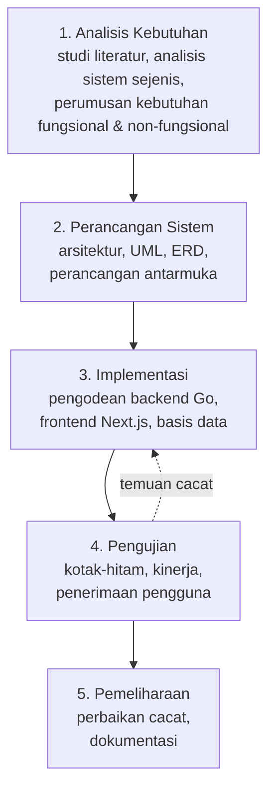

Panah putus-putus dari tahap Pengujian kembali ke Implementasi menunjukkan iterasi perbaikan cacat yang benar-benar terjadi dalam penelitian ini dan dilaporkan pada Subbab 4.6.

**Uraian tiap tahap:**

| Tahap | Kegiatan | Luaran |
|---|---|---|
| 1. Analisis Kebutuhan | Studi literatur R24J, CSCW, dan LLM; analisis ASA24 & Intake24; perumusan kebutuhan | Tabel 3.2 & 3.3 |
| 2. Perancangan | Arsitektur sistem, *use case*, *activity*, *sequence*, *class diagram*, ERD, rancangan antarmuka | Gambar 3.2–3.10 |
| 3. Implementasi | Pengodean layanan Go (REST + WebSocket *hub*), antarmuka Next.js, migrasi basis data | Kode sumber, basis data |
| 4. Pengujian | Kotak-hitam, penelusuran *end-to-end*, kinerja, UAT | Tabel 4.5–4.12 |
| 5. Pemeliharaan | Perbaikan cacat temuan, dokumentasi teknis | Tabel 4.9 |

## 3.2 Populasi dan Sampel

### 3.2.1 Populasi Penelitian

Populasi penelitian dibagi menjadi tiga kelompok sesuai peran dalam sistem:

1. **Populasi responden survei** — individu dewasa berusia ≥ 17 tahun yang mampu mengoperasikan peramban web dan bersedia melaporkan asupan makanannya. `[⚠ SESUAIKAN: sebutkan populasi konkret, misalnya "mahasiswa Program Studi X Universitas Y angkatan 2022–2025 berjumlah N orang"]`
2. **Populasi pendamping/enumerator** — mahasiswa atau tenaga gizi yang berperan mendampingi pengisian secara jarak jauh. `[⚠ SESUAIKAN]`
3. **Populasi administrator** — pengelola basis data pangan dan survei. `[⚠ SESUAIKAN]`

### 3.2.2 Sampel Penelitian

| Kelompok | Jumlah minimal | Dasar penentuan |
|---|---|---|
| Responden survei (UAT) | 20 orang | Ambang lazim agar skor SUS stabil; Sauro & Lewis merekomendasikan n ≥ 20 untuk estimasi rerata yang memadai |
| Pendamping/enumerator | 5 orang | Pengujian fitur kolaborasi memerlukan minimal 2 peserta per sesi; 5 memungkinkan variasi kombinasi peran |
| Administrator | 3 orang | Cukup untuk menguji seluruh modul CRUD dan CMS anotasi |
| Ahli gizi (penilai keluaran AI) | 2–3 orang | Memungkinkan perhitungan kesepakatan antar-penilai |

`[⚠ SESUAIKAN jumlah sebenarnya setelah pengambilan data]`

### 3.2.3 Teknik Pengambilan Sampel

Teknik yang digunakan adalah ***purposive sampling***, yaitu pemilihan sampel berdasarkan kriteria tertentu yang relevan dengan tujuan penelitian. Kriteria inklusi:

- **Responden:** berusia ≥ 17 tahun; memiliki perangkat dengan peramban modern dan koneksi internet; bersedia mengisi *recall* minimal satu kali; menandatangani lembar persetujuan (*informed consent*).
- **Pendamping:** memiliki latar belakang gizi atau pernah mengikuti pelatihan R24J; mampu mengoperasikan aplikasi web.
- **Ahli gizi penilai:** berlatar pendidikan minimal S1 Gizi dan memiliki pengalaman praktik `[⚠ SESUAIKAN kriteria]`.

Kriteria eksklusi: peserta yang tidak menyelesaikan seluruh rangkaian tugas pengujian, dan peserta dengan gangguan yang menghalangi penggunaan antarmuka web tanpa alat bantu yang tersedia.

## 3.3 Alat dan Bahan Penelitian

**Tabel 3.1 Alat dan bahan penelitian**

| Kategori | Komponen | Spesifikasi/Versi | Fungsi |
|---|---|---|---|
| Perangkat keras | Komputer pengembangan | `[⚠ ISI spesifikasi: prosesor, RAM, sistem operasi]` | Pengodean dan pengujian |
| | Perangkat uji | Laptop dan telepon pintar `[⚠ ISI]` | Uji responsivitas & UAT |
| Perangkat lunak — antarmuka | Next.js (App Router) | Terbaru | Kerangka kerja aplikasi web |
| | React + TypeScript | — | Pustaka antarmuka & bahasa bertipe |
| | Tailwind CSS | v4 | Penataan gaya berbasis *design token* |
| | Zustand | v5 | Pengelolaan keadaan kolaborasi |
| | TanStack Query | — | Pengelolaan keadaan server |
| | Zod + React Hook Form | — | Validasi formulir admin |
| | lucide-react | — | Pustaka ikon |
| Perangkat lunak — layanan | Go | 1.21 | Bahasa pemrograman layanan |
| | Gin | 1.9.1 | Kerangka kerja HTTP |
| | gorilla/websocket | 1.5.3 | Implementasi WebSocket |
| | GORM + driver MySQL | 1.30 / 1.5.7 | Pemetaan objek-relasional |
| | golang-jwt/jwt | v5 | Autentikasi berbasis token |
| Basis data | MySQL | 8.x, InnoDB, utf8mb4 | Penyimpanan data |
| Layanan eksternal | Groq API | Model `llama3-8b-8192` | Pembangkitan rekomendasi gizi |
| Perkakas | Visual Studio Code, Git, Postman | — | Pengodean, versi, uji API |
| Bahan | Tabel komposisi pangan | `[⚠ SEBUTKAN sumber: TKPI/DKBM]` | Sumber nilai gizi |
| | Foto porsi *as served* | `[⚠ SEBUTKAN sumber & jumlah]` | Estimasi porsi |
| | Instrumen SUS | Brooke (1996), 10 butir | Pengukuran kebergunaan |

## 3.4 Metode Pengumpulan Data

| Teknik | Sumber | Data yang diperoleh | Tahap |
|---|---|---|---|
| Studi literatur | Artikel jurnal, dokumentasi resmi, RFC | Landasan teori, celah penelitian, praktik baku | 1 |
| Analisis sistem sejenis | ASA24, Intake24 | Perbandingan fitur (Tabel 2.1) | 1 |
| Observasi & pengujian mandiri | Sistem yang dibangun | Hasil uji kotak-hitam, temuan cacat | 4 |
| Instrumentasi perangkat lunak | *Log* aplikasi, tabel `ai_result_logs`, `/collab/stats` | Latensi, jumlah token, *throughput* | 4 |
| Kuesioner | Responden & pendamping | Skor SUS, umpan balik kualitatif | 4 |
| Penilaian pakar | Ahli gizi | Kelayakan klinis keluaran LLM | 4 |

Catatan metodologis: sebagian data kinerja **tidak memerlukan instrumentasi tambahan** karena sistem sudah merekamnya secara rutin — tabel `ai_result_logs` menyimpan `model_used`, `token_used`, dan `latency_ms` untuk setiap analisis yang benar-benar dijalankan, sehingga evaluasi dapat dilakukan terhadap keluaran yang sungguh diterima responden.

## 3.5 Analisis Kebutuhan

### 3.5.1 Kebutuhan Fungsional

**Tabel 3.2 Kebutuhan fungsional sistem**

| Kode | Kebutuhan | Aktor | Prioritas |
|---|---|---|---|
| F-01 | Sistem dapat mendaftarkan dan mengautentikasi pengguna dengan peran admin atau responden | Semua | Wajib |
| F-02 | Sistem dapat menampilkan daftar survei berstatus aktif | Responden | Wajib |
| F-03 | Sistem dapat mendaftarkan responden sebagai partisipan survei dan menerbitkan token akses | Responden | Wajib |
| F-04 | Sistem dapat menampilkan pilihan waktu makan sesuai konfigurasi survei beserta jam bawaan | Responden | Wajib |
| F-05 | Sistem dapat mencari makanan dan minuman berdasarkan kata kunci minimal tiga karakter | Responden | Wajib |
| F-06 | Sistem dapat mencatat makanan yang tidak ditemukan di basis data sebagai catatan manual | Responden | Wajib |
| F-07 | Sistem dapat menampilkan foto porsi *as served* beserta beratnya dan menerima pilihan responden | Responden | Wajib |
| F-08 | Sistem dapat menerima masukan berat porsi manual dengan batas maksimal 5.000 gram | Responden | Wajib |
| F-09 | Sistem dapat mencatat bahan tambahan beserta takaran dan satuannya | Responden | Opsional |
| F-10 | Sistem dapat menghitung nilai gizi per porsi dan total harian untuk energi, protein, karbohidrat, dan lemak | Sistem | Wajib |
| F-11 | Sistem dapat menampilkan ringkasan laporan sebelum pengiriman | Responden | Wajib |
| F-12 | Sistem dapat memvalidasi kelengkapan laporan sebelum pengiriman | Sistem | Wajib |
| F-13 | Sistem dapat menyimpan laporan *recall* ke basis data | Sistem | Wajib |
| F-14 | Sistem dapat menyimpan progres pengisian sehingga tidak hilang saat halaman dimuat ulang | Sistem | Wajib |
| F-15 | Sistem dapat membuat ruang kolaborasi untuk sesi *recall* | Sistem | Wajib |
| F-16 | Sistem dapat menampilkan daftar peserta yang sedang aktif di ruang | Semua | Wajib |
| F-17 | Sistem dapat menampilkan kursor peserta lain secara real-time | Semua | Wajib |
| F-18 | Sistem dapat menyelaraskan posisi gulir, halaman, **dan langkah *wizard*** peserta yang diikuti | Semua | Wajib |
| F-19 | Sistem dapat menerbitkan tautan undangan berperan *editor* atau *viewer* dengan masa berlaku terbatas | Pemilik ruang | Wajib |
| F-20 | Sistem dapat mencegah peserta berperan *viewer* mengubah data melalui antarmuka, klien, maupun server | Sistem | Wajib |
| F-21 | Sistem dapat menampilkan umpan aktivitas peserta di ruang | Semua | Opsional |
| F-22 | Sistem dapat mengunci entitas yang sedang disunting dan menampilkan penyuntingnya | Admin | **Tidak jadi lingkup v1** ⚠ |
| F-23 | Sistem dapat menjalankan analisis gizi berbasis LLM atas satu laporan | Responden | Wajib |
| F-24 | Sistem dapat menyimpan hasil analisis beserta model, jumlah token, dan latensi | Sistem | Wajib |
| F-25 | Sistem dapat menyajikan hasil analisis tersimpan tanpa memanggil ulang LLM | Sistem | Wajib |
| F-26 | Sistem dapat menangani keluaran LLM yang tidak sesuai skema tanpa merusak halaman | Sistem | Wajib |
| F-27 | Sistem dapat mengelola (CRUD) survei beserta konfigurasi waktu makannya | Admin | Wajib |
| F-28 | Sistem dapat mengelola (CRUD) makanan, kategori, dan zat gizi | Admin | Wajib |
| F-29 | Sistem dapat mengelola set foto porsi *as served* beserta berat gramnya | Admin | Wajib |
| F-30 | Sistem dapat menganotasi foto makanan dengan poligon area dan menautkannya ke entri makanan | Admin | Wajib |
| F-31 | Sistem dapat menerbitkan dan menarik terbit anotasi (siklus *draft*–*published*) | Admin | Wajib |
| F-32 | Sistem dapat menampilkan dan mengekspor daftar *submission* per survei | Admin | Wajib |
| F-33 | Sistem dapat menyimpan progres penyuntingan anotasi secara otomatis (*autosave*) | Admin | Wajib |

> **Catatan status F-22.** Kebutuhan penguncian entitas **tidak diwujudkan sebagai fitur v1**. Mekanismenya tersedia pada lapis layanan (`LockManager` di sisi Go dan tipe pesan `db_edit_*` pada protokol) serta komponen penanda `LockIndicator` di sisi antarmuka, namun **belum ada satu pun halaman portal admin yang mengaktifkannya** — sesi kolaborasi (`CollabSession`) hanya dipasang pada halaman *recall* dan pencarian makanan. F-22 karena itu dinyatakan sebagai kebutuhan yang teridentifikasi tetapi ditangguhkan, dan dicatat pada Subbab 5.2.1 sebagai saran pengembangan. Kebutuhan ini **tidak** disertakan dalam perhitungan tingkat keberhasilan pengujian pada Subbab 4.2.

### 3.5.2 Kebutuhan Non-Fungsional

**Tabel 3.3 Kebutuhan non-fungsional sistem**

| Kode | Kategori | Kebutuhan | Kriteria keberhasilan |
|---|---|---|---|
| NF-01 | Kinerja | Latensi sinkronisasi kursor antar peserta | ≤ 300 ms pada jaringan lokal `[⚠ VERIFIKASI]` |
| NF-02 | Kinerja | Latensi sinkronisasi langkah *wizard* | ≤ 500 ms `[⚠ VERIFIKASI]` |
| NF-03 | Kinerja | Sistem menahan beban pesan tanpa kehilangan data | Tidak ada *drop* pada ≤ 50 pesan/detik/klien |
| NF-04 | Kinerja | Waktu tanggap analisis LLM | ≤ 60 detik (batas waktu klien) |
| NF-05 | Keandalan | Sistem memulihkan koneksi otomatis setelah putus | Rekoneksi berhasil dengan *backoff* maksimal 30 detik |
| NF-06 | Keandalan | Progres pengisian tidak hilang saat halaman dimuat ulang | Sesi bertahan hingga 24 jam |
| NF-07 | Keandalan | Kegagalan analisis LLM tidak merusak alur utama | Halaman hasil tetap tampil dengan pesan galat |
| NF-08 | Keamanan | Seluruh *endpoint* selain publik memerlukan autentikasi | 401 untuk permintaan tanpa token |
| NF-09 | Keamanan | Peran *viewer* tidak dapat mengubah data melalui jalur mana pun | Ditolak pada tiga lapis |
| NF-10 | Keamanan | Peran tidak dapat dinaikkan melalui navigasi ulang tanpa parameter undangan | Peran diingat server per pengguna |
| NF-11 | Kebergunaan | Sistem memperoleh skor SUS kategori *acceptable* | Skor ≥ 68 `[⚠ VERIFIKASI]` |
| NF-12 | Kebergunaan | Antarmuka dapat digunakan pada layar telepon pintar | Tidak ada gulir horizontal pada lebar 360 px |
| NF-13 | Aksesibilitas | Kontrol yang dinonaktifkan tetap terbaca pembaca layar sebagai nonaktif | Atribut `aria-disabled`/`inert` terpasang |
| NF-14 | Pemeliharaan | Kode terorganisasi per domain bisnis | Tidak ada ketergantungan melingkar antar domain |
| NF-15 | Pemeliharaan | Kode lolos pemeriksaan tipe dan *linter* | `tsc --noEmit` dan `eslint` bersih |

## 3.6 Perancangan Sistem

### 3.6.1 Arsitektur Sistem

**Gambar 3.2 Arsitektur sistem Atlas Food**

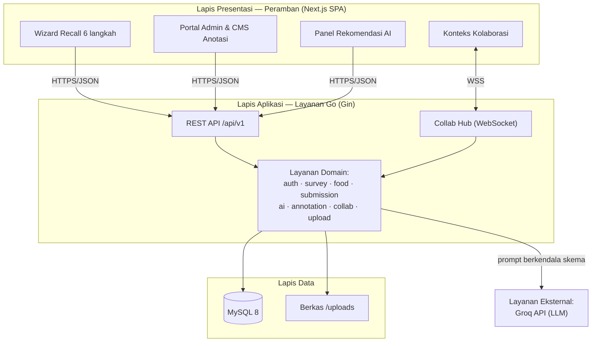

Sistem menerapkan arsitektur **tiga lapis** dengan pemisahan tegas antara presentasi, aplikasi, dan data. Layanan Go menyediakan dua kanal komunikasi dalam satu proses: REST untuk operasi permintaan–tanggapan dan WebSocket untuk komunikasi dua arah real-time.

Struktur kode kedua sisi disusun **per domain bisnis** (*domain-driven modular*), bukan per jenis berkas, sehingga setiap fitur dapat ditelusuri sebagai satu unit. Di sisi layanan, tiap domain memuat `model.go`, `dto.go`, `repository.go`, `service.go`, dan `handler.go`. Di sisi antarmuka, tiap domain memuat `components/`, `hooks/`, `services/`, `store/`, dan `types/`. Aturan ketergantungan bersifat searah: `app/` → `internal/domain/*` → `internal/lib|pkg`, tanpa ketergantungan melingkar antar domain (memenuhi NF-14).

### 3.6.2 *Use Case Diagram*

**Tabel 3.4 Definisi aktor sistem**

| Aktor | Deskripsi |
|---|---|
| Responden | Pengguna yang mengisi laporan *recall* atas dirinya sendiri |
| Pendamping | Responden lain yang diundang ke ruang kolaborasi dengan peran *editor* atau *viewer* |
| Administrator | Pengelola survei, basis data pangan, dan aset anotasi |
| Sistem LLM | Aktor sistem eksternal yang menghasilkan rekomendasi gizi |

**Gambar 3.3 *Use case diagram* sistem**

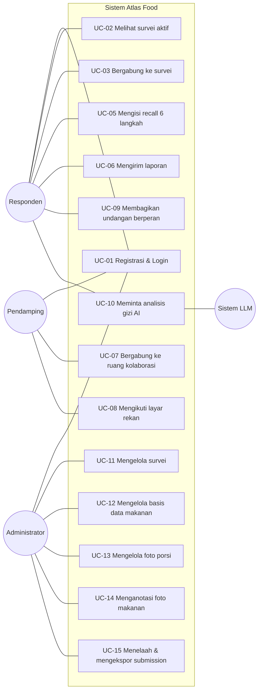

### 3.6.3 Skenario *Use Case*

**Tabel 3.5 Skenario *use case* UC-05 (Mengisi recall)**

| Bagian | Uraian |
|---|---|
| **Kode / Nama** | UC-05 / Mengisi *recall* enam langkah |
| **Aktor** | Responden |
| **Deskripsi** | Responden mencatat seluruh konsumsi pada satu waktu makan hingga siap dikirim |
| **Prakondisi** | Responden sudah masuk sebagai partisipan survei dan memiliki token akses |
| **Pascakondisi** | Laporan tersimpan di sesi lokal dan siap dikirim |
| **Alur utama** | 1. Sistem menampilkan pilihan waktu makan sesuai `meals_config`<br/>2. Responden memilih jenis waktu makan dan menyetel jam<br/>3. Sistem berpindah ke langkah tambah makanan<br/>4. Responden mengetik kata kunci minimal tiga karakter<br/>5. Sistem menampilkan hasil pencarian<br/>6. Responden memilih makanan; sistem menambahkannya ke daftar<br/>7. Responden mengulangi langkah 4–6 untuk seluruh item<br/>8. Sistem berpindah ke langkah porsi<br/>9. Responden memilih foto porsi atau mengisi berat manual untuk tiap makanan<br/>10. Sistem menghitung nilai gizi tiap porsi<br/>11. Responden mengisi bahan tambahan (opsional)<br/>12. Sistem menampilkan ringkasan dan total gizi harian<br/>13. Responden menekan "Kirim laporan" |
| **Alur alternatif A1** | Pada langkah 5, hasil pencarian kosong → sistem menawarkan pencatatan manual → item masuk `missing_foods` dan ditampilkan terpisah dengan penanda "tanpa nilai gizi" |
| **Alur alternatif A2** | Pada langkah 9, pemuatan foto porsi gagal → sistem menampilkan galat dan responden tetap dapat mengisi berat manual |
| **Alur alternatif A3** | Pada langkah 12, responden menekan "Tambah waktu makan" → sistem kembali ke langkah 1 dengan mempertahankan data waktu makan sebelumnya dan mengatur ulang indeks porsi |
| **Alur pengecualian E1** | Validasi gagal (tidak ada waktu makan terisi, atau ada porsi bernilai nol) → tombol kirim dinonaktifkan disertai pesan sebab |
| **Alur pengecualian E2** | Pengiriman ke server gagal → sistem menampilkan pesan galat dan mempertahankan seluruh isian |

**Tabel 3.6 Skenario *use case* UC-08 (Mengikuti layar rekan)**

| Bagian | Uraian |
|---|---|
| **Kode / Nama** | UC-08 / Mengikuti layar rekan (*follow mode*) |
| **Aktor** | Pendamping |
| **Deskripsi** | Pendamping menyelaraskan tampilannya dengan peserta lain, termasuk langkah *wizard* aktif |
| **Prakondisi** | Pendamping berada di ruang kolaborasi yang sama dan koneksi berstatus tersambung |
| **Pascakondisi** | Tampilan pendamping mengikuti halaman, posisi gulir, dan langkah pemimpin |
| **Alur utama** | 1. Pendamping menekan avatar peserta yang ingin diikuti<br/>2. Sistem mengirim `follow_user`<br/>3. *Hub* menetapkan pemimpin dan memberitahu kedua pihak melalui `follow_started`<br/>4. *Hub* menyiarkan `follow_state` ke seluruh ruang<br/>5. *Hub* mengirim *viewport* terakhir pemimpin yang tersimpan<br/>6. Sistem memindahkan pendamping ke halaman, posisi gulir, dan **langkah** pemimpin<br/>7. Setiap perubahan pemimpin dikirim sebagai `viewport_update` dan diteruskan sebagai `viewport_sync` hanya kepada pengikutnya |
| **Alur alternatif A1** | Pendamping menekan "Stop following" → sistem mengirim `unfollow_user` dan penyelarasan berhenti |
| **Alur alternatif A2** | Pemimpin meninggalkan ruang → sistem menghapus status ikut dan mengosongkan *viewport* pemimpin |
| **Alur pengecualian E1** | Pendamping mencoba mengikuti dirinya sendiri → permintaan ditahan di klien sebelum dikirim |
| **Alur pengecualian E2** | Pengguna target tidak ada di ruang → *hub* mengirim galat `NOT_FOUND` |
| **Aturan khusus** | Selama mengikuti, pendamping berhenti menyiarkan kursor dan pencariannya sendiri, serta tidak memantulkan balik langkah pemimpin, untuk mencegah *loop* pemantulan |

`[⚠ LENGKAPI skenario untuk UC-01 s.d. UC-15 dengan format yang sama bila pembimbing meminta seluruhnya]`

### 3.6.4 *Activity Diagram*

**Gambar 3.4 *Activity diagram* pengisian recall**

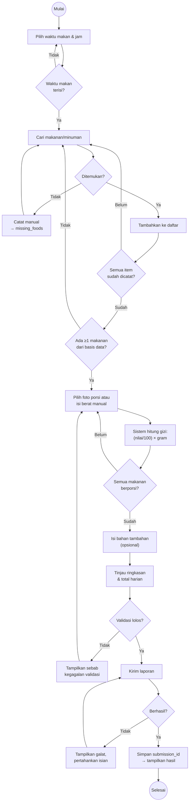

**Gambar 3.5 *Activity diagram* sesi kolaborasi**

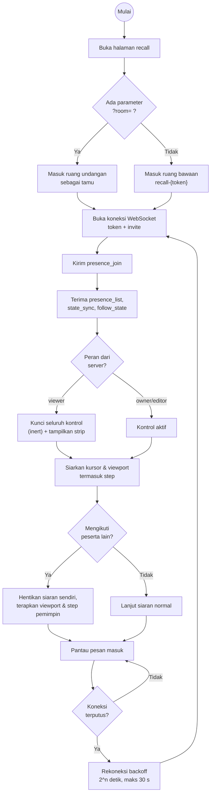

### 3.6.5 *Sequence Diagram*

**Gambar 3.6 *Sequence diagram* pengisian hingga analisis AI**

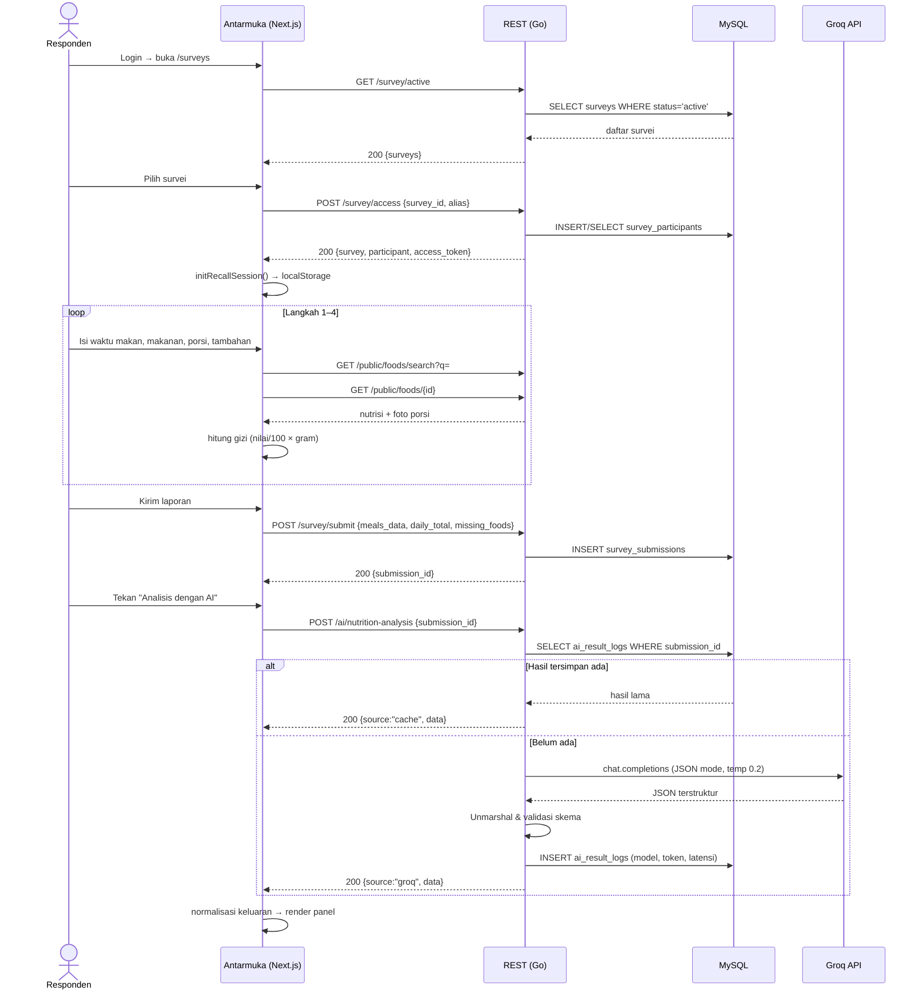

**Gambar 3.7 *Sequence diagram* mode ikut dan sinkronisasi langkah**

```mermaid
sequenceDiagram
    participant P as Pendamping (pengikut)
    participant H as Collab Hub
    participant R as Responden (pemimpin)

    Note over P,R: Keduanya sudah tersambung ke ruang yang sama
    P->>H: follow_user {user_id: R}
    H->>H: set FollowingUserID
    H-->>P: follow_started {leader_id, leader_name, leader_color}
    H-->>R: follow_started (pemberitahuan diikuti)
    H-->>P: follow_state (snapshot graf ikut)
    H-->>R: follow_state
    H-->>P: viewport_sync (viewport tersimpan terakhir, termasuk step)
    P->>P: Terapkan halaman + gulir + goToStep(step)

    Note over R: Responden berpindah dari langkah 2 ke 3
    R->>H: viewport_update {page, path, scroll, step:"portion"}
    H->>H: Simpan Viewport terakhir R (replace)
    H-->>P: viewport_sync {…, step:"portion"}
    P->>P: Validasi step terhadap daftar langkah sah
    P->>P: goToStep("portion")

    Note over R: Responden menggulir halaman
    R->>H: viewport_update {scroll, step:"portion"}
    Note right of R: step WAJIB disertakan;<br/>tanpa itu viewport tersimpan<br/>kehilangan jejak langkah
    H-->>P: viewport_sync
    P->>H: unfollow_user
    H-->>P: follow_stopped
```

### 3.6.6 Diagram Keadaan *Wizard*

**Gambar 3.10 Diagram keadaan *wizard* enam langkah**

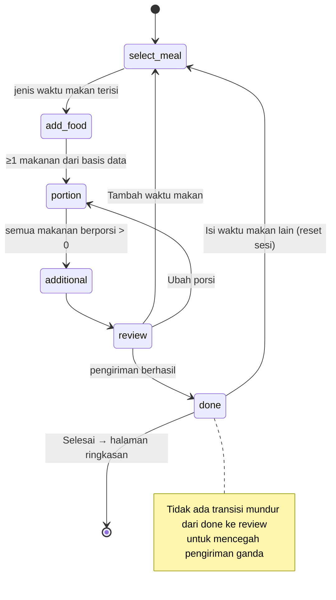

Pemetaan enam langkah ini terhadap metode lintasan berganda (Subbab 2.1): langkah 1–2 setara lintasan daftar cepat dan penggalian item terlupakan; langkah 3 setara lintasan rincian porsi; langkah 4 setara penggalian bahan; langkah 5 setara tinjauan akhir.

### 3.6.7 *Class Diagram*

**Gambar 3.8 *Class diagram* domain inti**

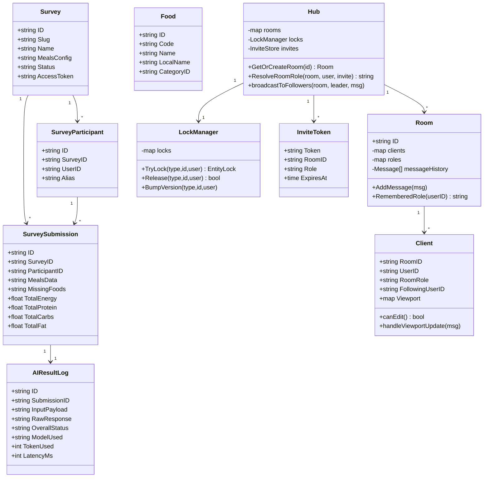

### 3.6.8 Perancangan Basis Data

**Gambar 3.9 *Entity Relationship Diagram***

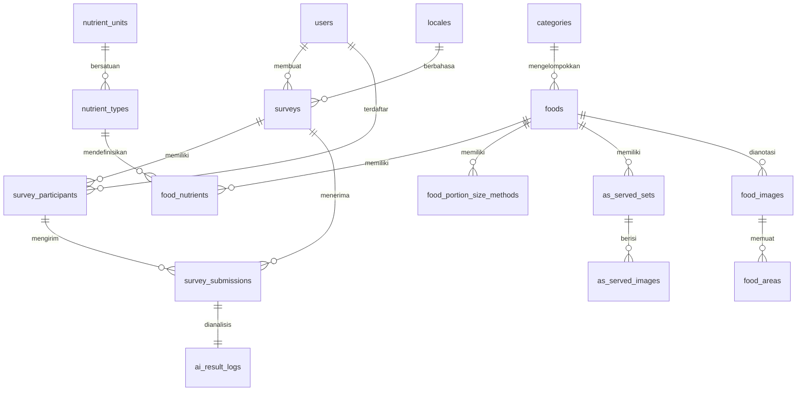

**Tabel 3.7 Struktur tabel basis data (ringkas)**

| Tabel | Kolom kunci | Keterangan |
|---|---|---|
| `users` | `id`, `email`, `password_hash`, `role` | `role` ∈ {admin, respondent} |
| `surveys` | `id`, `slug`, `meals_config` (JSON), `status`, `access_token`, `created_by` | `meals_config` menentukan pilihan waktu makan pada langkah 1 |
| `survey_participants` | `id`, `survey_id`, `user_id`, `alias` | Menautkan pengguna ke survei |
| `survey_submissions` | `id`, `survey_id`, `participant_id`, `meals_data` (JSON), `missing_foods` (JSON), `total_*` | Laporan *recall* final |
| `ai_result_logs` | `id`, `submission_id` (**UNIQUE**), `input_payload`, `raw_response`, `overall_status`, `model_used`, `token_used`, `latency_ms` | Hasil analisis + jejak audit |
| `categories` | `id`, `code`, `name`, `display_order` | Kategori makanan |
| `foods` | `id`, `code`, `name`, `local_name`, `category_id` | Indeks **FULLTEXT** pada (`name`, `local_name`) |
| `nutrient_types`, `nutrient_units`, `food_nutrients` | — | Nilai gizi per 100 g |
| `food_portion_size_methods` | `food_id`, `method_type`, `config` (JSON) | `method_type` ∈ {as_served, guide_image, weight} |
| `as_served_sets`, `as_served_images` | `set_id`, `weight_gram`, `image_url` | Aset foto porsi |
| `food_images`, `food_areas` | poligon, status draft/published | CMS anotasi |
| `locales` | `code`, `name` | Multi-bahasa (id, en) |

**Justifikasi penggunaan kolom JSON.** Struktur satu laporan *recall* bersifat bersarang dan variatif: jumlah waktu makan, makanan, dan bahan tambahan berbeda tiap responden. Normalisasi penuh akan menghasilkan banyak tabel dengan *join* dalam untuk satu kali baca, padahal laporan **selalu dibaca sebagai satu kesatuan** dan tidak pernah dikueri per baris makanan. Total gizi tetap didenormalisasi ke kolom numerik agar agregasi lintas responden tetap murah. Konsekuensi metodologis yang menguntungkan: nilai gizi yang tersimpan merupakan *snapshot* pada saat pengisian, sehingga perubahan basis data makanan di kemudian hari tidak mengubah laporan historis.

### 3.6.9 Perancangan Antarmuka

`[⚠ LAMPIRKAN wireframe/mockup untuk: (1) halaman daftar survei, (2) enam layar wizard, (3) bilah kolaborasi + avatar kehadiran, (4) modal berbagi undangan, (5) panel rekomendasi AI, (6) dasbor admin, (7) editor anotasi]`

Prinsip perancangan antarmuka yang diterapkan:

1. **Satu keputusan per layar.** Setiap langkah *wizard* meminta satu jenis keputusan untuk menekan beban kognitif responden.
2. **Progres selalu terlihat.** Bilah progres, penomoran langkah, dan bilah samping menunjukkan posisi responden dalam alur.
3. **Umpan balik segera atas kegagalan.** Pencarian yang gagal, pemuatan porsi yang gagal, dan validasi yang tidak lolos ditampilkan sebagai pesan spesifik — bukan kegagalan senyap.
4. **Kolaborasi tidak mengganggu.** Elemen kolaborasi ditempatkan pada bilah terpisah di atas konten agar tidak menutupi alur pengisian.
5. **Keadaan terkunci terbaca jelas.** Peserta *viewer* memperoleh strip penjelas dan tampilan meredup, bukan kontrol yang diam-diam tidak berfungsi.

## 3.7 Teknik Pengujian

**Tabel 3.8 Instrumen pengujian dan teknik analisis**

| Jenis pengujian | Instrumen | Responden/Objek | Teknik analisis |
|---|---|---|---|
| Kotak-hitam | Tabel kasus uji berbasis kebutuhan fungsional F-01…F-32 | Sistem | Persentase kasus uji berstatus "Sesuai" |
| Penelusuran *end-to-end* | Skenario alur lengkap responden dan pendamping | Sistem | Klasifikasi cacat berdasarkan jenis |
| Kinerja real-time | Instrumentasi waktu pada klien dan `/collab/stats` | 2, 5, 10, 20 klien | Statistik deskriptif: rerata, p50, p95 |
| Penerimaan pengguna | Kuesioner SUS 10 butir | ≥ 20 responden, ≥ 5 pendamping | Perhitungan skor SUS |
| Penilaian pakar | Lembar penilaian keluaran LLM | 2–3 ahli gizi | Rerata skor Likert + kesepakatan antar-penilai |

### 3.7.1 Pengujian Kotak-Hitam

Pengujian kotak-hitam menguji sistem dari sisi masukan dan keluaran tanpa memeriksa struktur internal. Setiap kebutuhan fungsional diturunkan menjadi satu atau lebih kasus uji dengan format: kode, skenario, masukan, hasil yang diharapkan, hasil yang diperoleh, dan status (Sesuai/Tidak Sesuai). Rancangan kasus uji disajikan pada Subbab 4.5.

Tingkat keberhasilan dihitung dengan:

$$\text{Tingkat keberhasilan} = \frac{\text{jumlah kasus uji berstatus Sesuai}}{\text{jumlah seluruh kasus uji}} \times 100\%$$

### 3.7.2 Pengujian Kinerja

Metrik yang diukur dan definisi operasionalnya:

| Metrik | Definisi operasional | Cara ukur |
|---|---|---|
| Latensi kursor | Selisih waktu antara `cursor_move` dikirim pemimpin dan `cursor_update` dirender pengikut | Sisipkan `t_send` pada muatan; catat `performance.now()` saat render |
| Latensi sinkronisasi langkah | Selisih waktu antara pemimpin berpindah langkah dan pengikut berada di langkah sama | Instrumentasi `viewport_update` → `goToStep` |
| *Throughput* *hub* | Pesan per detik yang dilayani tanpa *drop* | `/collab/stats` + penghitung *drop* pada buffer kirim |
| Skalabilitas | Latensi p50/p95 pada 2, 5, 10, 20 klien serentak | Klien sintetis WebSocket |
| Efektivitas *batching* | Rasio pesan kursor masuk terhadap pesan tersiar | Bandingkan penghitung sebelum dan sesudah *coalescing* |
| Waktu pemulihan | Waktu hingga status kembali "tersambung" setelah pemutusan paksa | Simulasi putus jaringan |

Rancangan pembanding yang digunakan adalah **dengan dan tanpa mekanisme *batching* + *coalescing*** pada beban identik. Rancangan ini menghasilkan klaim yang dapat dipertahankan tanpa perlu membandingkan dengan produk pihak ketiga yang kondisi ujinya tidak dapat dikendalikan.

### 3.7.3 Pengujian Penerimaan Pengguna

Instrumen yang digunakan adalah *System Usability Scale* (SUS) yang dikembangkan Brooke (1996), terdiri atas 10 pernyataan dengan skala Likert 1–5. Butir bernomor ganjil bernada positif dan bernomor genap bernada negatif.

Perhitungan skor:
1. Butir ganjil: skor = (nilai jawaban − 1)
2. Butir genap: skor = (5 − nilai jawaban)
3. Skor SUS = (jumlah seluruh skor) × 2,5

**Tabel 3.9 Interpretasi skor SUS**

| Rentang skor | Predikat | Tingkat penerimaan |
|---|---|---|
| > 80,3 | A — Excellent | Acceptable |
| 68–80,3 | B — Good | Acceptable |
| 68 | C — Okay | Marginal |
| 51–67 | D — Poor | Marginal |
| < 51 | F — Awful | Not acceptable |

Instrumen SUS versi bahasa Indonesia yang digunakan dilampirkan pada Lampiran B.

### 3.7.4 Pengujian Keluaran LLM

Tiga aspek diuji:

1. **Validitas skema** — persentase respons yang lolos penguraian JSON tanpa perbaikan, dari N laporan uji.
2. **Konsistensi** — laporan identik dianalisis ulang M kali dengan penyimpanan hasil dinonaktifkan; diukur kesamaan `overall_status` dan tumpang tindih `recommended_foods` menggunakan indeks Jaccard.
3. **Kelayakan klinis** — panel ahli gizi menilai relevansi dan keamanan rekomendasi pada skala Likert; kesepakatan antar-penilai dihitung dengan Cohen's/Fleiss' κ.

## 3.8 Jadwal Penelitian

**Tabel 3.10 Jadwal penelitian**

| No | Kegiatan | Bulan 1 | Bulan 2 | Bulan 3 | Bulan 4 | Bulan 5 | Bulan 6 |
|---|---|---|---|---|---|---|---|
| 1 | Studi literatur & analisis kebutuhan | ██ | ██ | | | | |
| 2 | Perancangan sistem | | ██ | ██ | | | |
| 3 | Implementasi backend | | | ██ | ██ | | |
| 4 | Implementasi frontend | | | ██ | ██ | ██ | |
| 5 | Pengujian kotak-hitam & perbaikan | | | | | ██ | |
| 6 | Pengujian kinerja & UAT | | | | | ██ | ██ |
| 7 | Penyusunan laporan | | | | ██ | ██ | ██ |

`[⚠ SESUAIKAN dengan jadwal sebenarnya]`

---
---

# BAB IV HASIL DAN PEMBAHASAN

## 4.1 Hasil Implementasi Sistem

Sistem berhasil diimplementasikan sesuai rancangan pada BAB III. Verifikasi teknis yang telah dijalankan: pemeriksaan tipe `tsc --noEmit` tanpa galat, proses `next build` berhasil, dan pemeriksaan `eslint` bersih pada seluruh berkas modul *recall*, kolaborasi, dan AI — memenuhi NF-15.

### 4.1.1 Implementasi Modul Responden

Modul ini diwujudkan sebagai *wizard* enam langkah dalam satu rute (`/surveys/{accessToken}/recall`) dengan keadaan langkah dikelola oleh *hook* `useRecallSession`.

**Pengelolaan keadaan.** Seluruh keadaan sesi disimpan dalam satu objek `RecallSession` yang memuat identitas survei, langkah aktif, waktu makan aktif, indeks porsi, daftar waktu makan beserta makanannya, daftar makanan yang tidak ditemukan, dan `submission_id`. Setiap mutasi menulis ulang objek tersebut ke `localStorage` dalam *envelope* `{savedAt, session}` ber-TTL 24 jam (memenuhi F-14 dan NF-06).

**Perhitungan gizi (F-10).** Diimplementasikan secara deterministik:

```
nilai_gizi_porsi = (nilai_per_100g ÷ 100) × berat_porsi_gram
```

dibulatkan satu desimal, kemudian diakumulasi menjadi total per waktu makan dan total harian.

**Validasi (F-12).** Tiga aturan ditegakkan sebelum pengiriman: `survey_id` harus ada; minimal satu waktu makan berisi makanan; seluruh makanan pada waktu makan terisi wajib memiliki `portion_gram > 0`.

`[⚠ LAMPIRKAN Gambar 4.3–4.8: tangkapan layar keenam langkah wizard]`

### 4.1.2 Implementasi Modul Kolaborasi

**Gambar 4.1 Topologi *hub*–*room*–*client***

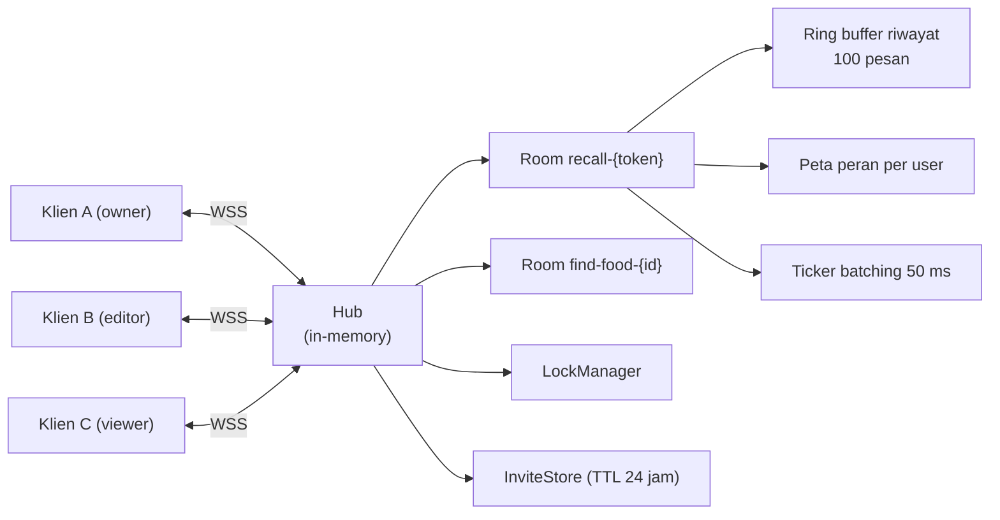

**Tabel 4.2 Protokol pesan WebSocket**

| Arah | Tipe pesan | Muatan utama | Mutasi data |
|---|---|---|---|
| K→S | `presence_join` | `user_id`, `display_name`, `role` | Tidak |
| K→S | `cursor_move` | `x`, `y`, `scroll_x`, `scroll_y`, `page` | Tidak |
| K→S | `viewport_update` | `page`, `path`, `scroll_x`, `scroll_y`, **`step`**, `zoom` | Tidak |
| K→S | `follow_user` / `unfollow_user` | `user_id` | Tidak |
| K→S | `food_search` | `query`, `filters` | **Ya** |
| K→S | `food_select` | `food_id`, `food_name` | **Ya** |
| K→S | `meal_add` | `meal_type`, `food_id`, `food_name` | **Ya** |
| K→S | `portion_set` | `food_id`, `portion_gram`, `image_label` | **Ya** |
| K→S | `review_submit` | `survey_id` | **Ya** |
| K→S | `db_edit_start/field/save/cancel` ⚠ | `entity_type`, `entity_id`, `version` | **Ya** |
| K→S | `get_history`, `ping` | — | Tidak |
| S→K | `presence_list`, `presence_joined`, `presence_left` | daftar/identitas peserta | — |
| S→K | `cursor_update`, `viewport_sync` | posisi, halaman, **langkah** | — |
| S→K | `follow_started`, `follow_stopped`, `follow_state` | relasi pemimpin–pengikut | — |
| S→K | `food_search_shared`, `food_selected`, `meal_updated`, `portion_updated` | siaran aktivitas | — |
| S→K | `db_locked`, `db_unlocked`, `db_edit_saved` | status kunci entitas | — |
| S→K | `state_sync`, `history`, `activity_log`, `error`, `pong` | sinkronisasi & sistem | — |

⚠ Tipe pesan `db_edit_*` beserta pasangannya `db_locked`/`db_unlocked`/`db_edit_saved` **tersedia dan tertangani pada protokol maupun *hub*, tetapi belum ada klien yang mengirimkannya** pada versi 1 karena penguncian entitas belum diintegrasikan ke portal admin (catatan status F-22, Subbab 3.5.1).

**Tabel 4.3 Parameter kendali transport real-time**

| Mekanisme | Nilai | Justifikasi |
|---|---|---|
| Batas ukuran pesan | 64 KB | Menolak muatan abnormal |
| Batas laju | 50 pesan/detik/klien | Melindungi *hub* dari banjir pesan (NF-03) |
| *Batching* | *Ticker* 50 ms; *flush* paksa pada 50 pesan antre | Meredam frekuensi tinggi kursor/*viewport* |
| *Coalescing* kursor | Hanya posisi terakhir per pengguna dikirim | Membuang bingkai antara |
| Riwayat | *Ring buffer* 100 pesan; kursor & `viewport_sync` tidak dicatat | Mencegah riwayat dibanjiri |
| *Heartbeat* | Klien `ping` tiap 25 s; server `pongWait` 60 s | Deteksi koneksi mati |
| Rekoneksi | *Backoff* `2^n` detik, batas 30 s | Mencegah badai rekoneksi (NF-05) |
| Buffer kirim | 256 pesan/klien; kelebihan di-*drop* dan dicatat | Klien lambat tidak memblokir *hub* |
| Pembersihan ruang | *Ticker* 30 detik menghapus ruang kosong | Mencegah kebocoran memori |

**Implementasi sinkronisasi langkah (F-18, kontribusi K-1).** Tiga persoalan diselesaikan:

1. *Path* pemimpin disalin ke pengikut, tetapi parameter `room` dan `invite` milik pengikut dipertahankan; navigasi memakai `router.replace` agar riwayat peramban pengikut tidak menumpuk.
2. Langkah aktif disiarkan sebagai atribut `step`, disimpan server sebagai bagian *viewport* terakhir pemimpin, dan diterapkan pengikut setelah divalidasi terhadap daftar langkah yang sah — nilai `step` dari jaringan tidak pernah dipercaya mentah.
3. Karena server menyimpan *viewport* secara *replace* dan bukan *merge*, **setiap** `viewport_update` wajib menyertakan `step`. Langkah aktif karena itu disimpan pada *store* kolaborasi dan dibaca oleh seluruh pengirim, termasuk yang dipicu peristiwa gulir dan ubah ukuran.

**Implementasi otorisasi berlapis (F-20, kontribusi K-2).**

**Tabel 4.4 Penegakan peran berlapis tiga**

| Lapis | Mekanisme | Sifat |
|---|---|---|
| 1 — Antarmuka | Komponen `ViewerLock` membungkus isi setiap langkah dengan atribut `inert`, mengeluarkan seluruh subpohon dari urutan tab, peristiwa penunjuk, dan pohon aksesibilitas sekaligus | Preventif |
| 2 — Klien | Fungsi `send()` menyaring himpunan tipe pesan mutasi; bila berada dalam ruang dan peran belum diketahui server, pengiriman **ditahan** (*fail-closed*) | Preventif |
| 3 — Server | `Client.canEdit()` menolak pesan mutasi dari peran `viewer` | Otoritatif |

Pemilihan atribut `inert` dan bukan `pointer-events: none` didasari kenyataan bahwa `pointer-events` hanya memblokir tetikus, sementara navigasi papan ketik, pengisian otomatis, dan pembaca layar masih dapat menembusnya (sekaligus memenuhi NF-13).

**Ketahanan peran (NF-10).** Ruang mengingat peran per-`user_id`. Tanpa mekanisme ini, peserta *viewer* yang berpindah halaman — sehingga parameter `invite` hilang dari URL — akan naik menjadi `editor` pada koneksi berikutnya. Selain itu, tab kedua milik pengguna yang sama mewarisi peran tab pertama, dan *socket* lama tidak ditendang karena penendangan memicu siklus rekoneksi saling-tendang tanpa henti.

`[⚠ LAMPIRKAN Gambar 4.9–4.10: tangkapan layar bilah kolaborasi, avatar kehadiran, kursor peserta, dan modal berbagi undangan]`

### 4.1.3 Implementasi Modul AI

**Gambar 4.2 *Pipeline* analisis gizi LLM**

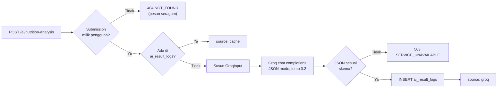

**Kendala skema.** *System prompt* mengunci peran model sebagai penganalisis gizi dan mewajibkan keluaran JSON yang cocok dengan skema tetap berisi `overall_status`, `overall_message`, `nutritional_analysis`, `ai_recommendation`, `recommended_foods`, `health_insight`, dan `suggested_activities`. Parameter: `temperature = 0,2`, `response_format = {"type":"json_object"}`, `max_tokens` bawaan 512.

**Pertahanan terhadap keluaran model (F-26).** Keluaran LLM diperlakukan sebagai masukan tidak tepercaya melalui tiga lapis: penguraian dan pemetaan galat ke 503 di server; normalisasi paksa tiap medan ke tipe aman di klien (array bukan-array menjadi `[]`, string bukan-string menjadi `""`, item tanpa label maupun deskripsi dibuang); serta pemetaan nilai status tak dikenal ke gaya visual netral.

**Penyimpanan hasil dan audit (F-24, F-25).** Kolom `submission_id` bersifat unik sehingga permintaan berulang dilayani dari basis data dengan penanda `source: "cache"`. Setiap analisis meninggalkan jejak `model_used`, `token_used`, dan `latency_ms`.

**Keputusan pemicuan manual.** Analisis dijalankan hanya atas penekanan tombol oleh responden, bukan otomatis. Alasannya: pemanggilan otomatis menahan responden pada layar pemuatan dan membakar kuota bagi responden yang tidak berminat, padahal analisis bukan syarat keberhasilan pengumpulan data.

`[⚠ LAMPIRKAN Gambar 4.11: tangkapan layar panel rekomendasi AI dalam keadaan belum dianalisis, memuat, berhasil, dan gagal]`

### 4.1.4 Implementasi Modul Admin

Portal admin mengimplementasikan F-27 sampai F-32 melalui enam kelompok rute: survei, makanan, kategori, set foto *as served*, metode porsi, dan anotasi.

**CMS anotasi (F-30, F-31, F-33).** Domain anotasi memisahkan aset gambar (`food_images`) dari area poligon (`food_areas`) dengan siklus *draft* → *published*. Operasi `PUT /{id}/areas` mengganti seluruh himpunan area sekaligus — operasi idempoten yang menjadi dasar mekanisme penyimpanan otomatis.

**Penyimpanan otomatis (F-33).** Editor anotasi dilengkapi *autosave* melalui *hook* `useAnnotationAutosave` dengan penanda status `AutosaveIndicator` yang menampilkan keadaan penyimpanan beserta waktu simpan terakhir; perubahan yang masih tertahan di antrean dipaksa tersimpan (`flush`) sebelum aksi penerbitan dijalankan. Rancangan ini penting karena penganotasian poligon merupakan pekerjaan panjang yang mudah hilang bila bergantung pada penyimpanan manual.

**Pemisahan draf dan terbitan.** *Endpoint* publik hanya menyajikan anotasi berstatus *published* — ditegakkan pada lapis repositori melalui `FindPublishedByID` dan `ListPublished` yang menyaring `status = published`, bukan sekadar disembunyikan di antarmuka.

`[⚠ LAMPIRKAN Gambar 4.12: tangkapan layar dasbor admin dan editor anotasi]`

**Tabel 4.1 Kontrak API sistem**

| Kelompok | Metode & *Endpoint* | Kebutuhan |
|---|---|---|
| Publik | `GET /public/foods/search`, `/public/foods/{id}`, `/public/categories`, `/public/categories/{code}/foods`, `/public/food-images/…` | F-05, F-07 |
| Autentikasi | `POST /auth/register`, `/auth/login`, `/auth/refresh`; `GET\|PATCH /auth/me` | F-01 |
| Responden | `GET /survey/active`; `POST /survey/access`; `GET /survey/{id}/info`; `POST /survey/submit` | F-02, F-03, F-13 |
| AI | `POST /ai/nutrition-analysis` | F-23 |
| Admin — survei | `/admin/surveys` (CRUD, `/clone`, `/regenerate-token`), `/admin/surveys/{id}/submissions`, `/export` | F-27, F-32 |
| Admin — pangan | `/admin/foods` (CRUD, `/portion-methods`, `/photos`), `/admin/categories`, `/admin/as-served-sets`, `/admin/portion-methods` | F-28, F-29 |
| Admin — anotasi | `/admin/food-images` (CRUD, `/areas`, `/publish`, `/unpublish`, `/export`) | F-30, F-31 |
| Kolaborasi | `GET /collab/rooms/{id}/ws`, `GET /collab/rooms/{id}`, `POST /collab/rooms/{id}/invite`, `DELETE /collab/invites/{token}`, `GET /collab/stats` | F-15, F-19 |

## 4.2 Hasil Pengujian Kotak-Hitam

> **Cara mengisi:** jalankan tiap kasus uji pada sistem, catat hasil yang benar-benar teramati pada kolom "Hasil Diperoleh", lalu isi kolom "Status" dengan Sesuai/Tidak Sesuai. Kolom "Hasil Diharapkan" sudah diturunkan dari spesifikasi dan tidak perlu diubah.

**Tabel 4.5 Hasil pengujian kotak-hitam modul recall**

| Kode | Kebutuhan | Skenario | Masukan | Hasil Diharapkan | Hasil Diperoleh | Status |
|---|---|---|---|---|---|---|
| UK-01 | F-02 | Menampilkan survei aktif | Login sebagai responden | Daftar survei berstatus aktif tampil | | |
| UK-02 | F-03 | Bergabung ke survei | Tekan tombol "Mulai" | Sesi *recall* terbentuk, diarahkan ke *wizard* | | |
| UK-03 | F-04 | Pilihan waktu makan sesuai konfigurasi | Survei dengan `meals_config` berisi 3 waktu makan | Hanya 3 pilihan tampil, jam bawaan sesuai | | |
| UK-04 | F-04 | Konversi jam 12/24 | Setel jam ke 19:30 | Tampil "07:30 PM", nilai tersimpan "19:30" | | |
| UK-05 | F-05 | Pencarian kurang dari 3 karakter | Ketik "na" | Muncul petunjuk minimal 3 karakter, tidak ada permintaan ke server | | |
| UK-06 | F-05 | Pencarian normal | Ketik "nasi goreng" | Daftar hasil tampil ≤ 10 item | | |
| UK-07 | F-05 | Pencarian gagal (server mati) | Matikan layanan, ketik kata kunci | Pesan galat tampil, bukan kegagalan senyap | | |
| UK-08 | F-05 | Penambahan duplikat | Tambahkan makanan yang sama dua kali | Pesan "sudah ada di daftar", item tidak berganda | | |
| UK-09 | F-06 | Pencatatan manual | Cari kata kunci tanpa hasil, tekan "Catat manual" | Item masuk daftar "Dicatat manual" dengan penanda tanpa nilai gizi | | |
| UK-10 | F-06 | Duplikat catatan manual | Catat nama yang sama dua kali | Ditolak, daftar tidak berganda | | |
| UK-11 | F-06 | Hanya item manual | Tambahkan hanya catatan manual tanpa makanan basis data | Tombol "Lanjut" nonaktif dengan penjelasan | | |
| UK-12 | F-07 | Pemilihan foto porsi | Pilih foto porsi 150 g | Total berat menampilkan 150 g | | |
| UK-13 | F-08 | Berat manual valid | Isi 200 | Total berat 200 g | | |
| UK-14 | F-08 | Berat melebihi batas | Isi 9999 | Nilai dijepit ke 5.000 g | | |
| UK-15 | F-08 | Berat tidak valid | Isi −50 | Total berat 0, tombol simpan nonaktif | | |
| UK-16 | F-07 | Kegagalan pemuatan foto porsi | Putus jaringan saat membuka langkah 3 | Pesan galat tampil, isian berat manual tetap dapat digunakan | | |
| UK-17 | F-10 | Perhitungan gizi | Makanan 130 kkal/100 g, porsi 150 g | Energi tercatat 195 kkal | | |
| UK-18 | F-09 | Bahan tambahan | Tambah "Minyak" 5 ml | Tercatat pada makanan yang bersangkutan | | |
| UK-19 | F-09 | Bahan tambahan bernilai negatif | Isi −3 | Nilai dijepit ke 0 | | |
| UK-20 | F-09 | Persistensi saat mundur | Isi takaran, tekan "Kembali", maju lagi | Takaran tetap tersimpan | | |
| UK-21 | F-11 | Ringkasan | Buka langkah 5 | Seluruh item, item manual, dan total harian tampil | | |
| UK-22 | F-12 | Validasi porsi kosong | Kosongkan porsi satu makanan | Tombol kirim nonaktif dengan pesan sebab | | |
| UK-23 | F-13 | Pengiriman berhasil | Tekan "Kirim laporan" | Laporan tersimpan, `submission_id` diterima | | |
| UK-24 | F-13 | Pengiriman gagal | Matikan layanan, tekan kirim | Pesan galat tampil, isian tidak hilang | | |
| UK-25 | — | Pencegahan kirim ganda | Setelah berhasil kirim, cari jalan kembali ke ringkasan | Tidak tersedia tombol kembali pada langkah hasil | | |
| UK-26 | F-14 | Persistensi sesi | Muat ulang halaman di tengah pengisian | Seluruh progres tetap ada | | |
| UK-27 | — | Tambah waktu makan | Dari ringkasan tekan "Tambah waktu makan", isi waktu makan kedua | Data waktu makan pertama tetap; langkah porsi tidak buntu | | |
| UK-28 | — | Halaman ringkasan akhir | Tekan "Selesai" | Ringkasan menampilkan jumlah waktu makan, item, dan total gizi yang benar | | |

**Tabel 4.6 Hasil pengujian kotak-hitam modul kolaborasi**

| Kode | Kebutuhan | Skenario | Masukan | Hasil Diharapkan | Hasil Diperoleh | Status |
|---|---|---|---|---|---|---|
| UK-29 | F-15 | Pembentukan ruang | Buka halaman *recall* | Koneksi WebSocket terbentuk, status "Live" | | |
| UK-30 | F-16 | Kehadiran | Peserta kedua bergabung | Avatar peserta tampil pada kedua sisi | | |
| UK-31 | F-16 | Multi-tab | Buka tab kedua dengan akun sama | Peserta tidak terhitung ganda; tab lama tidak terputus | | |
| UK-32 | F-17 | Kursor bersama | Gerakkan tetikus pada satu peserta | Kursor bernama tampil pada layar peserta lain | | |
| UK-33 | F-18 | Mode ikut — halaman | Tekan avatar untuk mengikuti | Pengikut berpindah ke halaman pemimpin | | |
| UK-34 | F-18 | Mode ikut — gulir | Pemimpin menggulir | Posisi gulir pengikut menyesuaikan | | |
| UK-35 | F-18 | **Mode ikut — langkah** | Pemimpin berpindah dari langkah 2 ke 3 | Pengikut ikut berpindah ke langkah 3 | | |
| UK-36 | F-18 | **Langkah bertahan setelah gulir** | Pemimpin berpindah langkah lalu menggulir; peserta ketiga baru mulai mengikuti | Peserta ketiga mendarat di langkah yang benar | | |
| UK-37 | F-18 | Pencegahan *loop* | Dua peserta saling mengikuti | Tidak terjadi perpindahan langkah berulang tanpa henti | | |
| UK-38 | F-18 | Berhenti mengikuti | Tekan "Stop following" | Penyelarasan berhenti, kendali kembali | | |
| UK-39 | F-19 | Pembuatan undangan | Tekan "Share", pilih peran *editor* | Tautan berisi `room` dan `invite` terbentuk | | |
| UK-40 | F-19 | **Tamu membuka undangan** | Akun berbeda membuka tautan undangan | Tamu masuk ke ruang yang sama, bukan diarahkan ke `/surveys` | | |
| UK-41 | F-19 | Undangan kedaluwarsa | Gunakan tautan setelah masa berlaku habis | Akses ditolak dengan pesan yang jelas | | |
| UK-42 | F-20 | Kunci antarmuka *viewer* | Masuk dengan undangan *viewer* | Seluruh kontrol tidak dapat diklik maupun di-tab | | |
| UK-43 | F-20 | Penolakan di klien | *Viewer* memicu peristiwa mutasi | Pesan ditahan, muncul pemberitahuan mode "Can view" | | |
| UK-44 | F-20 | Penolakan di server | Kirim pesan mutasi langsung melalui WebSocket sebagai *viewer* | Server menolak pesan | | |
| UK-45 | NF-10 | Ketahanan peran | *Viewer* berpindah halaman sehingga `invite` hilang dari URL | Peran tetap *viewer*, tidak naik menjadi *editor* | | |
| UK-46 | F-21 | Umpan aktivitas | Peserta lain menambahkan makanan | Aktivitas tampil dengan nama waktu makan yang benar | | |
| UK-47 | NF-05 | Rekoneksi | Putuskan jaringan 10 detik lalu sambungkan | Status kembali "Live" tanpa muat ulang halaman | | |
| UK-48 | NF-03 | Batas laju | Kirim > 50 pesan/detik | Server membalas `RATE_LIMITED`, koneksi tetap hidup | | |

**Tabel 4.7 Hasil pengujian kotak-hitam modul AI**

| Kode | Kebutuhan | Skenario | Masukan | Hasil Diharapkan | Hasil Diperoleh | Status |
|---|---|---|---|---|---|---|
| UK-49 | F-23 | Analisis pertama | Tekan "Analisis dengan AI" | Hasil tampil dengan penanda sumber AI | | |
| UK-50 | F-25 | Pemanggilan ulang | Tekan "Analisis ulang" | Hasil tampil dengan penanda sumber tersimpan | | |
| UK-51 | F-23 | Tanpa `submission_id` | Buka panel sebelum mengirim laporan | Tombol nonaktif disertai penjelasan | | |
| UK-52 | F-23 | Otorisasi | Minta analisis atas `submission_id` milik pengguna lain | Ditolak dengan 404 berpesan seragam | | |
| UK-53 | F-26 | Kegagalan layanan | Nonaktifkan kunci API | Pesan galat + tombol "Coba lagi"; halaman tetap utuh | | |
| UK-54 | F-26 | Keluaran tidak sesuai skema | Simulasikan respons non-JSON | Ditangani sebagai 503, halaman tidak rusak | | |
| UK-55 | F-24 | Jejak audit | Periksa tabel `ai_result_logs` | Tercatat model, jumlah token, dan latensi | | |
| UK-56 | NF-04 | Batas waktu | Analisis berjalan lama | Klien menunggu hingga 60 detik sebelum menyerah | | |

**Tabel 4.8 Hasil pengujian kotak-hitam modul admin**

| Kode | Kebutuhan | Skenario | Masukan | Hasil Diharapkan | Hasil Diperoleh | Status |
|---|---|---|---|---|---|---|
| UK-57 | F-01 | Otorisasi peran | Responden membuka rute admin | Akses ditolak | | |
| UK-58 | F-27 | CRUD survei | Buat, ubah, hapus survei | Data tersimpan dan tampil sesuai | | |
| UK-59 | F-27 | Konfigurasi waktu makan | Setel `meals_config` 4 waktu makan | Pilihan responden ikut berubah menjadi 4 | | |
| UK-60 | F-28 | CRUD makanan | Tambah makanan + nilai gizi | Makanan muncul pada pencarian responden | | |
| UK-61 | F-29 | Set foto *as served* | Tambah foto dengan berat 150 g | Foto muncul pada langkah porsi responden | | |
| UK-62 | F-30 | Anotasi poligon | Gambar area, tautkan ke makanan | Area tersimpan | | |
| UK-63 | F-31 | Siklus terbit | Simpan sebagai draf, lalu terbitkan | Draf tidak tampil publik; terbitan tampil | | |
| UK-64 | F-32 | Telaah *submission* | Buka daftar *submission* survei | Daftar dan detail tampil benar | | |
| UK-65 | F-32 | Ekspor CSV | Tekan "Export CSV" pada daftar *submission* | Berkas CSV terunduh berisi data yang sesuai | | |
| UK-66 | F-33 | Penyimpanan otomatis anotasi | Gambar area lalu tunggu tanpa menekan simpan | Penanda *autosave* berubah menjadi tersimpan disertai waktu simpan | | |
| UK-67 | F-33 | *Flush* sebelum terbit | Ubah area lalu langsung tekan "Terbitkan" | Perubahan terakhir ikut tersimpan sebelum penerbitan | | |
| UK-68 | F-31 | Draf tidak bocor ke publik | Akses *endpoint* publik untuk anotasi berstatus draf | Ditolak/tidak ditemukan | | |

**Rekapitulasi:**

`[⚠ ISI SETELAH PENGUJIAN]`

| Modul | Jumlah kasus uji | Sesuai | Tidak Sesuai | Tingkat keberhasilan |
|---|---|---|---|---|
| Recall | 28 (UK-01…UK-28) | | | |
| Kolaborasi | 20 (UK-29…UK-48) | | | |
| AI | 8 (UK-49…UK-56) | | | |
| Admin | 12 (UK-57…UK-68) | | | |
| **Total** | **68** | | | |

Catatan: kebutuhan F-22 (penguncian entitas) tidak memiliki kasus uji karena dinyatakan di luar lingkup versi 1 — lihat catatan status pada Subbab 3.5.1.

## 4.3 Hasil Penelusuran *End-to-End* dan Perbaikan Cacat

Selain pengujian kotak-hitam berbasis kebutuhan, dilakukan penelusuran alur *end-to-end* yang menelaah keterhubungan antar modul. Metode ini menemukan sebelas cacat yang tidak terdeteksi oleh pemeriksaan tipe maupun proses *build*, karena seluruhnya bersifat kesalahan logika lintas-komponen, bukan kesalahan sintaksis.

**Tabel 4.9 Temuan cacat dan perbaikan**

| Kode | Modul | Gejala | Akar masalah | Klasifikasi | Perbaikan |
|---|---|---|---|---|---|
| D-01 | Recall | Halaman ringkasan akhir selalu kosong (0 waktu makan, 0 item) dan analisis AI tidak dapat dijalankan | Sesi direset **sebelum** navigasi ke halaman ringkasan, padahal halaman tersebut membaca sesi yang sama | Kesalahan urutan operasi | Reset dipindahkan ke aksi eksplisit "Isi survey lagi" |
| D-02 | Recall | Langkah porsi menampilkan "belum ada makanan" padahal daftar terisi; alur buntu | Indeks porsi tidak diatur ulang saat waktu makan berganti dan tidak dijepit saat makanan dihapus | Inkonsistensi keadaan | Pengaturan ulang indeks saat pergantian waktu makan; penjepitan saat penghapusan dan saat memasuki langkah porsi |
| D-03 | Recall | Laporan berpotensi terkirim ganda | Tombol kembali tetap aktif pada langkah hasil | Integritas data | Tombol dihilangkan pada langkah hasil |
| D-04 | Recall | Makanan yang dicatat manual hilang dari antarmuka | `missing_foods` disimpan dan dikirim, tetapi tidak pernah ditampilkan | Ketiadaan umpan balik | Ditampilkan pada langkah 2 dan 5 dengan penanda "tanpa nilai gizi"; duplikat ditolak |
| D-05 | Recall | Takaran bahan tambahan hilang saat menekan "Kembali" | Persistensi hanya dilakukan pada aksi maju | Kehilangan data senyap | Persistensi juga pada aksi mundur |
| D-06 | Kolaborasi | Tautan undangan sesi *recall* selalu berakhir di `/surveys` | Gerbang halaman menolak pengguna yang token akses pada URL bukan miliknya, padahal tautan undangan memang membawa URL pengundang | Kontrol akses terlalu ketat | Gerbang mengizinkan tamu bila terdapat parameter `room`, disertai panel penjelas |
| D-07 | Kolaborasi | Tamu yang lolos gerbang tetap sendirian di ruangnya | Ruang bawaan selalu diprioritaskan di atas parameter `room` | Kesalahan prioritas konfigurasi | Parameter `room` diprioritaskan pada halaman *recall* |
| D-08 | Kolaborasi | Mode ikut tidak pernah menyelaraskan langkah | *Wizard* berbagi satu URL; atribut `step` didukung protokol tetapi tidak pernah diisi klien | Fitur tidak lengkap | Penyiaran dan penerapan `step`; langkah disimpan pada *store* agar setiap `viewport_update` membawanya |
| D-09 | Kolaborasi | Umpan aktivitas menampilkan jenis pencarian, bukan waktu makan | `meal_add` mengirim `"food"`/`"drink"` pada medan `meal_type` | Pelanggaran kontrak pesan | Mengirim nama waktu makan yang sebenarnya |
| D-10 | Kolaborasi | Indikator "sedang mencari" saling tumpang tindih | Peserta yang sedang mengikuti tetap menyiarkan pencariannya | Inkonsistensi antar-halaman | Penyiaran ditahan saat mode ikut aktif |
| D-11 | Kolaborasi | *Viewer* masih dapat mengirim pesan mutasi pada jeda *handshake* | Peran kosong dianggap "boleh" | Celah otorisasi | Penerapan prinsip *fail-closed*: peran kosong berarti tolak |

**Analisis klasifikasi cacat:**

| Klasifikasi | Jumlah | Persentase |
|---|---|---|
| Kehilangan data senyap / kebuntuan alur | 5 (D-01, D-02, D-04, D-05, D-08) | 45,5% |
| Kesalahan kontrol akses | 3 (D-06, D-07, D-11) | 27,3% |
| Pelanggaran kontrak/konsistensi | 2 (D-09, D-10) | 18,2% |
| Integritas data | 1 (D-03) | 9,1% |

Temuan yang layak dibahas: hampir separuh cacat tergolong **kehilangan data senyap atau kebuntuan alur** — jenis cacat yang tidak menimbulkan pesan galat apa pun sehingga tidak terdeteksi oleh pemeriksaan otomatis maupun oleh pengguna yang tidak membandingkan hasil dengan harapannya. Hal ini menunjukkan bahwa untuk sistem dengan keadaan berlapis (keadaan lokal *wizard*, keadaan tersimpan di peramban, dan keadaan bersama di server), **penelusuran alur end-to-end tetap diperlukan** dan tidak tergantikan oleh pemeriksaan tipe maupun proses *build* yang berhasil.

## 4.4 Hasil Pengujian Kinerja

**Tabel 4.10 Hasil pengujian kinerja real-time**

`[⚠ ISI SETELAH PENGUJIAN — jangan mengisi dengan angka perkiraan]`

| Metrik | 2 klien | 5 klien | 10 klien | 20 klien | Target (NF) |
|---|---|---|---|---|---|
| Latensi kursor — rerata (ms) | | | | | ≤ 300 (NF-01) |
| Latensi kursor — p95 (ms) | | | | | |
| Latensi sinkronisasi langkah — rerata (ms) | | | | | ≤ 500 (NF-02) |
| Latensi sinkronisasi langkah — p95 (ms) | | | | | |
| *Throughput* (pesan/detik) | | | | | |
| Pesan *drop* | | | | | 0 (NF-03) |
| Waktu pemulihan koneksi (detik) | | | | | ≤ 30 (NF-05) |

**Perbandingan dengan dan tanpa *batching*:**

| Kondisi | Pesan kursor masuk | Pesan tersiar | Rasio reduksi |
|---|---|---|---|
| Tanpa *batching* + *coalescing* | | | |
| Dengan *batching* + *coalescing* | | | |

**Latensi analisis LLM** (diambil dari kolom `latency_ms` pada tabel `ai_result_logs`):

| Statistik | Nilai (ms) |
|---|---|
| Jumlah analisis (N) | |
| Rerata | |
| Median | |
| p95 | |
| Rerata jumlah token | |

## 4.5 Hasil Pengujian Penerimaan Pengguna

**Tabel 4.11 Karakteristik responden UAT**

`[⚠ ISI SETELAH PENGUJIAN]`

| Karakteristik | Kategori | Jumlah | Persentase |
|---|---|---|---|
| Jenis kelamin | Laki-laki / Perempuan | | |
| Usia | 17–25 / 26–35 / > 35 | | |
| Peran uji | Responden / Pendamping / Admin | | |
| Pengalaman aplikasi survei daring | Pernah / Belum pernah | | |

**Tabel 4.12 Hasil kuesioner SUS**

`[⚠ ISI SETELAH PENGUJIAN]`

| No | Pernyataan | Rerata skor (1–5) |
|---|---|---|
| 1 | Saya merasa ingin sering menggunakan sistem ini | |
| 2 | Saya merasa sistem ini terlalu rumit | |
| 3 | Saya merasa sistem ini mudah digunakan | |
| 4 | Saya merasa membutuhkan bantuan teknis untuk menggunakan sistem ini | |
| 5 | Saya merasa fungsi-fungsi dalam sistem ini terintegrasi dengan baik | |
| 6 | Saya merasa ada terlalu banyak ketidaksesuaian dalam sistem ini | |
| 7 | Saya membayangkan kebanyakan orang akan cepat belajar menggunakan sistem ini | |
| 8 | Saya merasa sistem ini sangat kaku untuk digunakan | |
| 9 | Saya merasa percaya diri saat menggunakan sistem ini | |
| 10 | Saya perlu belajar banyak hal sebelum dapat menggunakan sistem ini | |
| | **Skor SUS akhir** | |
| | **Predikat** | |
| | **Tingkat penerimaan** | |

**Perbandingan sesi mandiri dan sesi berpendamping** (bila menerapkan rancangan eksperimen dua kelompok):

| Variabel | Kelompok A (mandiri) | Kelompok B (berpendamping) | Selisih |
|---|---|---|---|
| Jumlah item tercatat per laporan | | | |
| Proporsi `missing_foods` | | | |
| Proporsi porsi diisi manual | | | |
| Waktu penyelesaian (menit) | | | |
| Skor SUS | | | |

Seluruh variabel tersebut sudah terekam sistem tanpa instrumentasi tambahan.

## 4.6 Hasil Penilaian Pakar terhadap Keluaran LLM

`[⚠ ISI SETELAH PENGUJIAN]`

| Aspek penilaian | Rerata skor | Kesepakatan antar-penilai (κ) |
|---|---|---|
| Relevansi rekomendasi terhadap data laporan | | |
| Kesesuaian dengan prinsip gizi seimbang | | |
| Keamanan (tidak mengandung saran berisiko) | | |
| Kejelasan bahasa bagi awam | | |

| Metrik objektif | Nilai |
|---|---|
| Validitas skema (% respons lolos penguraian JSON) | |
| Konsistensi `overall_status` pada M pengulangan | |
| Indeks Jaccard `recommended_foods` antar pengulangan | |

## 4.7 Pembahasan

### 4.7.1 Menjawab RM-1 — Perancangan dan pembangunan sistem R24J

Sistem berhasil dibangun dengan alur enam langkah yang memetakan metode lintasan berganda (Subbab 3.6.6). Keputusan perancangan yang menentukan adalah **penyimpanan progres di sisi peramban dengan masa berlaku 24 jam**, yang menjawab sifat pengisian R24J yang kerap bertahap sepanjang hari dan berpindah perangkat. Perhitungan gizi dilakukan secara deterministik dan hasilnya dikirim sebagai *snapshot*, sehingga laporan historis tidak berubah ketika basis data pangan diperbarui — sifat yang diperlukan untuk data penelitian.

`[⚠ TAMBAHKAN pembahasan berdasarkan tingkat keberhasilan uji kotak-hitam modul recall]`

### 4.7.2 Menjawab RM-2 — Kolaborasi real-time dan sinkronisasi langkah

Persoalan inti yang ditemukan adalah bahwa mekanisme *follow* konvensional — yang memantulkan *path* dan posisi gulir — **tidak memadai** untuk *wizard* pada aplikasi satu halaman, karena seluruh langkah berbagi satu URL. Pengikut mendarat di halaman yang benar tetapi pada langkah yang berbeda, sehingga fungsi pendampingan gagal tepat pada saat paling dibutuhkan.

Solusi yang diterapkan memperluas unsur "lokasi" dalam kerangka *workspace awareness* (Gutwin & Greenberg, 2002) dari sekadar posisi spasial menjadi **posisi dalam alur kerja**. Implementasinya menuntut tiga hal yang saling terkait: penyiaran atribut `step`, validasi nilai `step` dari jaringan sebelum diterapkan, dan — yang paling mudah terlewat — jaminan bahwa **setiap** pesan *viewport* menyertakan `step` karena server menyimpannya secara *replace*. Cacat D-08 menunjukkan bahwa protokol yang sudah mendukung suatu medan tidak berarti medan itu terpakai; dan analisis lanjutan menunjukkan pengisian yang tidak menyeluruh justru menghasilkan kegagalan yang lebih halus (pengikut yang bergabung belakangan mendarat di langkah salah) dibanding tidak mengisi sama sekali.

`[⚠ TAMBAHKAN pembahasan berdasarkan hasil UK-33 s.d. UK-38 dan latensi NF-02]`

### 4.7.3 Menjawab RM-3 — Penegakan kontrol peran

Model tiga lapis berhasil diterapkan. Yang layak dibahas adalah **mengapa tiga lapis diperlukan padahal lapis server sudah otoritatif**. Lapis server menjamin keamanan data, tetapi tidak menjamin pengalaman yang benar: tanpa lapis antarmuka, peserta *viewer* akan menekan tombol yang tampak berfungsi lalu menerima galat — pengalaman yang membingungkan. Tanpa lapis klien, setiap penekanan menghasilkan pesan yang pasti ditolak, membebani jaringan dan memunculkan pemberitahuan galat beruntun.

Cacat D-11 memperlihatkan pentingnya prinsip *fail-closed*: implementasi awal menganggap peran yang belum diketahui sebagai "boleh", sehingga terdapat jeda beberapa milidetik antara terbukanya koneksi dan tibanya `state_sync` yang dapat dimanfaatkan. Jeda sekecil itu mudah luput dari pengujian manual, tetapi merupakan celah nyata pada tingkat protokol.

Temuan NF-10 juga penting: peran **tidak boleh** hanya bersandar pada parameter URL, karena navigasi internal biasa dapat menghilangkannya. Pengingatan peran per-pengguna di sisi ruang menutup celah kenaikan hak akses yang tidak disengaja maupun yang disengaja.

`[⚠ TAMBAHKAN pembahasan berdasarkan hasil UK-42 s.d. UK-45]`

### 4.7.4 Menjawab RM-4 — Integrasi LLM

*Pipeline* yang dibangun menempatkan LLM pada peran yang sesuai dengan temuan literatur mutakhir. Kajian terhadap tiga LLM menyimpulkan model tujuan umum belum sesuai untuk penilaian diet presisi karena *underestimation* sistematis dan variabilitas tinggi (*Am. J. Clin. Nutr.*, 2025). Sistem ini karena itu **tidak menggunakan LLM untuk menghitung gizi**; perhitungan dilakukan deterministik dari tabel komposisi pangan, dan LLM hanya menyusun interpretasi naratif di atas angka yang sudah pasti.

Tiga mekanisme yang mendukung reproduktibilitas dan auditabilitas: keluaran berkendala skema dengan *temperature* rendah; normalisasi dua lapis yang memperlakukan keluaran model sebagai masukan tidak tepercaya; dan penyimpanan hasil per-*submission* yang sekaligus menjadi jejak audit. Kombinasi ketiganya memungkinkan evaluasi *post-hoc* oleh ahli gizi terhadap **keluaran yang benar-benar diterima responden**, bukan terhadap keluaran hasil pengulangan yang mungkin berbeda — keunggulan metodologis yang jarang tersedia pada sistem berbasis LLM.

`[⚠ TAMBAHKAN pembahasan berdasarkan hasil Subbab 4.6]`

### 4.7.5 Menjawab RM-5 — Hasil pengujian

`[⚠ ISI SETELAH SELURUH PENGUJIAN SELESAI: rangkum tingkat keberhasilan kotak-hitam, hasil kinerja terhadap target NF, skor SUS dan predikatnya, serta penilaian pakar]`

### 4.7.6 Perbandingan dengan Sistem Terdahulu

| Aspek | ASA24 | Intake24 | Atlas Food |
|---|---|---|---|
| Pendampingan jarak jauh | Tidak | Tidak | **Ya** |
| Kontrol peran sesi | — | — | **Tiga lapis, *fail-closed*** |
| Penyelarasan langkah *wizard* | — | — | **Ya** |
| Umpan balik ke responden | Terbatas | Terbatas | **Rekomendasi LLM berkendala skema** |
| Validasi terhadap standar emas | Ya | Ya (*doubly labelled water*) | **Belum** (di luar cakupan) |
| Skala penggunaan | Nasional (AS) | Nasional (Britania Raya) | **Prototipe** |

Perbandingan ini harus disampaikan secara berimbang: Atlas Food unggul pada dimensi kolaborasi dan umpan balik, namun **belum tervalidasi secara gizi** dan belum diuji pada skala nasional seperti kedua sistem pembanding. Klaim penelitian ini terbatas pada ranah rekayasa perangkat lunak, bukan pada ranah validitas pengukuran asupan.

---
---

# BAB V PENUTUP

## 5.1 Kesimpulan

**Tabel 5.1 Pemetaan rumusan masalah dan kesimpulan**

| Rumusan | Kesimpulan |
|---|---|
| RM-1 | Sistem survei R24J berbasis web berhasil dirancang dan dibangun dengan alur *wizard* enam langkah yang memetakan metode lintasan berganda, dilengkapi estimasi porsi berbasis foto *as served*, perhitungan gizi deterministik untuk empat zat gizi makro, penyimpanan progres berbasis peramban ber-TTL 24 jam, dan validasi tiga aturan sebelum pengiriman. `[⚠ TAMBAHKAN tingkat keberhasilan uji]` |
| RM-2 | Mekanisme kolaborasi real-time berbasis WebSocket berhasil diterapkan mencakup kehadiran, kursor bersama, umpan aktivitas, dan mode ikut. Persoalan penyelarasan langkah pada aplikasi satu halaman diselesaikan dengan memperluas unsur "lokasi" pada kerangka *workspace awareness* menjadi posisi dalam alur kerja, diwujudkan sebagai atribut `step` yang disertakan pada **setiap** pesan *viewport* dan divalidasi sebelum diterapkan. `[⚠ TAMBAHKAN hasil latensi]` |
| RM-3 | Kontrol peran *owner*/*editor*/*viewer* berhasil ditegakkan melalui tiga lapis independen — atribut `inert` pada antarmuka, gerbang pengiriman *fail-closed* pada klien, dan penolakan otoritatif pada server — dilengkapi pengingatan peran per-pengguna di sisi ruang yang mencegah kenaikan hak akses melalui navigasi ulang. `[⚠ TAMBAHKAN hasil uji]` |
| RM-4 | Integrasi LLM berhasil dilakukan dengan pembagian peran yang tegas: perhitungan gizi tetap deterministik, LLM hanya menyusun interpretasi naratif. Reproduktibilitas dijaga melalui keluaran berkendala skema dengan *temperature* rendah, normalisasi dua lapis, serta penyimpanan hasil per-*submission* yang sekaligus berfungsi sebagai jejak audit model, token, dan latensi. `[⚠ TAMBAHKAN hasil penilaian pakar]` |
| RM-5 | Pengujian menghasilkan `[⚠ ISI]`. Penelusuran alur *end-to-end* menemukan sebelas cacat yang seluruhnya telah diperbaiki, dengan 45,5% di antaranya tergolong kehilangan data senyap atau kebuntuan alur — menunjukkan bahwa pemeriksaan tipe dan proses *build* yang berhasil tidak cukup untuk menjamin kebenaran sistem berkeadaan berlapis. |

**Kesimpulan umum.** Penelitian ini menunjukkan bahwa pendampingan enumerator dapat dikembalikan ke dalam sistem R24J mandiri melalui teknologi kolaborasi real-time, tanpa mengorbankan kepemilikan dan validitas data responden, dengan cara memilih model *awareness* alih-alih model penyuntingan bersama dan menegakkan kontrol peran secara berlapis.

## 5.2 Saran

### 5.2.1 Saran Pengembangan Sistem

1. **Persistensi keadaan kolaborasi.** *Hub*, kunci entitas, dan token undangan saat ini disimpan di memori proses sehingga seluruh sesi hilang saat layanan dimulai ulang dan sistem tidak dapat disebar ke banyak instans. Disarankan memindahkannya ke Redis dengan Pub/Sub.
2. **Pengamanan *handshake* WebSocket.** Token JWT saat ini dikirim melalui parameter *query* sehingga berpotensi tercatat pada log proksi. Disarankan menggunakan tiket sekali pakai berumur pendek yang ditukar sebelum proses *upgrade*.
3. **Pembatasan asal permintaan.** Pemeriksaan `CheckOrigin` pada WebSocket saat ini mengizinkan seluruh asal; untuk penggunaan produksi diperlukan daftar putih berbasis konfigurasi.
4. **Integrasi penguncian entitas ke portal admin (F-22).** `LockManager`, tipe pesan `db_edit_*`, dan komponen `LockIndicator` sudah tersedia tetapi belum terhubung. Menyematkan `CollabSession` pada rute admin dan mengirim `db_edit_start` saat formulir dibuka akan melengkapi kebutuhan ini dengan pekerjaan yang relatif kecil, karena seluruh lapis pendukungnya sudah ada.
5. **Pengujian otomatis.** Belum terdapat berkas uji pada sisi antarmuka. Disarankan menambahkan uji unit untuk mesin keadaan `useRecallSession` dan perutean pesan kolaborasi, serta uji *end-to-end* berbasis Playwright agar cacat sejenis D-01 hingga D-08 terdeteksi otomatis.
6. **Privasi data pada layanan LLM.** Laporan dikirim ke penyedia pihak ketiga. Disarankan menganonimkan nama responden sebelum pengiriman, atau mengevaluasi penggunaan model yang dijalankan secara lokal.
7. **Pembersihan rute lama.** Terdapat rute *wizard* versi terdahulu yang tidak tertaut dari mana pun namun masih dapat dibuka langsung dan berperilaku berbeda; disarankan dihapus atau dialihkan.
8. **Dukungan luring.** Penerapan *Progressive Web App* akan memungkinkan pengisian di wilayah dengan konektivitas buruk — kondisi yang lazim pada penelitian gizi lapangan.

### 5.2.2 Saran Penelitian Lanjutan

1. **Validasi gizi terhadap standar emas.** Membandingkan estimasi asupan sistem dengan metode penimbangan makanan (*weighed food record*) atau *doubly labelled water*, sebagaimana dilakukan pada Intake24 (Foster et al., 2019).
2. **Eksperimen efektivitas pendampingan.** Menguji hipotesis bahwa pendampingan real-time menurunkan proporsi `missing_foods` dan proporsi porsi yang diisi manual, menggunakan rancangan antar-subjek dua kelompok. Seluruh variabel terikatnya sudah terekam sistem.
3. **Evaluasi mendalam keluaran LLM.** Melibatkan panel ahli gizi berjumlah lebih besar dan sampel laporan yang lebih beragam, termasuk pengujian terhadap laporan ekstrem (asupan sangat rendah atau sangat tinggi) untuk menguji keamanan rekomendasi.
4. **Penerapan pada populasi khusus.** Menguji kebergunaan sistem pada kelompok lanjut usia dan kelompok dengan literasi digital rendah, yang justru paling membutuhkan pendampingan.
5. **Estimasi porsi berbantu penglihatan komputer.** Mengembangkan anotasi otomatis untuk mengurangi beban pengelolaan aset foto porsi.

---
---

# DAFTAR PUSTAKA

> **Catatan format:** daftar berikut menggunakan gaya APA edisi ke-7. **Sesuaikan dengan pedoman institusimu** (banyak kampus mewajibkan IEEE atau gaya selingkung sendiri). Seluruh sumber di bawah ini nyata dan dapat diverifikasi melalui tautan yang disertakan; **verifikasi ulang** halaman, volume, dan nomor terbitan sebelum diserahkan, dan **lengkapi** entri bertanda `[⚠]`.

Badan Kebijakan Pembangunan Kesehatan, Kementerian Kesehatan Republik Indonesia. (2023). *Survei Kesehatan Indonesia (SKI) 2023: Hasil utama*. Jakarta: Kemenkes RI. https://www.badankebijakan.kemkes.go.id/hasil-ski-2023/

Bradley, J., Simpson, E., Poliakov, I., Matthews, J. N. S., Olivier, P., Adamson, A. J., & Foster, E. (2016). Comparison of INTAKE24 (an online 24-h dietary recall tool) with interviewer-led 24-h recall in 11–24 year-old. *Nutrients, 8*(6), 358. https://doi.org/10.3390/nu8060358

Bradley, J., Simpson, E., Poliakov, I., Matthews, J. N. S., Olivier, P., Adamson, A. J., & Foster, E. (2018). Field testing of the use of Intake24—An online 24-hour dietary recall system. *Nutrients, 10*(11), 1690. https://doi.org/10.3390/nu10111690 — https://pmc.ncbi.nlm.nih.gov/articles/PMC6266941/

Brooke, J. (1996). SUS: A "quick and dirty" usability scale. In P. W. Jordan, B. Thomas, B. A. Weerdmeester, & I. L. McClelland (Eds.), *Usability evaluation in industry* (pp. 189–194). London: Taylor & Francis.

Fette, I., & Melnikov, A. (2011). *The WebSocket Protocol* (RFC 6455). Internet Engineering Task Force. https://www.rfc-editor.org/rfc/rfc6455

Foster, E., Lee, C., Imamura, F., Hollidge, S. E., Westgate, K. L., Venables, M. C., Poliakov, I., Rowland, M. K., Osadchiy, T., Bradley, J. C., Simpson, E. L., Adamson, A. J., Olivier, P., Wareham, N., Forouhi, N. G., & Brage, S. (2019). Validity and reliability of an online self-report 24-h dietary recall method (Intake24): A doubly labelled water study and repeated-measures analysis. *Journal of Nutritional Science, 8*, e29. https://doi.org/10.1017/jns.2019.20 — https://pmc.ncbi.nlm.nih.gov/articles/PMC6722486/

Gutwin, C., & Greenberg, S. (2002). A descriptive framework of workspace awareness for real-time groupware. *Computer Supported Cooperative Work (CSCW), 11*(3–4), 411–446. https://doi.org/10.1023/A:1021271517844

National Cancer Institute. (2012). *ASA24® Dietary Assessment Tool*. Epidemiology and Genomics Research Program, National Cancer Institute. https://epi.grants.cancer.gov/asa24/

Shapiro, M., Preguiça, N., Baquero, C., & Zawirski, M. (2011). Conflict-free replicated data types. In *Stabilization, Safety, and Security of Distributed Systems (SSS 2011)*, Lecture Notes in Computer Science, vol. 6976 (pp. 386–400). Springer. https://doi.org/10.1007/978-3-642-24550-3_29 — https://www.lip6.fr/Marc.Shapiro/papers/2011/CRDTs_SSS-2011.pdf

`[⚠ LENGKAPI]` Penulis, A. B., dkk. (2025). Performance evaluation of 3 large language models for nutritional content estimation from food images. *The American Journal of Clinical Nutrition*. https://pubmed.ncbi.nlm.nih.gov/41081011/ — **verifikasi nama penulis, volume, nomor, dan halaman melalui tautan tersebut.**

`[⚠ TAMBAHKAN]` Rujukan berbahasa Indonesia mengenai penerapan R24J di Indonesia (jurnal gizi nasional).

`[⚠ TAMBAHKAN]` Rujukan mengenai Tabel Komposisi Pangan Indonesia (TKPI) sebagai sumber nilai gizi.

`[⚠ TAMBAHKAN]` Sauro, J., & Lewis, J. R. (2016). *Quantifying the user experience: Practical statistics for user research* (2nd ed.) — bila dipakai sebagai dasar penentuan ukuran sampel dan interpretasi SUS.

`[⚠ TAMBAHKAN]` Rujukan mengenai model pengembangan Waterfall (mis. Pressman atau Sommerville) sesuai buku ajar yang dipakai kampusmu.

> **Target jumlah rujukan:** sebagian besar pedoman skripsi mensyaratkan minimal 20–30 rujukan dengan sebagian besar terbit dalam 5–10 tahun terakhir. Saat ini tersedia 9 rujukan inti; **tambahkan sekitar 15 lagi**, terutama untuk landasan teori BAB II yang masih bertumpu pada sedikit sumber.

---

# LAMPIRAN

## Lampiran A — Peta Berkas Kode Sumber

| Fungsi | Berkas |
|---|---|
| Mesin keadaan *wizard* | `internal/domain/recall/hooks/useRecallSession.ts` |
| Kerangka *wizard* + sinkronisasi langkah | `internal/domain/recall/components/RecallWizard.tsx` |
| Langkah 1–6 | `internal/domain/recall/components/Step1SelectMeal.tsx` … `Step6Result.tsx` |
| Persistensi sesi | `internal/domain/recall/services/recallStorage.ts` |
| Perhitungan gizi | `internal/domain/recall/utils/nutrients.ts` |
| Konteks kolaborasi & peran | `internal/domain/collab/components/CollabSession.tsx` |
| Klien WebSocket + gerbang mutasi | `internal/domain/collab/hooks/useWebSocket.ts` |
| Perutean pesan | `internal/domain/collab/lib/messageRouter.ts` |
| *Store* kolaborasi | `internal/domain/collab/store/collabStore.ts` |
| Kursor & *viewport* | `internal/domain/collab/hooks/useLiveCursor.ts` |
| Mode ikut | `internal/domain/collab/hooks/useFollowMode.ts` |
| Kunci antarmuka *viewer* | `internal/domain/collab/components/ViewerLock.tsx` |
| Panel rekomendasi AI | `internal/domain/ai/components/AiRecommendationPanel.tsx` |
| Normalisasi keluaran LLM | `internal/domain/ai/services/aiService.ts` |
| *Hub* WebSocket | `internal/domain/collab/hub.go` |
| Klien WS & penanganan pesan | `internal/domain/collab/client.go` |
| Ruang, *batching*, riwayat | `internal/domain/collab/room.go` |
| Kunci entitas | `internal/domain/collab/lock.go` |
| Token undangan | `internal/domain/collab/invite.go` |
| Layanan AI | `internal/domain/ai/service.go` |
| Klien Groq & *prompt* | `internal/pkg/groq/` |
| Perutean HTTP | `internal/router/router.go` |
| Migrasi basis data | `migrations/001…009` |

## Lampiran B — Instrumen Kuesioner SUS (Bahasa Indonesia)

**Petunjuk:** Berilah tanda pada kolom yang paling sesuai dengan pendapat Anda setelah menggunakan sistem. 1 = Sangat Tidak Setuju, 5 = Sangat Setuju.

| No | Pernyataan | 1 | 2 | 3 | 4 | 5 |
|---|---|---|---|---|---|---|
| 1 | Saya merasa ingin sering menggunakan sistem ini | ☐ | ☐ | ☐ | ☐ | ☐ |
| 2 | Saya merasa sistem ini terlalu rumit | ☐ | ☐ | ☐ | ☐ | ☐ |
| 3 | Saya merasa sistem ini mudah digunakan | ☐ | ☐ | ☐ | ☐ | ☐ |
| 4 | Saya merasa membutuhkan bantuan orang lain yang paham teknis untuk menggunakan sistem ini | ☐ | ☐ | ☐ | ☐ | ☐ |
| 5 | Saya merasa fungsi-fungsi dalam sistem ini terintegrasi dengan baik | ☐ | ☐ | ☐ | ☐ | ☐ |
| 6 | Saya merasa ada terlalu banyak hal yang tidak konsisten dalam sistem ini | ☐ | ☐ | ☐ | ☐ | ☐ |
| 7 | Saya membayangkan kebanyakan orang akan cepat belajar menggunakan sistem ini | ☐ | ☐ | ☐ | ☐ | ☐ |
| 8 | Saya merasa sistem ini membingungkan untuk digunakan | ☐ | ☐ | ☐ | ☐ | ☐ |
| 9 | Saya merasa percaya diri saat menggunakan sistem ini | ☐ | ☐ | ☐ | ☐ | ☐ |
| 10 | Saya perlu mempelajari banyak hal sebelum dapat menggunakan sistem ini | ☐ | ☐ | ☐ | ☐ | ☐ |

**Pertanyaan terbuka:**
1. Bagian mana dari sistem yang paling membantu Anda? _______
2. Bagian mana yang paling membingungkan? _______
3. Saran perbaikan: _______

**Khusus peserta sesi berpendamping:**
4. Apakah kehadiran pendamping di layar membantu Anda? _______
5. Apakah Anda merasa privasi Anda terjaga selama sesi berpendamping? _______

## Lampiran C — Lembar Penilaian Ahli Gizi terhadap Keluaran LLM

| No | Aspek | 1 | 2 | 3 | 4 | 5 | Catatan |
|---|---|---|---|---|---|---|---|
| 1 | Rekomendasi relevan dengan data laporan yang dianalisis | ☐ | ☐ | ☐ | ☐ | ☐ | |
| 2 | Rekomendasi sesuai prinsip gizi seimbang | ☐ | ☐ | ☐ | ☐ | ☐ | |
| 3 | Rekomendasi tidak mengandung saran yang berisiko | ☐ | ☐ | ☐ | ☐ | ☐ | |
| 4 | Bahasa mudah dipahami awam | ☐ | ☐ | ☐ | ☐ | ☐ | |
| 5 | Daftar makanan yang disarankan tersedia dan lazim di Indonesia | ☐ | ☐ | ☐ | ☐ | ☐ | |
| 6 | Saran aktivitas fisik proporsional dan aman | ☐ | ☐ | ☐ | ☐ | ☐ | |

## Lampiran D — Lembar Persetujuan Responden (*Informed Consent*)

`[⚠ SUSUN sesuai ketentuan komisi etik institusi. Wajib memuat: tujuan penelitian; prosedur yang akan dijalani responden; pernyataan bahwa data laporan makanan akan dikirim ke layanan LLM pihak ketiga untuk analisis; hak mengundurkan diri kapan saja tanpa konsekuensi; jaminan kerahasiaan identitas; kontak peneliti.]`

## Lampiran E — Tangkapan Layar Sistem

`[⚠ LAMPIRKAN minimal: (1) halaman login, (2) daftar survei aktif, (3) enam layar wizard, (4) bilah kolaborasi dengan avatar kehadiran, (5) kursor peserta lain, (6) modal berbagi undangan, (7) tampilan mode viewer terkunci, (8) panel AI empat keadaan, (9) halaman ringkasan akhir, (10) dasbor admin, (11) editor anotasi, (12) daftar submission]`

## Lampiran F — Kode Sumber Terpilih

`[⚠ LAMPIRKAN potongan kode kunci sesuai permintaan pembimbing — umumnya: mesin keadaan wizard, penanganan viewport_update di hub, penegakan peran tiga lapis, dan pipeline analisis LLM]`

---

*Draf ini disusun berdasarkan pembacaan langsung kode sumber sistem Atlas Food. Seluruh nilai konfigurasi, nama endpoint, struktur data, dan perilaku sistem yang disebutkan dapat diverifikasi pada berkas yang dirujuk di Lampiran A.*
