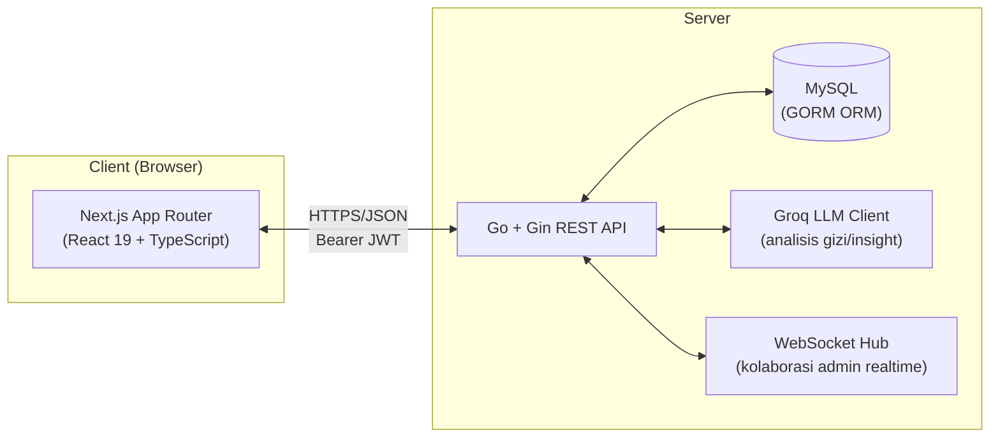
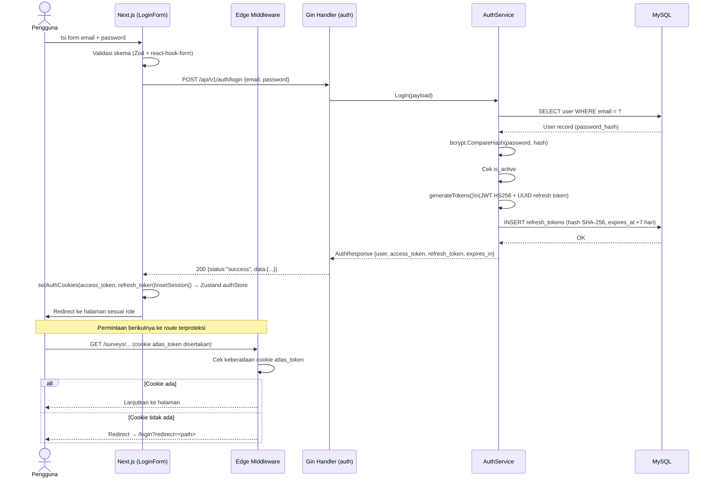
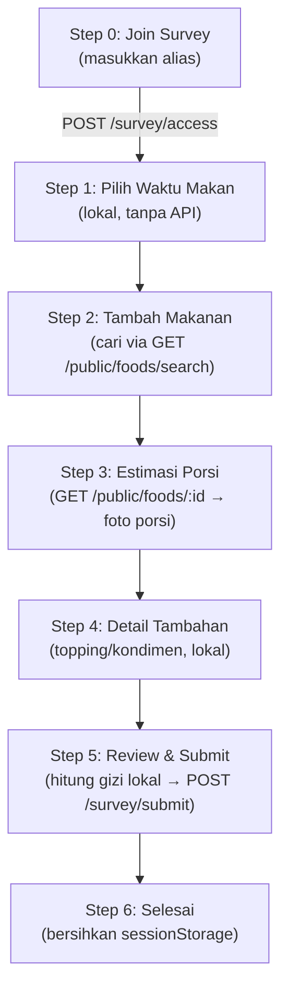
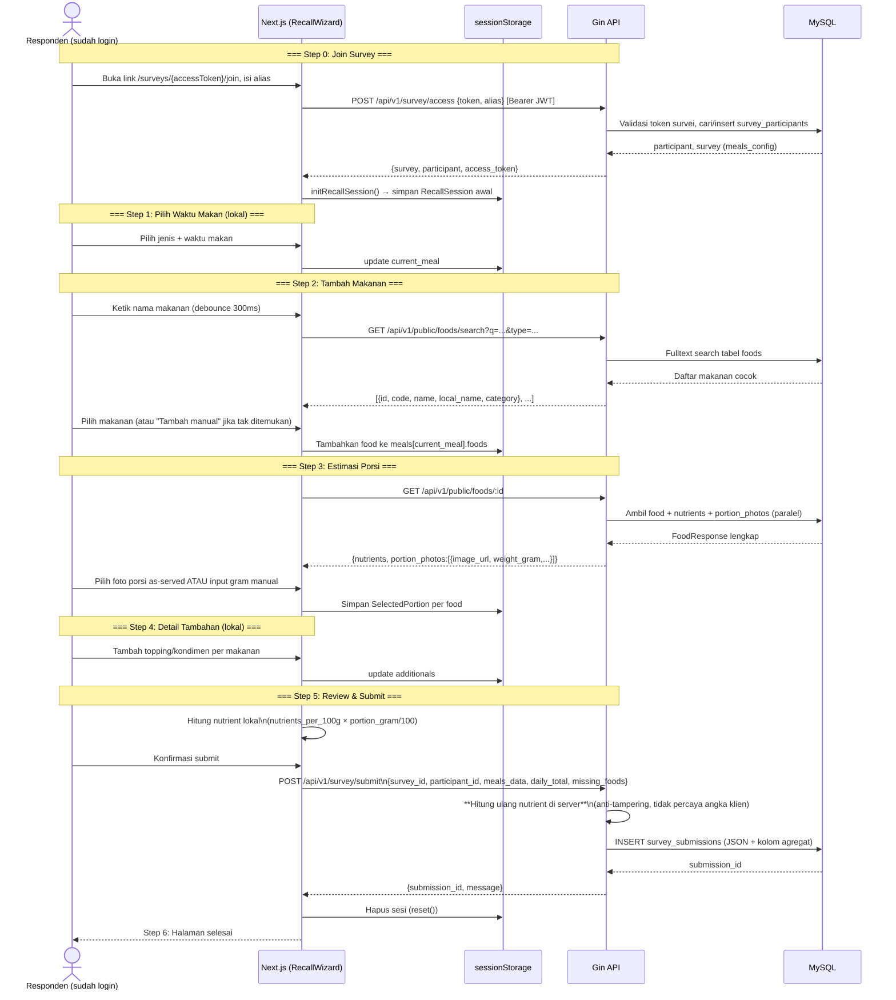
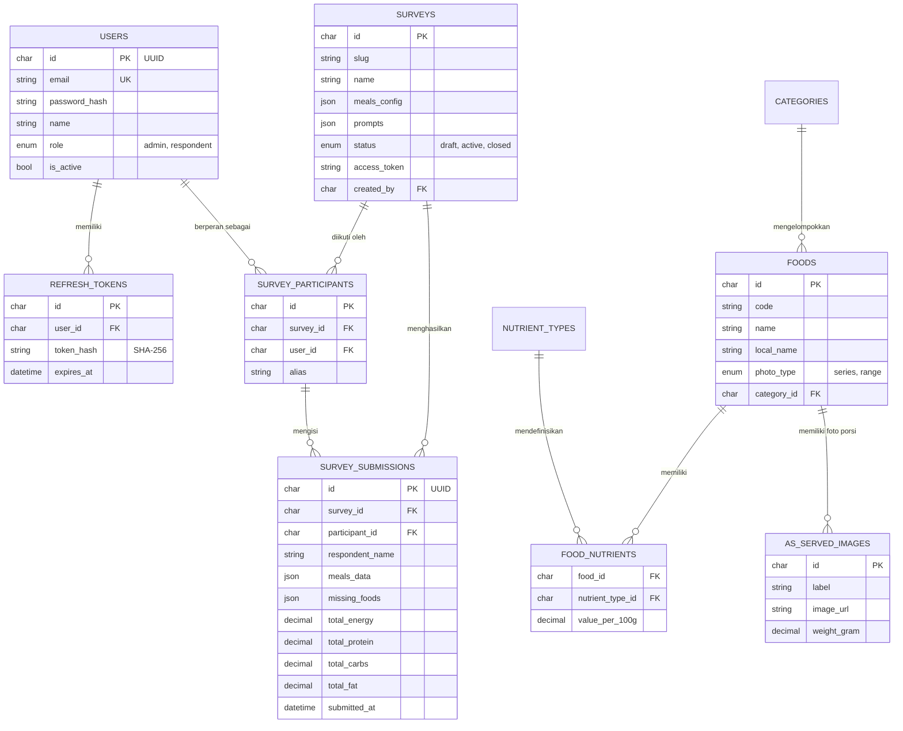
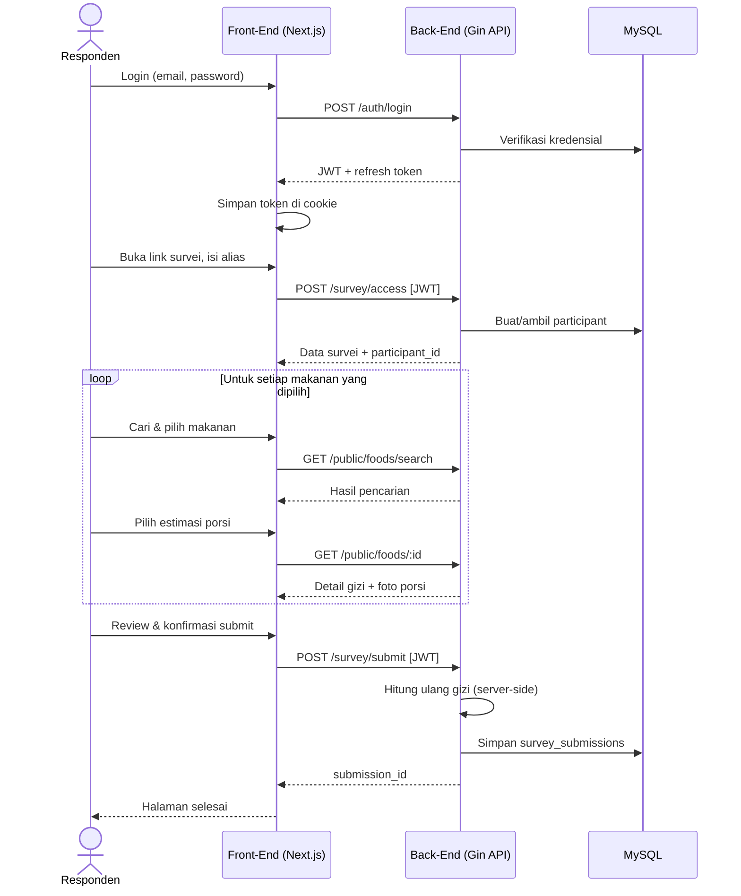

# Atlas Food — Arsitektur Sistem & Alur End-to-End (Login s.d. Dietary Recall)
**Dokumen Teknis Pendukung Skripsi/Publikasi Ilmiah**
Versi 1.0 · Juli 2026

---

## Abstrak Teknis

Dokumen ini menguraikan arsitektur sistem **Atlas Food**, sebuah aplikasi web yang mendigitalisasi metode *dietary recall* (metode ingatan 24 jam) berbasis referensi visual Atlas Makananku (BRIN–UPI). Cakupan dokumen meliputi: (1) tumpukan teknologi *front-end* (FE) dan *back-end* (BE), (2) arsitektur komunikasi klien-server, (3) alur otentikasi pengguna dari login hingga manajemen sesi, (4) alur pengumpulan data *dietary recall* multi-langkah dari inisiasi hingga penyimpanan hasil, serta (5) kontrak API dan skema basis data yang mendasarinya. Dokumen ini disusun untuk mendukung penulisan bab metodologi/implementasi pada skripsi atau naskah jurnal terakreditasi Sinta 2, dengan penekanan pada ketertelusuran (*traceability*) setiap klaim ke berkas kode sumber aktual.

---

## Daftar Isi

1. [Gambaran Umum Arsitektur](#1-gambaran-umum-arsitektur)
2. [Tumpukan Teknologi Front-End](#2-tumpukan-teknologi-front-end)
3. [Tumpukan Teknologi Back-End](#3-tumpukan-teknologi-back-end)
4. [Struktur Direktori & Pola Desain](#4-struktur-direktori--pola-desain)
5. [Alur Otentikasi End-to-End](#5-alur-otentikasi-end-to-end)
6. [Alur Dietary Recall End-to-End](#6-alur-dietary-recall-end-to-end)
7. [Kontrak API Lengkap](#7-kontrak-api-lengkap)
8. [Skema Basis Data](#8-skema-basis-data)
9. [Diagram Sequence Gabungan](#9-diagram-sequence-gabungan)
10. [Catatan Keamanan & Temuan Arsitektural](#10-catatan-keamanan--temuan-arsitektural)
11. [Batasan Studi & Saran Pengembangan Lanjutan](#11-batasan-studi--saran-pengembangan-lanjutan)

---

## 1. Gambaran Umum Arsitektur

Atlas Food dibangun dengan arsitektur **client-server terpisah (decoupled)**: front-end berbasis Next.js (React) mengonsumsi REST API yang disediakan oleh back-end Go (Gin + GORM). Kedua layanan berkomunikasi melalui HTTP/JSON, dengan otentikasi berbasis **JSON Web Token (JWT)** yang disimpan pada *cookie* browser.



Karakteristik arsitektural utama:

- **Stateless API, stateful client**: server tidak menyimpan status "sesi wizard" dietary recall di sisi server — seluruh progres pengisian multi-langkah disimpan di `sessionStorage` browser dan baru dikirim ke server dalam satu payload utuh saat submit akhir.
- **Role-based access control (RBAC)** dua peran: `admin` (peneliti/pengelola survei) dan `respondent` (responden pengisi recall), ditegakkan melalui middleware JWT di setiap grup route.
- **Domain-driven modularization** di kedua sisi: FE mengorganisir kode per domain bisnis (auth, survey, food, recall, submission), BE mengorganisir per domain serupa dengan pola *handler–service–repository*.

---

## 2. Tumpukan Teknologi Front-End

| Lapisan | Teknologi | Keterangan |
|---|---|---|
| Framework | **Next.js** (App Router) | Routing berbasis direktori `app/`, bukan Pages Router lama |
| Bahasa | **TypeScript** | Type-safety end-to-end pada request/response DTO |
| Library UI | **React** | Fungsional, berbasis hooks |
| State klien (UI) | **Zustand** | State ringan per-domain (`authStore`, `surveyStore`, dll.) |
| State server (caching data) | **TanStack Query (React Query)** | Digunakan pada modul admin (CRUD survei, makanan) |
| Styling | **Tailwind CSS v4** + custom design tokens (CSS variables) | Tanpa pustaka komponen pihak ketiga (bukan shadcn/ui) |
| Ikon | **lucide-react** | — |
| Validasi form | **react-hook-form** + **Zod** | Skema validasi dideklarasikan per domain (`*Schema.ts`) |
| Klien HTTP | **Axios** (dengan interceptor refresh-token) dan **fetch wrapper** kustom | Dua implementasi paralel — lihat catatan di §10 |
| Otentikasi | Kustom (JWT + cookie), tanpa NextAuth/Clerk | Middleware Next.js Edge untuk proteksi route |

### Rasionalisasi Pemilihan Teknologi

- **Next.js App Router** dipilih untuk memanfaatkan *server components* dan *edge middleware* bawaan sebagai gerbang otentikasi tanpa memerlukan solusi routing tambahan.
- **Zustand** dipilih di atas Redux karena footprint minimal dan API berbasis hook yang idiomatik untuk state UI lokal (sesi login, progres wizard sementara di memori).
- **TanStack Query** dipakai khusus untuk data yang bersifat *server-state* (daftar survei, daftar makanan admin) yang memerlukan caching, revalidasi, dan sinkronisasi otomatis — dipisahkan secara sengaja dari state UI murni.
- **Zod + react-hook-form** memastikan validasi skema konsisten antara pesan error yang ditampilkan ke pengguna dan tipe data TypeScript yang dikonsumsi API.

---

## 3. Tumpukan Teknologi Back-End

| Lapisan | Teknologi | Keterangan |
|---|---|---|
| Bahasa | **Go** | — |
| Web framework | **Gin** | Routing, middleware chain |
| ORM | **GORM** | Migrasi dan mapping model ke MySQL |
| Basis data | **MySQL** (InnoDB, utf8mb4) | — |
| Otentikasi | **JWT (HS256)** kustom + refresh token berbasis UUID | Hash refresh token (SHA-256) disimpan di DB, bukan token mentah |
| Password hashing | **bcrypt** | — |
| Integrasi AI | **Groq LLM client** | Domain `ai` — analisis/insight gizi (di luar cakupan alur login→recall) |
| Realtime | **WebSocket Hub** | Domain `collab` — kolaborasi admin, dijaga JWT |
| Middleware inti | Recovery, Logger, CORS, ErrorHandler, JWTAuth, AdminOnly, RespondentOnly | `internal/pkg/middleware/*` |

### Pola Arsitektur Back-End

Back-end mengikuti pola **layered architecture per domain** (mirip *Clean Architecture* ringan):

```
internal/domain/<nama_domain>/
├── model.go       # Model GORM (struct ↔ tabel)
├── dto.go         # Request/Response struct (kontrak API)
├── repository.go  # Akses data (query DB)
├── service.go      # Logika bisnis
└── handler.go      # Handler Gin + registrasi route domain
```

Setiap domain (`auth`, `survey`, `food`, `submission`, `ai`, `collab`, `upload`) memiliki hak untuk mendaftarkan route-nya sendiri melalui fungsi `SetupRoutes()`, sehingga `router.go` di level pusat hanya berperan sebagai *composition root* yang memanggil setiap domain, bukan mendefinisikan seluruh route secara terpusat. Pola ini memudahkan penambahan domain baru tanpa menyentuh berkas routing inti — relevan untuk didiskusikan sebagai justifikasi *maintainability* dalam skripsi.

---

## 4. Struktur Direktori & Pola Desain

### Front-End

```
app/
├── login/                       # Halaman login
├── register/                    # Halaman registrasi
├── profile/                     # Profil pengguna (protected)
├── find-food/**                 # Peramban makanan publik
├── admin/**                     # CRUD survei, makanan, kategori (protected, admin only)
└── surveys/[accessToken]/       # Alur dietary recall (protected, respondent)
    ├── join/                    # Step 0: bergabung ke survei
    ├── recall/                  # Step 1–5: wizard multi-langkah
    └── done/                    # Halaman selesai

internal/
├── domain/<nama_domain>/        # Logika bisnis per domain (components, hooks, services, store, schemas, types)
├── lib/                         # axios client, cookies, validasi global
├── pkg/api/                     # fetch wrapper, konstanta endpoint
└── services/                    # Lapisan service tambahan (axios-based)
```

Halaman (`app/*/page.tsx`) berperan sebagai *thin wrapper* yang hanya merender komponen dari `internal/domain/*` — memisahkan concern routing (Next.js) dari concern logika bisnis (domain layer). Pola ini memudahkan pengujian unit pada logika domain tanpa bergantung pada konteks routing Next.js.

### Penyimpanan Token Otentikasi

Token disimpan di **cookie browser** (bukan `localStorage`), dengan konfigurasi:

| Cookie | Isi | Masa Berlaku | Atribut |
|---|---|---|---|
| `atlas_token` | Access token (JWT) | 24 jam | `SameSite=Lax`, `Secure` (di HTTPS) |
| `atlas_refresh` | Refresh token (UUID) | 30 hari | `SameSite=Lax`, `Secure` (di HTTPS) |

Pemilihan cookie di atas `localStorage` relevan didiskusikan dalam konteks mitigasi XSS (cookie tidak dapat diakses skrip pihak ketiga jika dikombinasikan dengan flag `HttpOnly`; namun perlu dicatat bahwa implementasi saat ini menyetel cookie melalui `document.cookie` sisi klien, sehingga flag `HttpOnly` **tidak** aktif — lihat §10).

---

## 5. Alur Otentikasi End-to-End

### 5.1 Diagram Sequence — Login



### 5.2 Rincian Request/Response

**Request** — `POST /api/v1/auth/login`
```json
{
  "email": "user@example.com",
  "password": "********"
}
```

**Response (200)** — dibungkus *envelope* standar `{status, data, error}`:
```json
{
  "status": "success",
  "data": {
    "user": {
      "id": "uuid",
      "email": "user@example.com",
      "name": "Nama Pengguna",
      "role": "respondent",
      "is_active": true
    },
    "access_token": "<jwt>",
    "refresh_token": "<uuid>",
    "expires_in": 86400
  }
}
```

### 5.3 Refresh Token & Rotasi

Ketika access token kedaluwarsa, interceptor Axios FE menangkap respons `401`, memanggil `POST /api/v1/auth/refresh` dengan `{refresh_token}`. Back-end memvalidasi hash token terhadap tabel `refresh_tokens`, memeriksa `expires_at`, lalu **menghapus token lama dan menerbitkan pasangan token baru** (pola *rotation*, mencegah replay token refresh yang telah dipakai). Permintaan asli kemudian diulang otomatis dengan token baru — transparan bagi pengguna.

### 5.4 Otorisasi Bertingkat (Middleware)

| Middleware | Fungsi |
|---|---|
| `JWTAuth()` | Validasi signature & expiry JWT, injeksi `userID`, `email`, `role` ke context Gin |
| `AdminOnly()` | Hanya meloloskan `role == admin` |
| `RespondentOnly()` | Meloloskan `role == respondent` (admin juga diloloskan untuk keperluan pengujian) |

### 5.5 Logout

Logout bersifat **murni sisi klien**: menghapus cookie (`atlas_token`, `atlas_refresh`) dan state Zustand, lalu redirect ke halaman utama. **Tidak ada endpoint revocation di server** — refresh token yang sudah diterbitkan tetap valid di database hingga kedaluwarsa alami atau tergantikan oleh rotasi berikutnya. Ini merupakan celah yang layak dibahas pada bagian keamanan skripsi (lihat §10).

---

## 6. Alur Dietary Recall End-to-End

Fitur inti aplikasi: responden yang telah login mengisi *dietary recall* melalui wizard 6 langkah, merujuk pada metode estimasi porsi visual dari Atlas Makananku (BRIN–UPI).

### 6.1 Peta Langkah Wizard



**Catatan penting**: sepanjang Step 1–4, **tidak ada state tersimpan di server**. Seluruh objek `RecallSession` (survei aktif, makanan yang dipilih, porsi, detail tambahan) disimpan di `sessionStorage` browser dengan kunci `atlas-food-recall-session`, dan baru dipersistensi ke database dalam **satu payload tunggal** saat Step 5 (submit). Karakteristik ini penting dicatat sebagai desain *"stateless-server, stateful-client wizard"*.

### 6.2 Diagram Sequence — Dietary Recall Lengkap



### 6.3 Rincian Payload Kunci

**Request** — `POST /api/v1/survey/submit`
```json
{
  "survey_id": "uuid",
  "participant_id": "uuid",
  "respondent_name": "string",
  "meals_data": [
    {
      "name": "Makan Siang",
      "time": "12:00",
      "foods": [
        {
          "food_id": "uuid-atau-missing-<timestamp>",
          "food_name": "Nasi Putih",
          "portion_gram": 150,
          "portion": { "method": "simple_grid", "image_id": "...", "quantity": 1 },
          "nutrients": { "energy": 195, "protein": 3.6, "carbs": 42.9, "fat": 0.3 },
          "additionals": [{ "name": "Kecap", "amount_value": 5, "unit": "ml" }]
        }
      ],
      "meal_total": { "energy": 195, "protein": 3.6, "carbs": 42.9, "fat": 0.3 }
    }
  ],
  "daily_total": { "energy": 195, "protein": 3.6, "carbs": 42.9, "fat": 0.3 },
  "missing_foods": [{ "name": "Makanan tidak ditemukan", "description": "..." }]
}
```

**Response (200)**
```json
{
  "status": "success",
  "data": { "submission_id": "uuid", "message": "Submission berhasil disimpan" }
}
```

**Poin metodologis penting**: meskipun FE menghitung dan mengirim `nutrients`/`daily_total`, **back-end mengabaikan angka tersebut dan menghitung ulang total gizi secara independen** dari `food_id` + `portion_gram` terhadap tabel `food_nutrients` di database, sebelum menyimpan. Ini merupakan mekanisme *anti-tampering* yang menjamin integritas data penelitian — poin kuat untuk dibahas dalam bagian validitas data pada skripsi.

### 6.4 Sisi Admin/Peneliti

Setelah data terkumpul, peneliti (role `admin`) dapat:
- `GET /api/v1/admin/surveys/:id/submissions` — daftar seluruh submission per survei
- `GET /api/v1/admin/submissions/:id` — detail satu submission
- `GET /api/v1/admin/surveys/:id/export` — ekspor CSV untuk analisis lanjutan (mis. di SPSS/R)

---

## 7. Kontrak API Lengkap

| Metode | Path | Otorisasi | Fungsi |
|---|---|---|---|
| POST | `/api/v1/auth/register` | Publik | Registrasi akun responden |
| POST | `/api/v1/auth/login` | Publik | Login, terbitkan access + refresh token |
| POST | `/api/v1/auth/refresh` | Publik (butuh refresh_token valid) | Rotasi pasangan token |
| GET | `/api/v1/auth/me` | JWT | Profil pengguna saat ini |
| POST | `/api/v1/survey/access` | JWT (respondent/admin) | Bergabung ke survei via access token + alias |
| GET | `/api/v1/survey/:id/info` | JWT | Metadata survei (meals_config, prompts) |
| GET | `/api/v1/survey/active` | JWT | Daftar survei aktif untuk responden |
| GET | `/api/v1/public/foods/search` | Publik | Pencarian makanan/minuman (Step 2 recall) |
| GET | `/api/v1/public/foods/:id` | Publik | Detail makanan + gizi + foto porsi (Step 3 recall) |
| GET | `/api/v1/public/categories` | Publik | Daftar kategori makanan |
| GET | `/api/v1/public/categories/:code/foods` | Publik | Makanan per kategori |
| POST | `/api/v1/survey/submit` | JWT (respondent/admin) | Submit hasil dietary recall lengkap |
| GET | `/api/v1/admin/surveys/:id/submissions` | JWT + Admin | Daftar submission per survei |
| GET | `/api/v1/admin/submissions/:id` | JWT + Admin | Detail satu submission |
| GET | `/api/v1/admin/surveys/:id/export` | JWT + Admin | Ekspor CSV submission |

---

## 8. Skema Basis Data

Model relevan terhadap alur login → dietary recall (MySQL, migrasi `001`–`008`):



**Catatan desain skema**: kolom `meals_data` dan `missing_foods` pada `survey_submissions` disimpan sebagai **JSON**, bukan dinormalisasi ke tabel relasional terpisah — trade-off yang memprioritaskan fleksibilitas struktur data (jumlah makanan dan tambahan per makan bervariasi) di atas kemampuan query relasional langsung. Kolom agregat (`total_energy`, dsb.) tetap disediakan sebagai kolom skalar terpisah untuk mempercepat query analitik tanpa perlu parsing JSON.

---

## 9. Diagram Sequence Gabungan

Diagram berikut merangkum keseluruhan perjalanan pengguna dari login hingga penyelesaian dietary recall, cocok dijadikan gambar tunggal pada bab implementasi:



---

## 10. Catatan Keamanan & Temuan Arsitektural

Bagian ini merangkum temuan yang layak didiskusikan dalam bab pembahasan/keterbatasan skripsi:

1. **Tidak ada endpoint revocation token**. Logout bersifat murni sisi klien (hapus cookie); refresh token yang sudah diterbitkan tetap valid di server hingga kedaluwarsa alami. Risiko: token yang dicuri sebelum logout tetap dapat dipakai penyerang.
2. **Cookie token tanpa flag `HttpOnly`**. Karena diset melalui `document.cookie` di sisi klien (bukan `Set-Cookie` header dari server), token access/refresh berpotensi diakses skrip JavaScript pihak ketiga jika terjadi celah XSS.
3. **Anti-tampering pada perhitungan gizi**: back-end secara sengaja mengabaikan nilai gizi yang dihitung dan dikirim klien, lalu menghitung ulang dari sumber data server (`food_nutrients`) — desain yang baik untuk menjaga validitas data penelitian, layak disebut sebagai kontribusi metodologis.
4. **Duplikasi lapisan klien HTTP**: front-end memiliki dua implementasi klien HTTP paralel (fetch wrapper kustom dan Axios) yang dipakai tidak konsisten antar domain — tidak memengaruhi korektnes fungsional, namun relevan disebut sebagai keterbatasan pemeliharaan kode (*maintainability debt*).
5. **Sesi recall bersifat *client-only* hingga submit akhir**: implikasinya, jika sesi browser terputus (refresh tab tanpa persistensi, crash browser) sebelum tahap submit, seluruh progres pengisian recall akan hilang karena tidak ada checkpoint di server. Ini relevan didiskusikan sebagai potensi *dropout* data pada studi lapangan nyata.
6. **Endpoint publik tanpa otentikasi untuk pencarian & detail makanan** (`/public/foods/*`) sengaja dibuka tanpa JWT meskipun diakses dari alur yang mensyaratkan login — desain ini mengurangi beban validasi pada operasi baca data referensi (bukan data personal), namun berarti data referensi makanan dapat diakses pihak luar tanpa otentikasi.

---

## 11. Batasan Studi & Saran Pengembangan Lanjutan

- **Skalabilitas sesi client-side**: penyimpanan progres wizard di `sessionStorage` cukup untuk skala uji coba, namun untuk penelitian lapangan skala besar dengan durasi pengisian panjang (mis. recall multi-hari), disarankan mekanisme *auto-save* berkala ke server sebagai *draft submission*.
- **Revocation token**: penambahan endpoint `POST /auth/logout` yang menghapus/mem-blacklist refresh token di server akan menutup celah keamanan pada poin 1 di atas.
- **Konsolidasi klien HTTP**: unifikasi ke satu implementasi klien (disarankan Axios, karena sudah memiliki interceptor refresh-token) akan menyederhanakan pemeliharaan kode jangka panjang.
- **Potensi penelitian lanjutan**: integrasi domain `ai` (Groq LLM) yang sudah ada namun berada di luar cakupan dokumen ini dapat dieksplorasi sebagai fitur analisis pola konsumsi otomatis atau *nutrition insight generation* berbasis data recall yang terkumpul — arah yang relevan untuk penelitian lanjutan pascaskripsi.

---

*Dokumen ini disusun berdasarkan penelusuran langsung terhadap kode sumber repositori `atlas_food_frontend` (branch `branch-silva`) dan `atlas_food_backend` (branch `mahesa`) per Juli 2026. Nama berkas dan baris kode yang dirujuk dapat berubah seiring pengembangan lanjutan; disarankan verifikasi ulang terhadap commit terbaru sebelum dikutip sebagai bukti final dalam naskah publikasi.*
